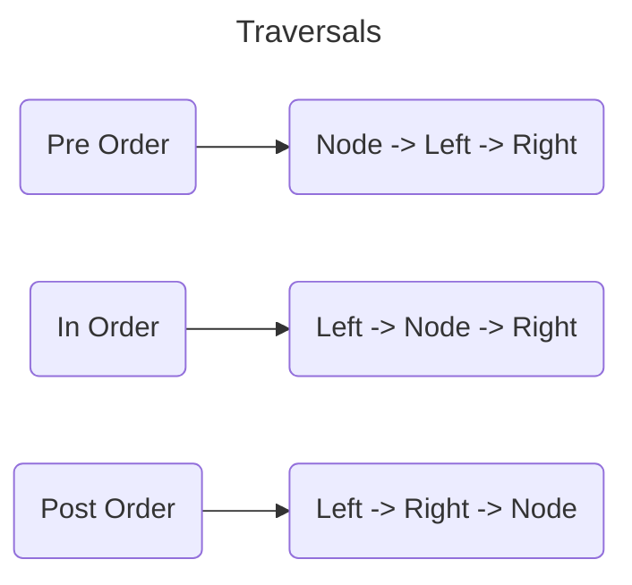

##### Tree Traversals

- PreOrder Traversal
	- https://www.geeksforgeeks.org/problems/preorder-traversal/1?page=1&difficulty%5B%5D=-1&category%5B%5D=Tree&sortBy=submissions
```js fold
const result = [];
(function traverse(root) {
	result.push(root.data)
	if(root.left) traverse(root.left) 
	if(root.right) traverse(root.right) 
})(root)
```
- InOrder Traversal
	- https://www.geeksforgeeks.org/problems/inorder-traversal/1?page=1&difficulty%5B%5D=-1&category%5B%5D=Tree&sortBy=submissions
```js fold
  const result = [];
	(function traverse(root) {
			if(root.left) traverse(root.left)
			result.push(root.data)
			if(root.right) traverse(root.right)
	})(root);
	return result
```
- PostOrder Traversal
	- https://www.geeksforgeeks.org/problems/postorder-traversal/1?page=1&difficulty%5B%5D=-1&category%5B%5D=Tree&sortBy=submissions
```js fold
const result = [];
(function traverse(root){
	if(root.left) traverse(root.left)
	if(root.right) traverse(root.right)
	result.push(root.data)
})(root)
```
- Level Order Traversal (BFS)
	- https://www.geeksforgeeks.org/problems/level-order-traversal/1?page=1&difficulty%5B%5D=0&category%5B%5D=Tree&sortBy=submissions
```js fold
const result = []	
const queue = []
queue.push(root)
while(queue.length){
	let current = queue.shift()
	result.push(current.data)
	if(current.left){
		queue.push(current.left)	
	}	
	if(current.right){
		queue.push(current.right)
	}
}
return result
```
- Size of Binary Tree
	- https://www.geeksforgeeks.org/problems/size-of-binary-tree/1?page=1&difficulty%5B%5D=-1&category%5B%5D=Tree&sortBy=submissions
```js fold
let count = 0
function calc(root){
	count++	
	if(root.left){
		calc(root.left)	
	}
	if(root.right){
		calc(root.right)	
	}
}	
calc(node)
return count
```
- Sum of Binary Tree
	- https://www.geeksforgeeks.org/problems/sum-of-binary-tree/1?page=1&difficulty%5B%5D=-1&category%5B%5D=Tree&sortBy=submissions
```js fold 
sumBT(root){
		if(root == null){
			return 0
		}
		return (root.data + this.sumBT(root.left) + this.sumBT(root.right))
        
}
```
- Count Leafs in Binary Tree
	- https://www.geeksforgeeks.org/problems/count-leaves-in-binary-tree/1?page=1&difficulty%5B%5D=-1&category%5B%5D=Tree&sortBy=submissions
```js fold
countNonLeafNodes(root){   
		if(!root){
				return 0
		}
		if(!root.left && !root.right){
				return 0
		}else {
				return 1 + (this.countNonLeafNodes(root.left) + this.countNonLeafNodes(root.right))
		}
}
```
- Height of Binary Tree 
	- https://www.geeksforgeeks.org/problems/height-of-binary-tree/1?page=1&difficulty%5B%5D=0&category%5B%5D=Tree&sortBy=submissions
```js fold
 height(node){
		if(!node){
				return 0
		}
		return 1 + Math.max(this.height(node.left),this.height(node.right))
		//your code here
}
```
- Largest value in each level
	- https://www.geeksforgeeks.org/problems/largest-value-in-each-level/1?page=4&difficulty%5B%5D=0&category%5B%5D=Tree&sortBy=submissions
```js fold
class Solution {
  largestValues(root) {
    if (!root) return [];
    
    const result = [];
    const queue = [root];
    
    while (queue.length > 0) {
      let levelSize = queue.length;
      let maxAtLevel = -Infinity;
      
      for (let i = 0; i < levelSize; i++) {
        const node = queue.shift();
        
        // Update max value at this level
        maxAtLevel = Math.max(maxAtLevel, node.data);
        
        // Add children to the queue for the next level
        if (node.left) queue.push(node.left);
        if (node.right) queue.push(node.right);
      }
      
      // Store the maximum value found at this level
      result.push(maxAtLevel);
    }
    
    return result;
  }
}
```
- Determine if two Trees are identicle
	- https://www.geeksforgeeks.org/problems/determine-if-two-trees-are-identical/1?page=1&difficulty%5B%5D=0&category%5B%5D=Tree&sortBy=submissions
```js fold
 isIdentical(root1, root2)
    {
        if(!root1 || !root2 ){
            if(!root1 && root2){
                return false
            }else if(root1 && !root2){
                return false
            }else {
                return true
            }
        }   
        
        return root1.data === root2.data && this.isIdentical(root1.left,root2.left) && this.isIdentical(root1.right,root2.right)
    }
```
- Mirror Tree
	- https://www.geeksforgeeks.org/problems/mirror-tree/1?page=1&difficulty%5B%5D=0&category%5B%5D=Tree&sortBy=submissions
```js fold
mirror(node) {
		if (node === null){
				return
		}
		let temp = node.right
		node.right = node.left
		node.left = temp
		this.mirror(node.right)
		this.mirror(node.left)
}
```
- Check for Balanced Tree
	- https://www.geeksforgeeks.org/problems/check-for-balanced-tree/1?page=1&difficulty%5B%5D=0&category%5B%5D=Tree&sortBy=submissions
```js fold
function checkBalance(node) {
		if (node === null) return 0; // Height of empty subtree is 0

		// Recursively get the height of left and right subtrees
		const leftHeight = checkBalance(node.left);
		const rightHeight = checkBalance(node.right);

		// If either subtree is unbalanced, propagate -1 upwards
		if (leftHeight === -1 || rightHeight === -1) return -1;

		// If the current node is unbalanced, return -1
		if (Math.abs(leftHeight - rightHeight) > 1) return -1;

		// Return the height of the current subtree
		return Math.max(leftHeight, rightHeight) + 1;
}

// If checkBalance returns -1, the tree is unbalanced
return checkBalance(root) !== -1;
```
- Level Order Traversal in spiral form
	- https://www.geeksforgeeks.org/problems/level-order-traversal-in-spiral-form/1?page=1&difficulty%5B%5D=0&category%5B%5D=Tree&sortBy=submissions
```js fold
findSpiral(root) {
    const result = [];
    const queue = [root];
    let isFromLeft = true;

    while (queue.length) {
        const length = queue.length;
        const levelNodes = []; // Temporary array to store nodes of the current level

        for (let i = 0; i < length; i++) {
            const node = queue.shift();

            // Add node data to the temporary level array
            levelNodes.push(node.data);

            // Add children to the queue in the current traversal order
            if (isFromLeft) {
                if (node.left) queue.push(node.left);
                if (node.right) queue.push(node.right);
            } else {
                if (node.right) queue.push(node.right);
                if (node.left) queue.push(node.left);
            }
        }

        // Add level nodes to result, reversing if needed
        if (!isFromLeft) {
            levelNodes.reverse();
        }

        result.push(...levelNodes);
        isFromLeft = !isFromLeft;
    }

    return result;
}
```
- Check if Two nodes are cousins
	- https://www.geeksforgeeks.org/problems/check-if-two-nodes-are-cousins/1?page=2&difficulty%5B%5D=0&category%5B%5D=Tree&sortBy=submissions
