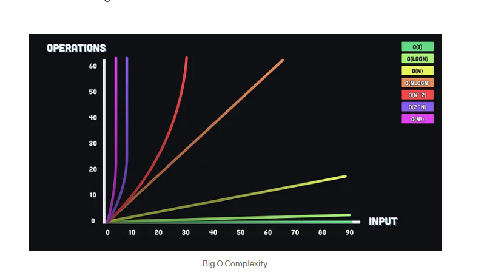

<!-- # Time & Space Complexity — Complete Notes -->

> [!info] Overview
> Foundations of Time and Space Complexity for evaluating data structures, algorithms, and code performance beyond simple execution time.

---

## 1. Fundamentals

> [!note] What is Time Complexity?
> The rate at which execution time increases relative to the input size (`n`). It does **not** measure actual clock time — it measures the **growth pattern** of operations, independent of hardware.

> [!note] What is Space Complexity?
> The total memory a program needs to execute. It has two parts:
> - **Auxiliary Space** — Extra space used during execution (temp variables, call stack, helper arrays).
> - **Input Space** — Space taken by the input data itself.

> [!warning] Best Practice
> Never manipulate input data purely to save space unless explicitly instructed. Modifying input is considered bad practice in professional software engineering.

---

## 2. Asymptotic Notations

| Notation | Symbol | Meaning | Use Case |
|---|---|---|---|
| Big O | `O(f(n))` | **Upper bound** — worst-case growth rate | Most used in interviews |
| Theta | `Θ(f(n))` | **Tight bound** — both upper and lower | Average/exact performance |
| Omega | `Ω(f(n))` | **Lower bound** — best-case growth rate | Best case analysis |
| Little o | `o(f(n))` | **Strict upper bound** — grows strictly slower than `f(n)` | Theoretical analysis |
| Little omega | `ω(f(n))` | **Strict lower bound** — grows strictly faster than `f(n)` | Theoretical analysis |

> [!important] Three Rules for Big O
> 1. **Always assume the worst-case scenario**
> 2. **Drop constants** — `O(2n + 5)` → `O(n)`
> 3. **Drop lower-order terms** — `O(n² + n)` → `O(n²)`

---

## 3. Orders of Growth (Slowest → Fastest)



```
O(1) < O(log log n) < O(log n) < O(∛n) < O(√n) < O(n) < O(n log n) < O(n²) < O(n³) < O(2ⁿ) < O(n!)
```

| Complexity | Name | Example |
|---|---|---|
| `O(1)` | Constant | Hash table lookup, array access by index |
| `O(log n)` | Logarithmic | Binary search, BST operations |
| `O(n)` | Linear | Loop through array, linear search |
| `O(n log n)` | Linearithmic | Merge sort, heap sort, quick sort (avg) |
| `O(n²)` | Quadratic | Nested loops, bubble sort, insertion sort |
| `O(n³)` | Cubic | Triple nested loops, Floyd-Warshall |
| `O(2ⁿ)` | Exponential | Brute force recursion, all subsets |
| `O(n!)` | Factorial | All permutations of a string |

> [!tip] Competitive Programming Tip
> Most servers handle ~`10⁸` operations/second. Use this to check if your solution will pass within a time limit.

---

## 4. Big O Simplification Examples

> [!example] Rule Application
> ```
> O(3)        → O(1)
> O(5n)       → O(n)
> O(3000n + 500000) → O(n)
> O(3n³)      → O(n³)
> O(2n² + 2n + 3)   → O(n²)
> f(n) = 7(log n)³ + 15n² + 2n³ + 8 → O(n³)
> ```

---

## 5. Analyzing Loops

### Pattern 1 — Single Loop (Linear)
```js
for (let i = 0; i < n; i++) {
  sum += i; // runs n times
}
// Time: O(n)
```

### Pattern 2 — Nested Loop (Quadratic)
```js
for (let i = 0; i < n; i++) {
  for (let j = 0; j < n; j++) {
    sum++; // runs n × n times
  }
}
// Time: O(n²)
```

### Pattern 3 — Dependent Nested Loop (Still Quadratic)
```js
for (let i = 0; i < n; i++) {
  for (let j = i; j < n; j++) {
    sum++;
  }
}
// Work = n + (n-1) + (n-2) + ... + 1 = n(n+1)/2 → O(n²)
```

### Pattern 4 — Multiplicative Loop (Logarithmic)
```js
for (let i = 1; i < n; i *= 2) {
  doWork(); // halves the problem each time
}
// Time: O(log n)
```

### Pattern 5 — Power Loop (Log Log)
```js
for (let i = 2; i <= n; i = i * i) {
  doWork(); // 2 → 4 → 16 → 256...
}
// Time: O(log log n)
```

### Pattern 6 — Sequential Loops (Add)
```js
for (let i = 0; i < n; i++) { ... }   // O(n)
for (let j = 0; j < n; j++) { ... }   // O(n)
// Total: O(n) + O(n) = O(n)  ← keep dominant term
```

### Pattern 7 — Nested Independent Loops (Multiply)
```js
for (let i = 0; i < n; i++) {
  for (let j = 0; j < m; j++) { ... }
}
// Time: O(n × m)
```

---

## 6. Analyzing Recursion (Tree Method)

> [!info] The 3-Step Process
> To analyze recursive functions:
> 1. Write the **recurrence relation**
> 2. **Draw the recursion tree** — visualize cost at each level
> 3. **Sum all levels** to get total cost

### Example 1 — Two Recursive Calls (Exponential)
```js
function fun(n) {
  if (n === 0) return;
  console.log("x");      // O(1)
  fun(n - 1);            // first call
  fun(n - 1);            // second call
}
// Recurrence: T(n) = 2T(n-1) + c
// Level 0: c | Level 1: 2c | Level 2: 4c | Level k: 2^k * c
// Sum = c(1 + 2 + 4 + ... + 2^(n-1)) = Θ(2ⁿ)
```

### Example 2 — Merge Sort (n log n)
```js
function mergeSort(arr) {
  if (arr.length <= 1) return arr;
  const mid = Math.floor(arr.length / 2);
  const left = mergeSort(arr.slice(0, mid));   // T(n/2)
  const right = mergeSort(arr.slice(mid));     // T(n/2)
  return merge(left, right);                   // O(n)
}
// Recurrence: T(n) = 2T(n/2) + O(n)
// Each level costs O(n), there are log₂n levels
// Total: Θ(n log n)
```

### Example 3 — Binary Search (Logarithmic)
```js
function binarySearch(arr, target, low = 0, high = arr.length - 1) {
  if (low > high) return -1;
  const mid = Math.floor((low + high) / 2);
  if (arr[mid] === target) return mid;
  if (arr[mid] < target) return binarySearch(arr, target, mid + 1, high);
  return binarySearch(arr, target, low, mid - 1);
}
// Recurrence: T(n) = T(n/2) + O(1)
// Time: O(log n) | Space: O(log n) call stack (iterative version = O(1))
```

---

## 7. Data Structures — Time & Space Complexity

### Linear Data Structures

| Data Structure | Access | Search | Insert | Delete | Space | Notes |
|---|---|---|---|---|---|---|
| **Array** | `O(1)` | `O(n)` | `O(n)` | `O(n)` | `O(n)` | Insert/delete requires shifting |
| **Dynamic Array** | `O(1)` | `O(n)` | `O(1)` amortized | `O(n)` | `O(n)` | Occasional resize costs `O(n)` |
| **Linked List** | `O(n)` | `O(n)` | `O(1)` | `O(1)` | `O(n)` | Insert/delete at known node |
| **Doubly Linked List** | `O(n)` | `O(n)` | `O(1)` | `O(1)` | `O(n)` | Bidirectional traversal |
| **Stack** | `O(n)` | `O(n)` | `O(1)` | `O(1)` | `O(n)` | Push/pop at top only |
| **Queue** | `O(n)` | `O(n)` | `O(1)` | `O(1)` | `O(n)` | Enqueue rear, dequeue front |
| **Deque** | `O(n)` | `O(n)` | `O(1)` | `O(1)` | `O(n)` | Insert/delete both ends |

### Search Algorithms

| Algorithm | Best | Average | Worst | Space | Prerequisite |
|---|---|---|---|---|---|
| **Linear Search** | `O(1)` | `O(n)` | `O(n)` | `O(1)` | None |
| **Binary Search (iterative)** | `O(1)` | `O(log n)` | `O(log n)` | `O(1)` | Sorted array |
| **Binary Search (recursive)** | `O(1)` | `O(log n)` | `O(log n)` | `O(log n)` | Sorted array |
| **Jump Search** | `O(1)` | `O(√n)` | `O(√n)` | `O(1)` | Sorted array |
| **Interpolation Search** | `O(1)` | `O(log log n)` | `O(n)` | `O(1)` | Sorted + uniform data |

### Tree Data Structures

| Data Structure | Access | Search | Insert | Delete | Space | Notes |
|---|---|---|---|---|---|---|
| **Binary Tree** | `O(n)` | `O(n)` | `O(n)` | `O(n)` | `O(n)` | No ordering guarantee |
| **Binary Search Tree (BST)** | `O(log n)` avg | `O(log n)` avg | `O(log n)` avg | `O(log n)` avg | `O(n)` | Degrades to `O(n)` if unbalanced |
| **BST (worst case)** | `O(n)` | `O(n)` | `O(n)` | `O(n)` | `O(n)` | When tree becomes a linked list |
| **AVL Tree** | `O(log n)` | `O(log n)` | `O(log n)` | `O(log n)` | `O(n)` | Self-balancing, guaranteed `O(log n)` |
| **Red-Black Tree** | `O(log n)` | `O(log n)` | `O(log n)` | `O(log n)` | `O(n)` | Used in JS `Map`, Java `TreeMap` |
| **B-Tree** | `O(log n)` | `O(log n)` | `O(log n)` | `O(log n)` | `O(n)` | Used in databases, disk-friendly |
| **Segment Tree** | `O(log n)` | `O(log n)` | `O(log n)` | `O(log n)` | `O(n)` | Range queries |
| **Fenwick Tree (BIT)** | `O(log n)` | `O(log n)` | `O(log n)` | `O(log n)` | `O(n)` | Prefix sums |
| **Trie** | `O(m)` | `O(m)` | `O(m)` | `O(m)` | `O(n×m)` | `m` = key length |

> [!note] BST Note
> An unbalanced BST (e.g., inserting sorted data) degenerates into a linked list, making all operations `O(n)`. Always prefer AVL or Red-Black trees when balance isn't guaranteed.

### Heap / Priority Queue

| Operation | Binary Heap | Fibonacci Heap |
|---|---|---|
| **Find Min/Max** | `O(1)` | `O(1)` |
| **Insert** | `O(log n)` | `O(1)` amortized |
| **Delete Min/Max** | `O(log n)` | `O(log n)` amortized |
| **Search** | `O(n)` | `O(n)` |
| **Merge** | `O(n)` | `O(1)` |
| **Space** | `O(n)` | `O(n)` |

### Hash-Based Structures

| Data Structure | Search | Insert | Delete | Space | Notes |
|---|---|---|---|---|---|
| **Hash Table** | `O(1)` avg | `O(1)` avg | `O(1)` avg | `O(n)` | `O(n)` worst if many collisions |
| **Hash Set** | `O(1)` avg | `O(1)` avg | `O(1)` avg | `O(n)` | Unordered unique elements |
| **Hash Map** | `O(1)` avg | `O(1)` avg | `O(1)` avg | `O(n)` | Key-value pairs |

### Graph Representations

| Representation | Space | Add Vertex | Add Edge | Remove Edge | Query Edge |
|---|---|---|---|---|---|
| **Adjacency Matrix** | `O(V²)` | `O(V²)` | `O(1)` | `O(1)` | `O(1)` |
| **Adjacency List** | `O(V + E)` | `O(1)` | `O(1)` | `O(E)` | `O(V)` |
| **Edge List** | `O(E)` | `O(1)` | `O(1)` | `O(E)` | `O(E)` |

### Other Structures

| Data Structure | Search | Insert | Delete | Space | Notes |
|---|---|---|---|---|---|
| **Skip List** | `O(log n)` avg | `O(log n)` avg | `O(log n)` avg | `O(n log n)` | Probabilistic balancing |
| **Bloom Filter** | `O(k)` | `O(k)` | ✗ Not supported | `O(m)` | `k` = hash functions, `m` = bits |
| **Disjoint Set (Union-Find)** | `O(α(n))` | `O(α(n))` | — | `O(n)` | Near constant with path compression |

---

## 8. Sorting Algorithms — Time & Space Complexity

| Algorithm | Best | Average | Worst | Space | Stable? | Notes |
|---|---|---|---|---|---|---|
| **Bubble Sort** | `O(n)` | `O(n²)` | `O(n²)` | `O(1)` | ✅ | Best when nearly sorted |
| **Selection Sort** | `O(n²)` | `O(n²)` | `O(n²)` | `O(1)` | ❌ | Always `O(n²)` regardless |
| **Insertion Sort** | `O(n)` | `O(n²)` | `O(n²)` | `O(1)` | ✅ | Great for small / nearly sorted arrays |
| **Merge Sort** | `O(n log n)` | `O(n log n)` | `O(n log n)` | `O(n)` | ✅ | Consistent; extra memory needed |
| **Quick Sort** | `O(n log n)` | `O(n log n)` | `O(n²)` | `O(log n)` | ❌ | Worst case on sorted input without good pivot |
| **Heap Sort** | `O(n log n)` | `O(n log n)` | `O(n log n)` | `O(1)` | ❌ | In-place but poor cache performance |
| **Counting Sort** | `O(n + k)` | `O(n + k)` | `O(n + k)` | `O(n + k)` | ✅ | `k` = range of values; not comparison-based |
| **Radix Sort** | `O(nk)` | `O(nk)` | `O(nk)` | `O(n + k)` | ✅ | `k` = number of digits |
| **Tim Sort** | `O(n)` | `O(n log n)` | `O(n log n)` | `O(n)` | ✅ | Used in JS `.sort()`, Python `sorted()` |

---

## 9. Graph Algorithms — Time & Space Complexity

| Algorithm | Time | Space | Use Case |
|---|---|---|---|
| **BFS** | `O(V + E)` | `O(V)` | Shortest path (unweighted), level traversal |
| **DFS** | `O(V + E)` | `O(V)` | Cycle detection, topological sort, connected components |
| **Dijkstra (min-heap)** | `O((V + E) log V)` | `O(V)` | Shortest path, non-negative weights |
| **Dijkstra (matrix)** | `O(V²)` | `O(V)` | Dense graphs |
| **Bellman-Ford** | `O(V × E)` | `O(V)` | Shortest path with negative weights |
| **Floyd-Warshall** | `O(V³)` | `O(V²)` | All-pairs shortest path |
| **Kruskal's MST** | `O(E log E)` | `O(V)` | Minimum spanning tree |
| **Prim's MST** | `O((V + E) log V)` | `O(V)` | Minimum spanning tree (dense graphs) |
| **Topological Sort** | `O(V + E)` | `O(V)` | Task scheduling, dependency resolution |
| **Tarjan's SCC** | `O(V + E)` | `O(V)` | Strongly connected components |

---

## 10. Greedy Algorithms — Time & Space Complexity

Greedy algorithms make the **locally optimal choice** at each step hoping to reach a global optimum. They do **not** reconsider past choices.

| Algorithm | Time | Space | Notes |
|---|---|---|---|
| **Activity Selection** | `O(n log n)` | `O(1)` | Sort by end time, pick non-overlapping |
| **Fractional Knapsack** | `O(n log n)` | `O(1)` | Sort by value/weight ratio |
| **Huffman Coding** | `O(n log n)` | `O(n)` | Priority queue for encoding |
| **Dijkstra's Algorithm** | `O((V + E) log V)` | `O(V)` | Greedy shortest path |
| **Prim's Algorithm** | `O((V + E) log V)` | `O(V)` | Greedy MST |
| **Kruskal's Algorithm** | `O(E log E)` | `O(V)` | Greedy MST using Union-Find |
| **Job Sequencing** | `O(n log n)` | `O(n)` | Maximize profit with deadlines |
| **Coin Change (Greedy)** | `O(n log n)` | `O(1)` | Only works for canonical coin systems |

### Greedy vs Dynamic Programming

| Property | Greedy | Dynamic Programming |
|---|---|---|
| **Choice** | Locally optimal at each step | Considers all subproblems |
| **Revisit** | Never revisits choices | Stores and reuses subproblems |
| **Space** | Usually `O(1)` or `O(n)` | Usually `O(n)` or `O(n²)` |
| **Speed** | Generally faster | Slower but more accurate |
| **Works for** | Specific problem structures | Overlapping subproblems |

---

## 11. Dynamic Programming — Time & Space Complexity

| Problem | Time | Space | Optimized Space |
|---|---|---|---|
| **Fibonacci** | `O(n)` | `O(n)` | `O(1)` with two variables |
| **0/1 Knapsack** | `O(n × W)` | `O(n × W)` | `O(W)` with 1D DP |
| **Longest Common Subsequence** | `O(m × n)` | `O(m × n)` | `O(min(m,n))` |
| **Longest Increasing Subsequence** | `O(n²)` or `O(n log n)` | `O(n)` | — |
| **Matrix Chain Multiplication** | `O(n³)` | `O(n²)` | — |
| **Edit Distance** | `O(m × n)` | `O(m × n)` | `O(min(m,n))` |
| **Coin Change (min coins)** | `O(n × amount)` | `O(amount)` | — |

---

## 12. Common Coding Patterns

| Pattern | Time | Space | When to Use |
|---|---|---|---|
| **Sliding Window** | `O(n)` | `O(1)` | Subarray/substring problems with fixed or variable window |
| **Two Pointers** | `O(n)` | `O(1)` | Sorted array pair problems, palindromes |
| **Fast & Slow Pointers** | `O(n)` | `O(1)` | Cycle detection in linked lists |
| **Prefix Sum** | `O(n)` build, `O(1)` query | `O(n)` | Range sum queries |
| **Monotonic Stack** | `O(n)` | `O(n)` | Next greater/smaller element |
| **Divide & Conquer** | `O(n log n)` | `O(log n)` | Merge sort, binary search |
| **Backtracking** | `O(2ⁿ)` | `O(n)` | Permutations, subsets, N-Queens |
| **Dynamic Programming** | Typically `O(n²)` | `O(n)` | Overlapping subproblems |
| **Greedy** | `O(n log n)` | `O(1)` | Locally optimal choices lead to global optimum |
| **BFS/DFS on Graphs** | `O(V + E)` | `O(V)` | Shortest path, connected components |
| **Binary Search on Answer** | `O(n log n)` | `O(1)` | Minimise/maximise under a condition |
| **Topological Sort** | `O(V + E)` | `O(V)` | Dependency resolution, scheduling |

---

## 13. Space Complexity Deep Dive

### Where Memory is Used

```
Total Space = Input Space + Auxiliary Space
Auxiliary Space = Variables + Data Structures + Call Stack (recursion)
```

### Recursion and the Call Stack

> [!warning] Memory Cost
> Every recursive call consumes stack space equal to the depth of recursion.

```js
// Factorial — O(n) space (call stack depth = n)
function factorial(n) {
  if (n === 0) return 1;
  return n * factorial(n - 1);
}

// Iterative Factorial — O(1) space
function factorialIter(n) {
  let result = 1;
  for (let i = 2; i <= n; i++) result *= i;
  return result;
}
```

```js
// Merge Sort — O(n) auxiliary (merging) + O(log n) call stack
// Total auxiliary = O(n)

// Binary Search recursive — O(log n) call stack
// Binary Search iterative — O(1) space  ← prefer this
```

### Space Complexity Examples

| Code Pattern | Space Complexity | Reason |
|---|---|---|
| `let x = 5` | `O(1)` | Fixed number of variables |
| `let arr = new Array(n)` | `O(n)` | Array scales with input |
| `let matrix = new Array(n).fill(new Array(n))` | `O(n²)` | 2D array |
| Recursive function depth `n` | `O(n)` | Call stack grows with `n` |
| Recursive function depth `log n` | `O(log n)` | Binary split recursion |
| BFS with queue | `O(V)` | Queue holds vertices |
| DFS with recursion | `O(V)` | Call stack depth = vertices |

---

## 14. Node.js / JavaScript Specific Notes

### Built-in Method Complexities

| Method | Time | Notes |
|---|---|---|
| `arr[i]` | `O(1)` | Direct index access |
| `arr.push()` | `O(1)` amortized | Dynamic array resize occasionally |
| `arr.pop()` | `O(1)` | Remove from end |
| `arr.shift()` | `O(n)` | Remove from front — shifts all elements |
| `arr.unshift()` | `O(n)` | Add to front — shifts all elements |
| `arr.splice()` | `O(n)` | Inserts/removes in middle |
| `arr.indexOf()` | `O(n)` | Linear scan |
| `arr.includes()` | `O(n)` | Linear scan |
| `arr.sort()` | `O(n log n)` | TimSort — V8 engine |
| `arr.slice()` | `O(n)` | Copies elements |
| `arr.concat()` | `O(n)` | Creates new array |
| `Map.get/set/has` | `O(1)` avg | Hash-based |
| `Set.add/has/delete` | `O(1)` avg | Hash-based |
| `Object[key]` | `O(1)` avg | Hash-based (V8 optimized) |
| `JSON.stringify(obj)` | `O(n)` | Traverses all keys/values |

> [!tip] Pro Tip
> Prefer `Map` over plain `Object` for frequent dynamic key-value operations. Prefer `Set` over `Array` when checking existence (`O(1)` vs `O(n)`).

---

## 15. Quick Reference Cheatsheet

### Complexity Order (Best → Worst)
```
O(1) → O(log n) → O(√n) → O(n) → O(n log n) → O(n²) → O(n³) → O(2ⁿ) → O(n!)
```

### Mnemonics

| Structure / Algorithm | Mnemonic |
|---|---|
| Array | *"Arrays peek fast, but tweaking takes a blast"* |
| Linked List | *"Lists link easily, but searching is tricky"* |
| Stack | *"Stacks pop and push with ease"* |
| Hash Table | *"Hash Tables are fast, searching doesn't last"* |
| BST | *"Binary Trees divide swiftly — but only when balanced"* |
| Merge Sort | *"Merge in halves, win in log-calves"* |
| Quick Sort | *"Quick and slick, divide quick — but watch sorted input"* |
| Binary Search | *"Halve the problem every time, log n is the climb"* |
| Greedy | *"Greed grabs locally, wins globally — sometimes"* |
| DP | *"Save subproblems, don't double the trouble"* |
| Sliding Window | *"Slide across, solve with ease, constant space please"* |
| Two Pointers | *"Two pointers glide like wings, linear time brings"* |

> [!tip] The Ultimate Summary Mnemonic
> *"Arrays peek fast, lists last, trees grow slow, heaps know,*
> *Sort divides quick, Bubble's thick, merge half the trick."*

---

## 16. Practical Estimation Checklist

> [!success] Quick Cheat Sheet
> - **Single loop over `n`** → `O(n)`
> - **Nested independent loops** → multiply their bounds
> - **Sequential loops** → add, then keep dominant term
> - **Loop divides/multiplies by constant** → `O(log n)`
> - **Recursion splitting into 2 halves** → `O(n log n)` (merge sort pattern)
> - **Recursion with 2 calls each reducing by 1** → `O(2ⁿ)` (exponential)
> - **Recursion call stack** → always count depth as space
> - **Hash operations** → assume `O(1)` average unless told otherwise
> - **Sorting required** → minimum `O(n log n)` for comparison-based sorts
> - **Competitive programming** → `10⁸` ops/sec; check if worst case fits in the time limit

---

*Sources: Striver's A2Z DSA Course · GeeksforGeeks · Medium (BiG MaN, AkashSDas) · DEV Community (Harshit)*