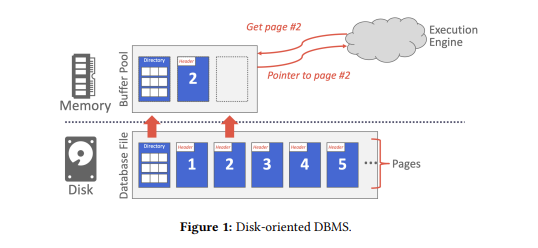
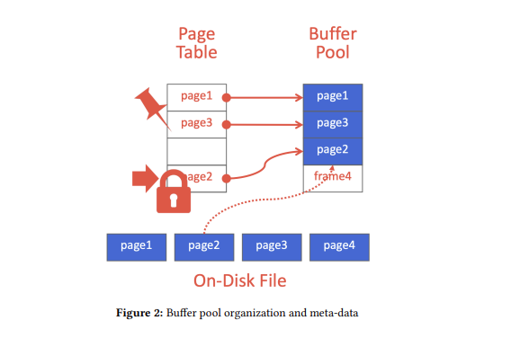
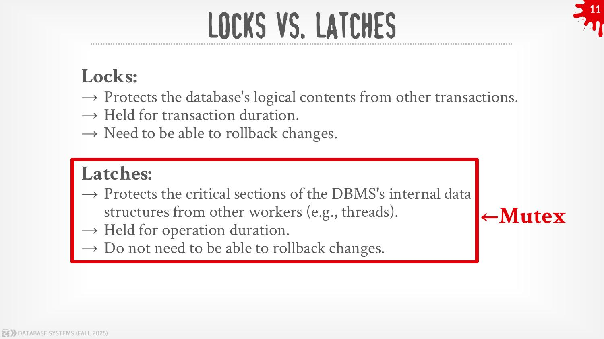
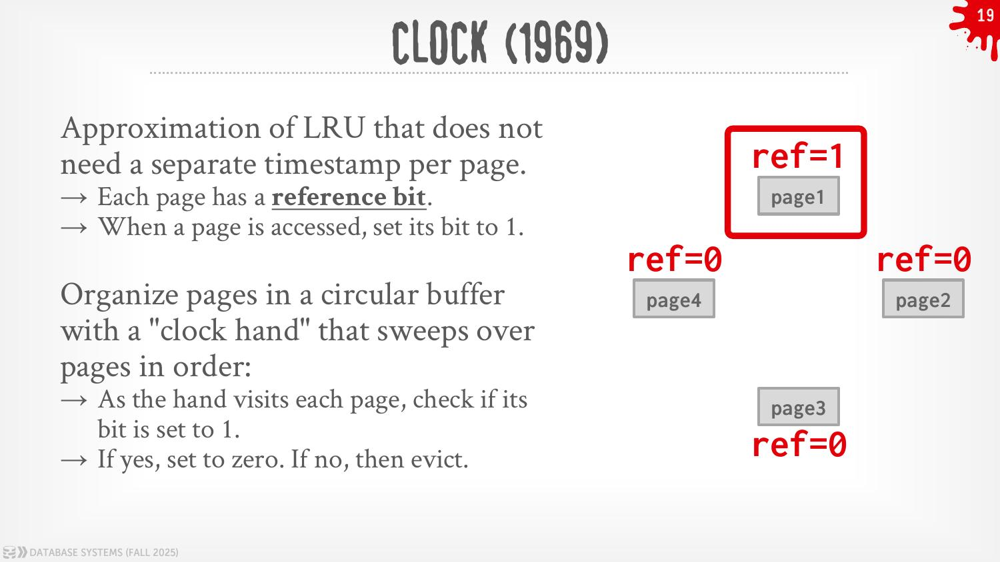
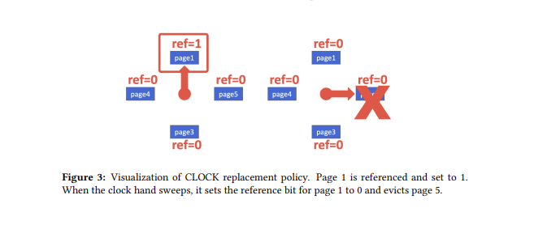
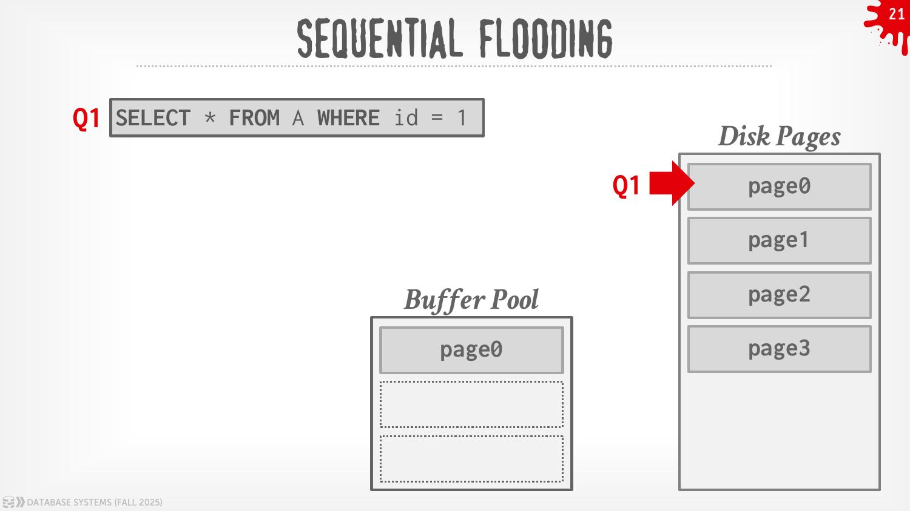
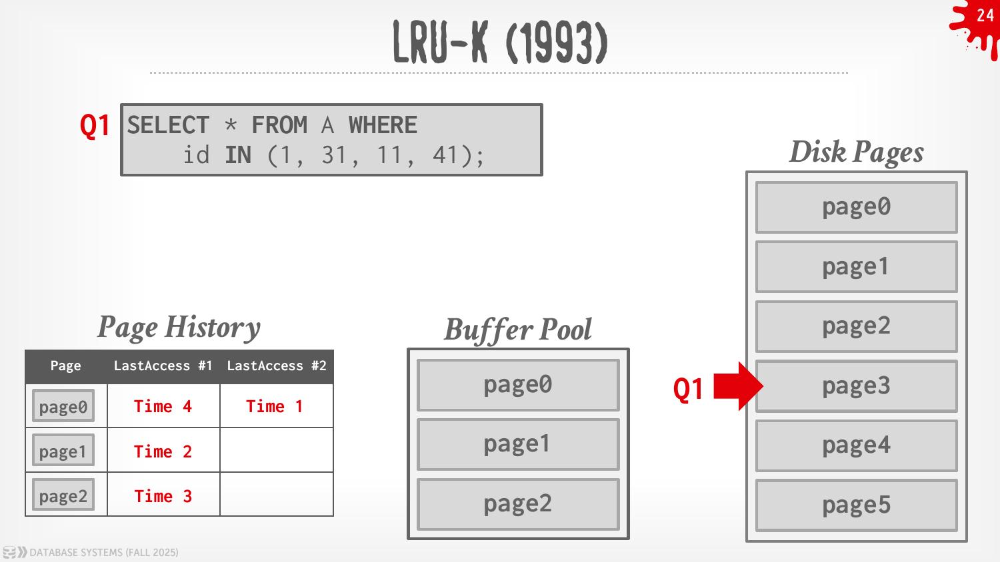
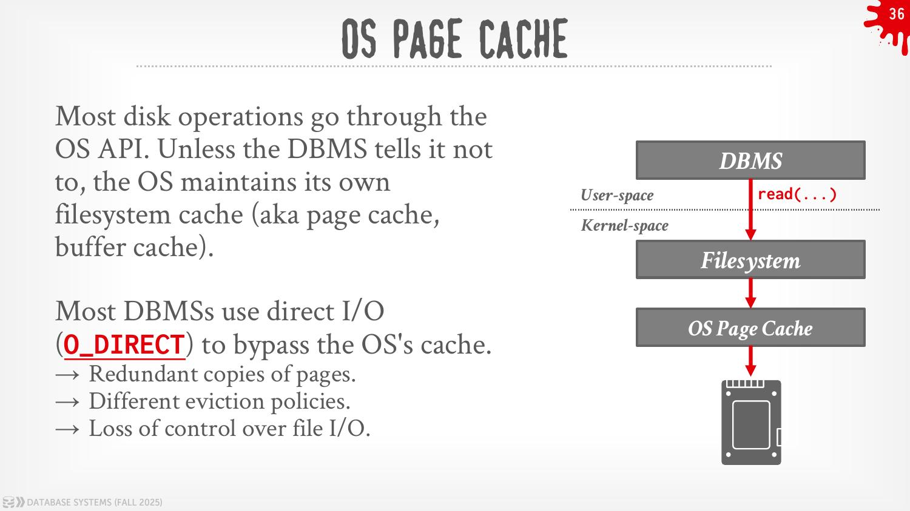
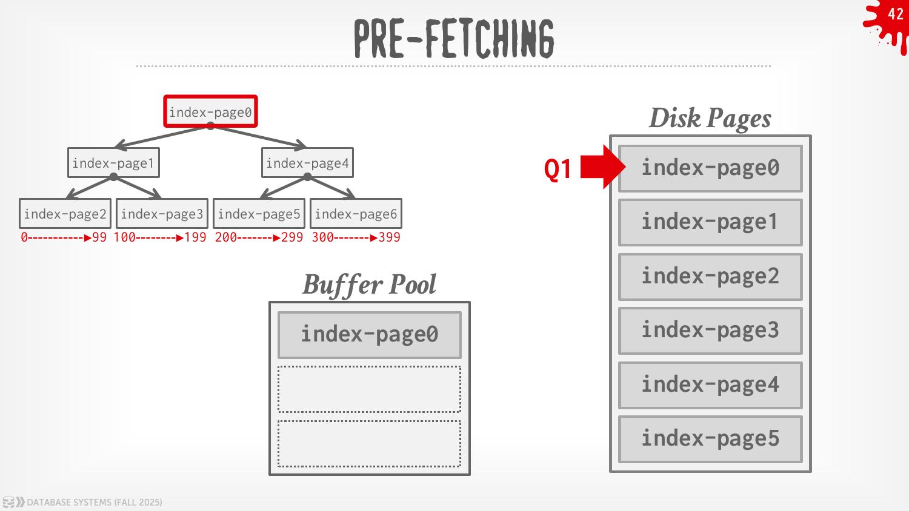
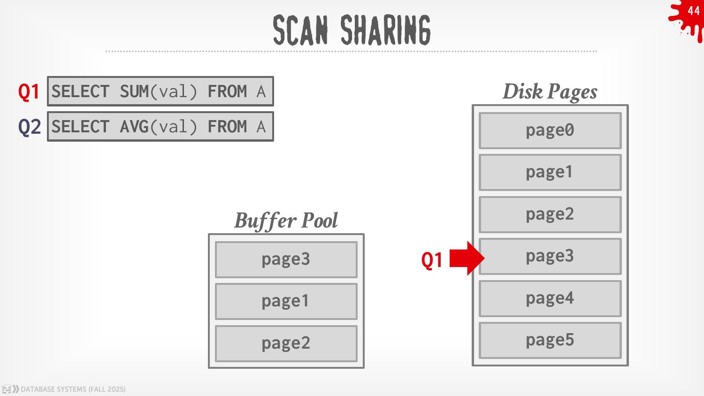

**Course:** 15-445/645 Database Systems (Fall 2025) · Carnegie Mellon University · Andy Pavlo

---

## 1. Introduction

> [!info] Focus of This Lecture
> This lecture focuses on **disk-oriented DBMS architecture** — where the primary storage location is persistent storage (HDD or SSD). This is different from an in-memory DBMS where all data lives in volatile memory.
>
> In the **Von Neumann architecture**, data must be in memory before we can operate on it. Any DBMS must efficiently move data between disk and memory — this is the job of the **Buffer Pool Manager**.

The two main things we optimize for:

| Goal | What It Means |
|------|--------------|
| **Spatial Control** | Where pages are physically placed on disk — keep frequently co-accessed pages physically close together to help prefetching |
| **Temporal Control** | When pages are loaded into memory and when they are written back — minimize stalls from waiting on disk reads |

> [!important] The Illusion
> From the DBMS's perspective, it should *appear* as if the entire database resides in memory — even if the database is far larger than available RAM. The DBMS only needs valid memory pointers to perform operations. The buffer pool manager maintains this illusion.

---

## 2. Buffer Pool

> [!note] What Is the Buffer Pool?
> The buffer pool is an **in-memory cache of pages** sitting between the database on disk and the execution engine in memory. It is a large memory region organized as an **array of fixed-size frames**.

```
📄 Screenshot this: fig1-disk-oriented-dbms.jpg
Figure 1 (PDF page 1) — Disk-Oriented DBMS diagram
Shows: Execution Engine → Buffer Pool (memory) ↔ Database File (disk pages 1–5)
Key labels: "Get page #2", "Pointer to page #2", Buffer Pool frames, Directory
```

> 
> *Figure 1: Disk-oriented DBMS — execution engine requests page #2, buffer pool fetches it from disk and returns a pointer*

### How the Buffer Pool Works

When the DBMS requests a page:
1. Buffer pool manager checks if the page is already in a **frame** (cache hit → fast).
2. If not found, the page is **read from disk** into a free frame (cache miss → slow).
3. A **pointer** to the frame in memory is returned to the execution engine.

> [!important] Write-Back vs Write-Through
> The buffer pool manager is a **write-back cache** — dirty pages are buffered in memory and NOT written to disk immediately on mutation.
> This is the opposite of a write-through cache (which immediately propagates changes to disk).
> Write-back batches writes, dramatically reducing IO.

### What the Buffer Pool Memory Is Used For

- Tuple storage and indexes
- Sorting and join buffers
- Query and dictionary caches
- Maintenance and log buffers

> [!tip] Not Everything Needs Buffer Pool Backing
> Some of the above can simply use `malloc` — they don't always need to be backed by disk or the buffer pool manager.

### Page Directory vs Page Table

| | Page Directory | Page Table |
|--|---------------|------------|
| **What it maps** | Page IDs → locations in database **files on disk** | Page IDs → frame locations in the **buffer pool in memory** |
| **Where it lives** | **On disk** (must survive restarts) | **In memory only** (rebuilt on startup) |
| **Persistence** | Must be recorded on disk — DBMS needs it on restart | Does not need to be stored on disk |
| **Caching** | Often kept in memory to reduce latency | Always in memory |

---

## 3. Buffer Pool Metadata

> [!note] Per-Page Metadata
> The buffer pool maintains metadata for each frame/page to manage access and eviction correctly.

```
📄 Screenshot this: fig2-buffer-pool-organization.jpg
Figure 2 (PDF page 2) — Buffer Pool Organization
Shows: Page Table (hash map: page1→frame, page3→frame, page2→locked frame)
       Buffer Pool frames (page1, page3, page2, frame4 empty)
       On-Disk File (page1, page2, page3, page4)
Key: page2 has a lock icon = pinned
```

> 
> *Figure 2: Buffer pool organization — Page Table maps page IDs to buffer pool frames; page2 is locked (pinned)*

### The Page Table

An in-memory hash table: **page ID → frame location in buffer pool**.

- The order of pages in the buffer pool does NOT match disk order — this indirection layer bridges the gap.
- Maintained per page:
  - **Dirty flag** — set when a thread modifies the page; indicates the page must be written back before eviction.
  - **Pin / reference counter** — number of threads currently accessing the page.
  - **Access tracking information** — which transactions/threads are accessing the page.

### Dirty Flag

Set by a thread whenever it **modifies a page**. Tells the storage manager: this page must be written to disk before it can be evicted. A clean page can be dropped immediately — free. A dirty page must be flushed — slow.

### Pin / Reference Counter

Tracks how many threads are currently accessing (reading or modifying) a page.

- A thread **increments** the counter before accessing a page.
- If a page's **pin count > 0** → the storage manager is NOT allowed to evict it.
- Pinning does NOT prevent other transactions from accessing the page concurrently.

> [!warning] Out of Memory
> If the buffer pool runs out of non-pinned pages to evict AND the buffer pool is full → the DBMS throws an **out-of-memory error**. This is why having too many concurrent long-running transactions can be dangerous.

---

## 4. OS vs DBMS — Locks vs Latches

> [!note] Critical Distinction: Locks vs Latches
> These two terms are often confused but mean very different things in a DBMS context.

```
📄 Screenshot this: slide11-locks-vs-latches.jpg
Slide 11 — Locks vs Latches
Shows clear two-box comparison with Locks (transaction duration, rollback needed)
vs Latches (operation duration, mutex, no rollback)
```

> 
> *Slide 11: Locks vs Latches — Latches are the low-level mutex equivalent inside the DBMS*

| | Locks | Latches |
|--|-------|---------|
| **Protects** | Logical contents (tuples, tables, databases) from other **transactions** | Critical sections of internal **data structures** (hash tables, memory regions) from other **threads** |
| **Duration** | Held for the entire **transaction duration** | Held only for the **duration of the operation** |
| **Rollback** | Must be able to roll back changes | Do NOT need rollback capability |
| **Visibility** | Exposed to users (you can see what locks a query holds) | Internal to DBMS, not exposed |
| **Implementation** | Complex DBMS lock manager | Simple `mutex` / conditional variables |

---

## 5. Why Not Use the OS?

> [!note] The mmap Temptation
> You might wonder: why not just use the OS's page cache / `mmap` instead of building a buffer pool? There are serious problems.

```
📄 Screenshot this: slide15-why-not-os.jpg
Slide 15 — Why Not Use the OS?
Shows: madvise/mlock/msync syscalls listed, plus two columns of databases:
Full Usage (manage their own memory): MonetDB, LMDB, LevelDB, RavenDB, QuestDB, Elasticsearch
Partial Usage (some OS cache): SQLite, WiredTiger, SQLite, influxdb
```

> 
> *Slide 15: Databases that manage memory fully vs those that partially rely on the OS page cache*

### Problems with Using the OS (`mmap`)

| Problem | Explanation |
|---------|------------|
| **Transaction Safety** | The OS can flush dirty pages **at any time** — this breaks DBMS transaction guarantees |
| **I/O Stalls** | The DBMS doesn't know which pages are in memory; OS may stall a thread on a page fault, blocking the whole query |
| **Error Handling** | Any page access can cause a `SIGBUS` signal that the DBMS must handle — complex and fragile |
| **Performance Issues** | Internal OS data structure contention; TLB shootdowns on page table updates |

### What the DBMS Does Better Than the OS

1. Flushing dirty pages to disk in the **correct order** (respects WAL, transaction commit order)
2. **Specialized prefetching** — knows future page access patterns from the query plan
3. **Better buffer replacement policies** — custom to database workload patterns
4. **Thread / process scheduling** — DBMS knows which threads are on the critical path

> [!warning] The Operating System Is Not Your Friend
> This is Pavlo's most repeated point. The DBMS almost always wants to control things itself. Using syscalls like `madvise`, `mlock`, `msync` to coerce the OS into correct behavior is "just as onerous as managing memory yourself."

---

## 6. Buffer Replacement Policies

> [!note] When Does Eviction Happen?
> When the DBMS needs to load a new page but the buffer pool is full, it must **evict** an existing page to make room. The choice of which page to evict is the **replacement policy**.
>
> Goals: correctness, accuracy, speed, low metadata overhead.
> **Remember: a pinned page can NEVER be evicted.**

### Policy 1: LRU — Least Recently Used

- Maintains a **timestamp** of when each page was last accessed.
- Evicts the page with the **oldest timestamp**.
- Can be stored in a sorted queue to speed up eviction searches.

**Problem:** Maintaining a sorted structure and large timestamps has **prohibitive overhead** at scale.

### Policy 2: CLOCK (1969)

An approximation of LRU without per-page timestamps.

```
📄 Screenshot this: slide19-clock-policy.jpg
Slide 19 — CLOCK Policy diagram
Shows: Circular buffer of pages (page1 ref=1, page2 ref=0, page3 ref=0, page4 ref=0)
Left state: page1 is accessed → ref=1 (red box)
Right state: clock hand sweeps → page1 ref set to 0 → page5 evicted (X mark)
```

> 
> *Slide 19: CLOCK policy — page1 is referenced (ref=1), clock hand sweeps and clears it to 0, then evicts page5 which has ref=0*

Also see the PDF version:

```
📄 Screenshot this: fig3-clock-policy.jpg
Figure 3 (PDF page 4) — CLOCK replacement policy
Same content but in lecture note format
```

> 
> *Figure 3: CLOCK replacement policy — circular buffer with clock hand; ref=1 gets cleared to 0, ref=0 gets evicted*

**How CLOCK works:**

```
Organize pages in a circular buffer with a "clock hand"

On eviction request:
  sweep the hand →
    if page ref bit = 1 → set to 0, move hand forward
    if page ref bit = 0 → EVICT this page, load new page here, move hand forward

On page access:
  set that page's ref bit = 1

Clock remembers its position between evictions.
```

### Problems with LRU and CLOCK

#### Sequential Flooding

```
📄 Screenshot this: slide21-sequential-flooding.jpg
Slide 21 — Sequential Flooding
Shows: Q1 (SELECT * FROM A WHERE id=1) scanning pages sequentially
Buffer Pool fills: page0, page1, page2, page3 — evicting potentially useful pages
```

> 
> *Slide 21: Sequential flooding — a full table scan fills the buffer pool with pages that won't be reused, evicting hot pages*

- A **sequential scan** reads many pages quickly → fills the buffer pool → evicts pages from other queries.
- For this workload, the **most recently used** page is actually the best to evict (it won't be needed again).
- LRU/CLOCK do the opposite — they evict the oldest page, which may be a hot page from another query.

#### LFU — Least Frequently Used

- Maintains an **access count** per page; evicts the page with the lowest count.
- Problem: **ignores time** — may retain stale pages that were popular long ago but aren't anymore.

### Policy 3: LRU-K

```
📄 Screenshot this: slide24-lru-k.jpg
Slide 24 — LRU-K
Shows: Page History table (page0: LastAccess#1=Time4, LastAccess#2=Time1; page1: Time2; page2: Time3)
Buffer Pool with page0, page1, page2
Disk Pages: page0-page5, Q1 arrow pointing to page3
```

> 
> *Slide 24: LRU-K — tracks the last K accesses per page to predict future access patterns*

- Tracks the **history of the last K references** as timestamps.
- Computes the **interval between subsequent accesses** to predict next access time.
- Evicts the page whose **K-th most recent access** is oldest (i.e., least likely to be needed soon).
- Requires a **ghost cache** of recently evicted pages to prevent thrashing.
- Higher storage overhead than LRU but much better accuracy.

**MySQL's LRU-2 approximation:** A single linked list with two entry points:
- If page accessed and already in the **old list** → move to start of **young queue**
- If page is new → put at start of **old list**
- Evictions always taken from end of the old list.

### Policy 4: Localization Per Query

- The DBMS chooses which pages to evict on a **per-query / per-transaction** basis.
- Minimizes "pollution" of the buffer pool from any single query.
- Postgres does something similar: each query has its own small ring buffer for sequential scans.

### Policy 5: Priority Hints

- Transactions tell the buffer pool **whether a page is important** based on execution context.
- E.g., an index root page is accessed constantly → hint to keep it pinned or at highest priority.

### Policy 6: ARC — Adaptive Replacement Cache

Developed by IBM Research. Dynamically adjusts between recency (LRU) and frequency (LFU) based on workload.

**Four lists:**

| List | Contents |
|------|---------|
| **T1 (Recency)** | Pages accessed **once** recently |
| **T2 (Frequency)** | Pages accessed **at least twice** |
| **B1 (Ghost of T1)** | Recently evicted pages from T1 (metadata only, no data) |
| **B2 (Ghost of T2)** | Recently evicted pages from T2 (metadata only, no data) |

**Target size parameter `p`:** Controls how much space T1 gets vs T2 — adjusts dynamically.

**ARC Lookup Protocol:**

| Event | Action |
|-------|--------|
| Cache miss, page in **B1** (ghost of T1) | Increase `p` (favor recency) → move page into T2 |
| Cache miss, page in **B2** (ghost of T2) | Decrease `p` (favor frequency) → move page into T2 |
| Cache miss, page not in cache or ghost lists | If T1+B1 full → evict from B1 or T1; If T2+B2 full → evict from B2 or T2; Insert into T1 |

---

## 7. Dirty Pages

When a page is modified in memory it becomes **dirty**. Two eviction paths:

| Path | Condition | Cost |
|------|-----------|------|
| **Fast path** | Page is **not dirty** | Simply drop the frame — no disk write needed |
| **Slow path** | Page is **dirty** | Must write the page back to disk before eviction |

### Background Writing

To avoid the slow path at eviction time, the DBMS can use **background writing**:

- A background thread **periodically walks the page table** and writes dirty pages to disk.
- Once a dirty page is safely written, the DBMS can either **evict it** or simply **unset the dirty flag**.
- This turns write cost from synchronous (blocking eviction) to asynchronous (background).

---

## 8. Disk I/O and OS Page Cache

> [!note] How Disk IO Works
> Most disk operations go through the OS API. The OS tries to maximize disk bandwidth by **reordering and batching** I/O requests — but it doesn't know which requests are more important.

```
📄 Screenshot this: slide36-os-page-cache.jpg
Slide 36 — OS Page Cache
Shows: DBMS (user-space) → read(...) → Filesystem (kernel-space) → OS Page Cache → Disk
Key point: without O_DIRECT, pages go through OS page cache = redundant copies
```

> 
> *Slide 36: OS page cache flow — DBMS read() call goes through filesystem and OS page cache before hitting disk*

### The DBMS's Internal IO Queue

The DBMS maintains internal queues to track page read/write requests from the entire system. Priorities are determined by:

- **Sequential vs Random I/O** — sequential reads can be batched and prefetched
- **Critical path vs Background task** — user-facing query vs maintenance job
- **Data type** — Table data vs Index vs Log vs Ephemeral (temp tables)
- **Transaction information** — high-priority transactions get priority IO
- **User-based SLAs** — latency commitments for certain query classes

### Direct I/O — Bypassing the OS Cache

Most DBMSs use **Direct I/O** (`O_DIRECT` flag) to bypass the OS's page cache:

| Without O_DIRECT | With O_DIRECT |
|-----------------|---------------|
| Pages go through OS page cache | Pages go directly to/from DBMS buffer pool |
| Redundant copies of pages in memory | No redundant copies |
| OS and DBMS have different eviction policies → conflict | DBMS fully controls eviction |
| OS interferes with DBMS IO ordering | DBMS controls IO ordering |

**Exception:** PostgreSQL uses the OS's page cache (does NOT use O_DIRECT). It relies on OS caching as a second layer.

> [!warning] fsync Silent Errors
> `fsync` by default has **silent errors** — on error it marks the page as clean even if the write didn't succeed. This is a known source of data corruption bugs. The DBMS must check return values carefully.

---

## 9. Buffer Pool Optimizations

### Pre-Fetching

```
📄 Screenshot this: slide42-prefetching-index.jpg
Slide 42 — Pre-Fetching (Index Scan)
Shows: B-Tree structure (index-page0 root → index-page1, index-page4 → leaves)
Buffer Pool: only index-page0 loaded so far
Disk Pages: index-page0 through index-page5 visible
Q1 arrow pointing to index-page0
Key insight: DBMS knows from query plan it will need index-page1, index-page2 next → prefetch them
```

> 
> *Slide 42: Pre-fetching for index scan — DBMS reads the query plan to predict which pages will be needed next and loads them before they're requested*

- The DBMS can prefetch pages based on the **query plan** — it knows future access patterns.
- Sequential scan → prefetch next N pages ahead.
- Index scan → prefetch likely leaf pages based on B-Tree traversal path.
- Some DBMSs prefetch pages to **fill empty frames at startup** to warm the buffer pool.

### Scan Sharing (Synchronized Scans)

```
📄 Screenshot this: slide44-scan-sharing.jpg
Slide 44 — Scan Sharing
Shows: Q1 (SELECT SUM(val) FROM A) and Q2 (SELECT AVG(val) FROM A) running concurrently
Buffer Pool: page3, page1, page2 loaded (Q1 is at page3)
Q2 attaches to Q1's cursor mid-scan and shares the already-loaded pages
```

> 
> *Slide 44: Scan sharing — Q2 attaches to Q1's in-progress scan, sharing already-loaded pages instead of starting its own full scan*

- If one query is scanning a table and another query starts the same scan, the second query can **attach to the first query's cursor**.
- The second query **shares** the pages already loaded by the first — no redundant disk IO.
- Also called **synchronized scans**.
- Different from result caching — the queries still run independently but share the buffer pool pages.

### Buffer Pool Bypass

- Some queries (especially sequential scans) can use a **local buffer** that does NOT go through the main buffer pool.
- This avoids polluting the shared buffer pool with pages that won't be reused (the sequential flooding problem).
- Postgres calls this a **ring buffer** for sequential scans.

---

## 10. Multiple Buffer Pools

> [!note] Why Multiple Pools?
> A single buffer pool becomes a bottleneck when many threads compete for the same lock on the page table. Multiple buffer pools reduce contention.

The DBMS can have multiple buffer pools for different purposes:

- **Per-database** buffer pool — each database gets its own pool
- **Per-page-type** buffer pool — separate pools for tuple pages, index pages, etc.
- **Partitioned** pool — hash page ID to determine which pool it belongs to

### Mapping Pages to Pools

**Object ID:** Embed a record ID in page table, map record ID → buffer pool.

**Hashing:** Hash the page ID to select a buffer pool partition. Distributes load evenly.

---

## 11. Summary / Checklist

> [!success] What You Must Know Cold
> - ✅ The **buffer pool** is an array of fixed-size **frames** in memory — a write-back cache between disk and the execution engine
> - ✅ **Spatial control** = keep related pages close on disk; **Temporal control** = minimize stalls by smart page loading/eviction
> - ✅ The **page table** (in-memory hash: pageID → frame) is different from the **page directory** (on-disk: pageID → file location)
> - ✅ Each frame has a **dirty flag** (must flush before evict) and a **pin counter** (pinned = cannot evict)
> - ✅ **Locks** protect logical DB contents for transaction duration; **Latches** protect internal data structures for operation duration (mutex)
> - ✅ Don't use `mmap` — the OS doesn't know transaction semantics, can stall on page faults, causes SIGBUS, has TLB contention
> - ✅ **LRU** evicts oldest timestamp; **CLOCK** approximates LRU with a reference bit and circular sweep
> - ✅ **Sequential flooding**: full table scans trash the buffer pool — LRU and CLOCK both fail here
> - ✅ **LRU-K** tracks last K accesses to predict future access — more accurate but higher overhead
> - ✅ **ARC** dynamically balances recency (T1) and frequency (T2) using ghost lists and target size `p`
> - ✅ **Background writing** asynchronously flushes dirty pages — avoids blocking evictions at query time
> - ✅ Most DBMSs use **Direct I/O** (`O_DIRECT`) to bypass the OS page cache — except PostgreSQL which uses it
> - ✅ **Pre-fetching** uses the query plan to load pages before they're requested
> - ✅ **Scan sharing** lets multiple queries share a single in-progress table scan
> - ✅ A **write-back cache** buffers dirty pages; a **write-through cache** immediately writes to disk

---

## 12. Tips

> [!tip] Buffer Pool Size Is Critical
> The buffer pool size is one of the most impactful configuration parameters. Too small → constant evictions and cache misses. Too large → memory pressure on other processes. In PostgreSQL, `shared_buffers` is the key parameter (default 128MB — almost always too small for production). A common starting point: 25% of available RAM.

> [!tip] Understand Your Workload Before Tuning
> OLTP workloads (short transactions, random point lookups) benefit from LRU-style policies. OLAP workloads (full scans, aggregations) suffer from sequential flooding — use buffer pool bypass or ensure sequential scan ring buffers are enabled.

> [!tip] Backend / Node.js Notes
> When using PostgreSQL with Node.js (`pg`, Prisma, Drizzle): connection pool size × query concurrency must fit within `shared_buffers`. Running 100 concurrent connections all doing full-table scans will trash your buffer pool. Use `EXPLAIN (BUFFERS)` to see buffer hits vs misses for any query — this is the fastest way to understand if your buffer pool is too small.

> [!tip] Watch the Dirty Page Ratio
> In PostgreSQL, `pg_stat_bgwriter` shows how often the background writer is flushing dirty pages vs checkpoint flushes. A very high `buffers_clean` rate means your buffer pool is under pressure — pages are being dirtied and flushed faster than your `bgwriter_delay` allows. Tune `shared_buffers` and `checkpoint_completion_target`.

> [!tip] Multiple Buffer Pools in Practice
> MySQL InnoDB has a `innodb_buffer_pool_instances` parameter — the buffer pool is divided into multiple independent pools to reduce mutex contention on the page table. For large buffer pools (> 1 GB), use at least 4–8 instances.

---

## 13. Practice Exercises

### Section A — Buffer Pool Fundamentals

```
-- 1. What is the difference between the page directory and the page table?
--    Where does each live and what does each map?

-- 2. A buffer pool has 4 frames. Pages A, B, C, D are loaded in that order.
--    Page A is then accessed again. The buffer pool is full and page E needs to load.
--    Which page is evicted under LRU? Under CLOCK (assume all ref bits=0 except A)?

-- 3. What is a "dirty flag" on a buffer pool frame? When is it set and
--    what does it mean for eviction?

-- 4. What does the pin counter track? What happens if the buffer pool is full
--    and all pages are pinned?

-- 5. Explain the difference between a write-back cache and a write-through cache.
--    Which does the buffer pool use and why?
```

**Answers:**

```
-- 1. Page Directory: maps page IDs → file locations ON DISK. Persisted to disk
--    so the DBMS can find pages after a restart. Must be durable.
--    Page Table: maps page IDs → frame locations IN THE BUFFER POOL (memory).
--    In-memory only hash table. Rebuilt on startup. Not persisted to disk.

-- 2. LRU: Evict D (least recently used — D was accessed at time 4, B at 2,
--    C at 3, A was re-accessed most recently).
--    CLOCK: All bits are 0 (except A=1 from recent access). Clock hand sweeps:
--    A → set to 0; B → ref=0 → EVICT B (assuming hand starts at B after A).

-- 3. Dirty flag = set whenever a thread modifies a page in the buffer pool.
--    Eviction:
--    - Clean page (dirty=0): simply drop the frame, no disk write needed (fast)
--    - Dirty page (dirty=1): must write page back to disk before evicting (slow)
--    Background writer proactively flushes dirty pages to avoid slow path at evict time.

-- 4. Pin counter = number of threads currently accessing (reading or modifying)
--    a given page. A thread increments it before access, decrements after.
--    If pin > 0 → storage manager cannot evict that page.
--    If all pages are pinned and buffer pool is full → OUT-OF-MEMORY ERROR is thrown.

-- 5. Write-through: every modification immediately propagates to disk. Safe but slow
--    (every write = a disk IO).
--    Write-back: modifications stay in memory (dirty page). Disk write is deferred.
--    Multiple writes to the same page = only one eventual disk flush.
--    Buffer pool uses write-back: batches writes, dramatically reduces IO overhead.
```

---

### Section B — Replacement Policies

```
-- 6. Describe the CLOCK replacement policy step by step.
--    What is the reference bit and when is it set/cleared?

-- 7. What is "sequential flooding" and why do LRU and CLOCK fail to handle it?
--    Give a concrete example with a query.

-- 8. How does LRU-K improve over basic LRU? What extra data does it track?
--    What is a "ghost cache" and why does LRU-K need one?

-- 9. Describe the four lists in ARC and explain what the target size parameter p does.

-- 10. You have a workload that is 80% repeated lookups of the same 100 rows
--     and 20% occasional full table scans on a large table.
--     Which replacement policy would handle this best and why?
```

**Answers:**

```
-- 6. CLOCK policy:
--    - Pages are organized in a circular buffer with a "clock hand"
--    - Each page has a reference bit (0 or 1)
--    - When a page is ACCESSED → set its reference bit to 1
--    - When EVICTION is needed → sweep the clock hand:
--        if ref bit = 1 → set to 0, advance hand (give it a second chance)
--        if ref bit = 0 → EVICT this page, load new page here, advance hand
--    - Clock remembers its position between evictions (doesn't reset to start)

-- 7. Sequential flooding: a full table scan reads every page of a large table
--    sequentially, rapidly filling the buffer pool.
--    Example: SELECT * FROM orders (10M rows, 333K pages)
--    LRU/CLOCK evict the "oldest" pages — but those are the hot, frequently
--    accessed pages from other queries (e.g., user table, product catalog).
--    After the scan, the buffer pool is full of ORDER pages that will never be
--    accessed again, and all the useful hot pages were evicted.
--    Fix: the most RECENTLY used page is often the best to evict during a seq scan.

-- 8. LRU-K tracks the LAST K ACCESS TIMESTAMPS per page (not just the most recent).
--    It computes the interval between the K-th last and (K-1)-th last access to
--    estimate future access frequency. Pages accessed in a regular pattern are
--    kept; rarely accessed pages are evicted.
--    Ghost cache: a metadata-only record of recently EVICTED pages (no actual data).
--    When an evicted page is requested again → ghost cache shows "this was evicted
--    recently" → restore it immediately and learn from the eviction mistake.
--    Without ghost cache, LRU-K would have no history for recently evicted pages.

-- 9. ARC four lists:
--    T1 (Recency):    pages accessed ONCE recently — candidates for promotion
--    T2 (Frequency):  pages accessed TWICE OR MORE — kept longer, more valuable
--    B1 (Ghost of T1): metadata of recently evicted T1 pages (no actual data)
--    B2 (Ghost of T2): metadata of recently evicted T2 pages (no actual data)
--    Target size p: how much space T1 gets (vs T2).
--    If B1 has many hits → workload is recency-biased → increase p (give T1 more space)
--    If B2 has many hits → workload is frequency-biased → decrease p (give T2 more space)
--    ARC self-tunes p dynamically based on which ghost list gets hits.

-- 10. Best policy: ARC (or LRU-K with K=2)
--    The 80% repeated lookups → frequency pattern → T2 in ARC protects them
--    The 20% sequential scans → flood T1 but ghost list B1 tracks evictions
--    → ARC adjusts p to protect T2 (frequency list) from scan pollution
--    LRU or CLOCK would let the scans pollute the pool and evict the hot rows.
--    Alternative: localization per query (scan uses ring buffer, doesn't touch main pool).
```

---

### Section C — OS, Direct IO, and Optimizations

```
-- 11. List four problems with using mmap for a DBMS buffer pool.

-- 12. What is Direct I/O (O_DIRECT) and why do most DBMSs use it?
--     Which major database does NOT use it and what does it use instead?

-- 13. What is pre-fetching and how does the DBMS know which pages to prefetch?
--     Give one example for a sequential scan and one for an index scan.

-- 14. Explain scan sharing (synchronized scans). How is it different from
--     result caching? What kind of queries benefit most?

-- 15. What is background writing? Why is it better to flush dirty pages
--     in the background rather than during eviction?
```

**Answers:**

```
-- 11. Four problems with mmap:
--     1. Transaction Safety: OS can flush dirty pages at ANY time, violating
--        the DBMS's write ordering (WAL must be written before data page)
--     2. I/O Stalls: DBMS doesn't know what's in memory; OS may stall a thread
--        on a page fault, blocking query execution with no way to continue other work
--     3. Error Handling: any page access can trigger SIGBUS; complex for DBMS to handle
--     4. Performance: TLB shootdowns from OS page table updates; OS data structure
--        contention; OS eviction policy conflicts with DBMS's needs

-- 12. Direct I/O (O_DIRECT): a flag on file open/read that tells the OS to bypass
--     its own page cache and write/read directly between the DBMS buffer pool and disk.
--     DBMSs use it because:
--     - Avoids redundant copies of pages (OS cache + DBMS buffer pool = double memory)
--     - DBMS controls eviction, not the OS (no conflicting policies)
--     - DBMS controls IO ordering (critical for WAL correctness)
--     PostgreSQL does NOT use O_DIRECT — it relies on the OS page cache as a
--     second caching layer on top of shared_buffers.

-- 13. Pre-fetching: loading pages into the buffer pool BEFORE they are explicitly
--     requested, based on query plan knowledge.
--     Sequential scan example: query does SELECT * FROM orders (full scan).
--     DBMS knows next N pages will be needed → issues async reads for pages
--     p+1, p+2, ... p+N while processing page p. When p+1 is needed, it's
--     already in the buffer pool.
--     Index scan example: query uses B-Tree index on employee_id > 5000.
--     DBMS reads root → knows it will traverse to right subtree →
--     pre-fetches index-page4, index-page5, index-page6 (the right branch leaves).

-- 14. Scan sharing: if Q1 is scanning table A and Q2 also needs to scan A,
--     Q2 attaches to Q1's cursor mid-scan and shares the already-loaded pages.
--     Both queries process the same pages together instead of Q2 starting over.
--     Different from result caching:
--     - Result cache: store the final output (rows/aggregates) and return it directly
--     - Scan sharing: queries still execute independently but share the PAGE-LEVEL IO
--     - Result cache hits require identical queries; scan sharing works for any
--       concurrent queries on the same table
--     Best for: aggregate queries (SUM, AVG, COUNT) on the same large table,
--     running concurrently (e.g., multiple dashboards hitting the same fact table).

-- 15. Background writing: a background thread periodically scans the page table
--     and writes dirty pages to disk proactively, before eviction is needed.
--     Benefits vs writing at eviction time:
--     - At eviction: a query is BLOCKED waiting for the dirty page to flush before
--       it can load the new page it needs → adds latency to user-facing queries
--     - Background: the flush happens asynchronously while the query is doing other
--       work → when eviction is needed, the page is already clean → fast path
--     Also allows batching of dirty page writes → better disk IO efficiency.
```

---

## 14. Image Screenshot Guide

Here is every image you need to screenshot from the PDFs and where to place them in these notes:

| # | File Name | Source | Content | Section Used |
|---|-----------|--------|---------|-------------|
| 1 | `fig1-disk-oriented-dbms.jpg` | PDF 1, Page 1 | Disk-Oriented DBMS diagram (Execution Engine ↔ Buffer Pool ↔ Disk) | §2 Buffer Pool |
| 2 | `fig2-buffer-pool-organization.jpg` | PDF 1, Page 2 | Page Table → Buffer Pool frames, On-Disk File, locked page icon | §3 Metadata |
| 3 | `fig3-clock-policy.jpg` | PDF 1, Page 4 | CLOCK circular buffer: ref=1 cleared to 0, page5 evicted | §6 Replacement |
| 4 | `slide6-disk-oriented-dbms-large.jpg` | PDF 2, Slide 6 | Larger cleaner version of disk-oriented DBMS with "Frames" label | §2 Buffer Pool |
| 5 | `slide11-locks-vs-latches.jpg` | PDF 2, Slide 11 | Side-by-side Locks vs Latches comparison boxes | §4 Locks |
| 6 | `slide15-why-not-os.jpg` | PDF 2, Slide 15 | madvise/mlock/msync + database logos (Full vs Partial OS usage) | §5 OS |
| 7 | `slide19-clock-policy.jpg` | PDF 2, Slide 19 | CLOCK circular buffer with ref bits, clock hand animation | §6 Replacement |
| 8 | `slide21-sequential-flooding.jpg` | PDF 2, Slide 21 | Sequential flooding: Q1 scan fills buffer pool step by step | §6 Problems |
| 9 | `slide24-lru-k.jpg` | PDF 2, Slide 24 | LRU-K Page History table + Buffer Pool + Disk Pages | §6 LRU-K |
| 10 | `slide36-os-page-cache.jpg` | PDF 2, Slide 36 | DBMS → read() → Filesystem → OS Page Cache → Disk flow | §8 Disk IO |
| 11 | `slide42-prefetching-index.jpg` | PDF 2, Slide 42 | B-Tree index pre-fetching: index-page0 through index-page6 | §9 Pre-fetching |
| 12 | `slide44-scan-sharing.jpg` | PDF 2, Slide 44 | Q1 + Q2 sharing buffer pool pages (SUM and AVG on same table) | §9 Scan Sharing |

> [!tip] How to Take Screenshots
> Open each PDF in your PDF viewer. The slide deck (PDF 2) has 129 slides. The slide number is shown in the **top-right corner** of each slide. Navigate to the slide number shown above and screenshot just the slide content area (not the browser/viewer chrome). For PDF 1 (the lecture notes), screenshot just the figure area cropped tightly around each diagram.

---

*Sources: CMU 15-445/645 Database Systems Lecture #04 — Memory & Disk Management · Andy Pavlo · Fall 2025 · https://15445.courses.cs.cmu.edu/fall2025/*