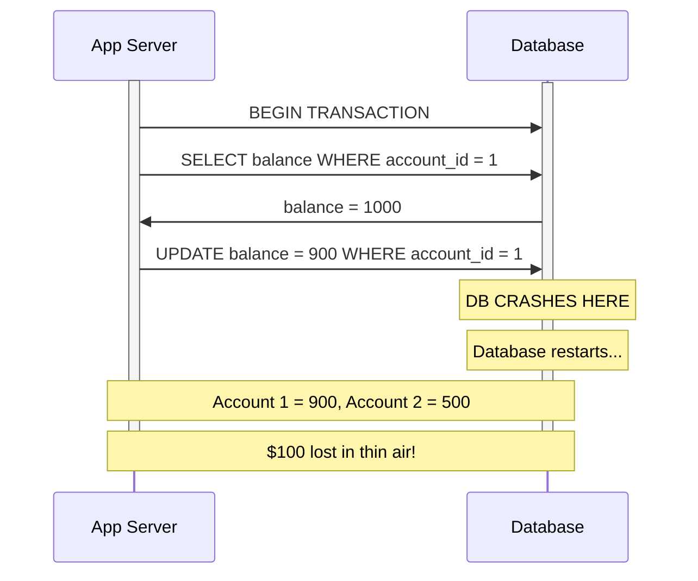
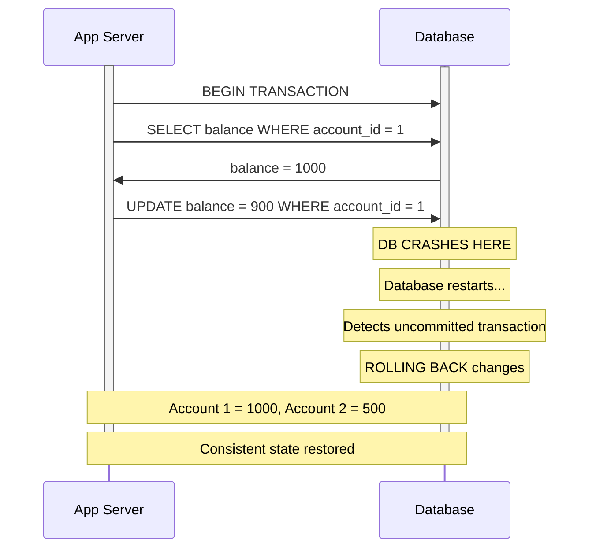
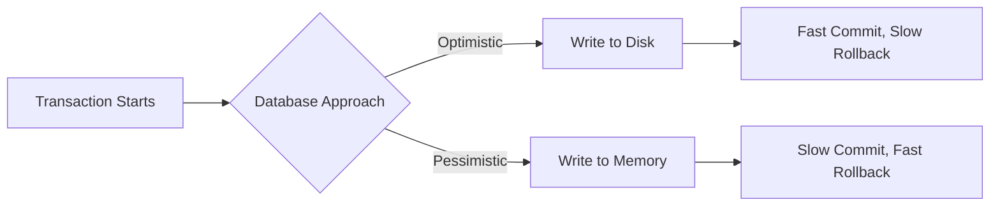

### What is Atomicity?
- All queries in a transaction must succeed. If one query fails, all queries are **rolled back**
- Think of it like an **atom** — it cannot be split
- All queries within a transaction are treated as a **single unit of work**
- Atomicity is one of the four ACID properties and applies to **any** database system — relational, NoSQL, graph, time-series etc.

##### What happens if one query fails?
A query can fail for many reasons:
- **Failed constraint** — balance goes negative, duplicate primary key
- **Invalid SQL syntax**
- **Database crash** mid-transaction

Even if you had **100 successful queries** in the same transaction, that **one failure** should roll back the entire transaction immediately. That's the rule of atomicity.

##### What if the database crashes mid-transaction?
- You can't really roll back because the database itself went down
- The database didn't even give you a chance to issue a `ROLLBACK` command
- Once the database **restarts**, it will detect that there was a running transaction that was never committed
- The database is now responsible to **clean up** — it will rollback all uncommitted changes

---

### Example — Money Transfer

**Scenario:** Send $100 from Account 1 to Account 2

| account_id | balance |
|------------|---------|
| 1          | 1000    |
| 2          | 500     |

```sql
BEGIN TRANSACTION;
-- Step 1: Check balance
SELECT balance FROM accounts WHERE account_id = 1;
-- balance = 1000, so 1000 > 100, proceed

-- Step 2: Debit from sender
UPDATE accounts SET balance = balance - 100 WHERE account_id = 1;

-- Step 3: Credit to receiver
UPDATE accounts SET balance = balance + 100 WHERE account_id = 2;

COMMIT;
```

---

### Without Atomicity — Data Inconsistency

What if the database **crashes after step 2** but before step 3?



| account_id | balance | status |
|------------|---------|--------|
| 1          | 900     | debited |
| 2          | 500     | NOT credited |

**$100 just vanished.** This is a badly implemented database that doesn't support atomicity. The data is now **inconsistent** — we lost actual money because of technology.

**Lack of atomicity leads to inconsistencies.**

---

### With Atomicity — Automatic Rollback

Same scenario but now the database **supports atomicity**:



| account_id | balance | status |
|------------|---------|--------|
| 1          | 1000    | rolled back to original |
| 2          | 500     | no change |

The database detected the incomplete transaction on restart and **cleaned up the garbage** by rolling back the debit. No money lost.

---

### How Databases Handle Transactions Internally

Different databases take different approaches to writing data during a transaction. **There is no right or wrong — it's always a trade-off.**

##### Approach 1 — Optimistic (Write to Disk)
- During the transaction, queries **actually write to disk** immediately
- The database **assumes** you are going to commit
- **COMMIT is fast** — just writes one bit saying "this transaction is committed"
- **ROLLBACK is slow** — has to go undo all the changes already written to disk

##### Approach 2 — Pessimistic (Write to Memory)
- During the transaction, queries only **write to memory**
- Nothing touches the disk until you commit
- **Queries execute fast** because memory is fast
- **COMMIT is slow** — has to flush everything from memory to disk
- **ROLLBACK is fast** — just discard the in-memory changes



---

### Rollback on Restart — Real World

When a database crashes mid-transaction and restarts:
- Some databases **won't let you use the database** until the rollback is complete
- In newer versions, they allow you to work on **other tables/databases** while the affected one is rolling back
- But the **CPU and memory get hammered** during rollback

**Long running transactions are generally a bad idea** because:
- If they crash, rollback takes a very long time
- Rollbacks can take **over an hour** for long transactions (seen in SQL Server in production)
- The database might be completely unavailable during this time

---

### Summary
- Atomicity = transaction is **one unit of work** that cannot be split
- If any query fails → **everything rolls back**
- If the database crashes mid-transaction → on restart, the database **automatically rolls back** uncommitted changes
- Lack of atomicity → **data inconsistency**
- Long transactions = bad idea because rollback can take very long
- Databases either write to **disk** (fast commit) or **memory** (fast rollback) — always a trade-off
