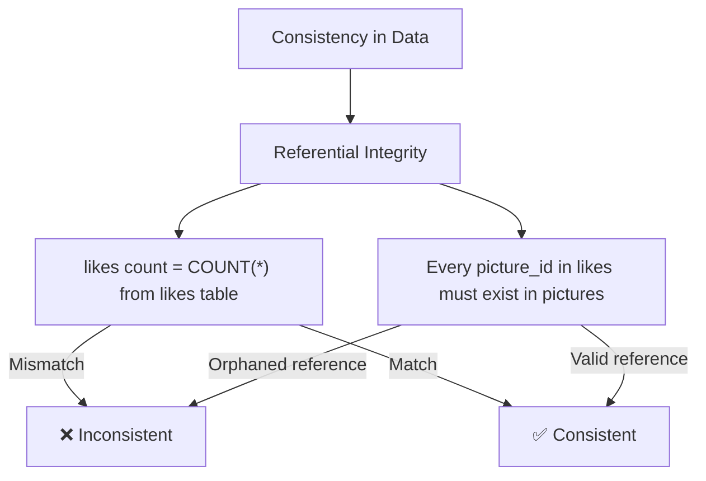
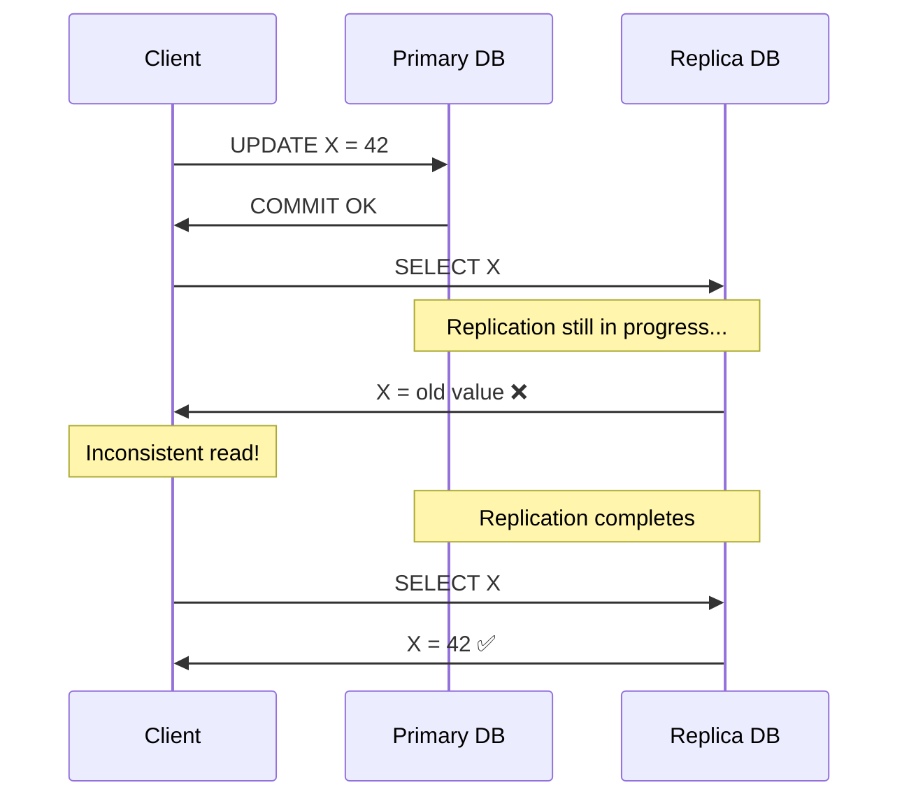

### What is Consistency?
- Consistency means the data in your database is **correct and not corrupt** based on the rules you define
- It's the ACID property most often **traded off** — NoSQL databases sacrifice consistency for speed, scalability, and performance
- Consistency is really **two things**:
  1. **Consistency in Data** — is the persisted data correct and valid?
  2. **Consistency in Reads** — when I read, do I get the latest committed value?

---

### Consistency in Data

- Defined by **you** (the developer / DBA) — the rules you set for your data model
- Primarily enforced through **referential integrity** and **foreign keys**
- Even NoSQL has referential integrity — a document referencing another document **must** have that reference be valid
- **Atomicity protects consistency** — if a crash leaves a half-finished transaction, the data is corrupt
- **Isolation protects consistency** — wrong isolation levels can give you inconsistent views of the data

##### Example — Instagram Likes Model

**Pictures Table:**

| id | blob   | likes |
|----|--------|-------|
| 1  | 0xaabb | 2     |
| 2  | 0xccdd | 1     |

**Likes Table (who liked what):**

| user   | picture_id |
|--------|------------|
| John   | 1          |
| Edmund | 1          |
| John   | 2          |

- The `likes` count in the pictures table **must equal** `SELECT COUNT(*) FROM likes WHERE picture_id = ?`
- Picture 1 has `likes = 2` and there are 2 rows in the likes table → ✅ **Consistent**

##### Spotting Inconsistencies

| id | blob   | likes |
|----|--------|-------|
| 1  | 0xaabb | **5** |
| 2  | 0xccdd | 1     |

| user   | picture_id |
|--------|------------|
| John   | 1          |
| Edmund | 1          |
| John   | 2          |
| Edmund | **4**      |

Two inconsistencies:
1. Picture 1 says **5 likes** but only **2 records** exist in the likes table → count mismatch
2. Edmund liked picture **4** but picture 4 **doesn't exist** → orphaned reference (broken referential integrity)

> **Note:** Some applications (like Instagram) intentionally allow the likes count to be slightly out of sync for performance — nobody is going to manually verify Kylie Jenner's 1.8 million likes. But the **rules you define** determine what "consistent" means for your system.

---

### Consistency in Reads

- Your data on disk might be perfectly consistent, but **reads can return stale values**
- This happens when you have **multiple database instances** (primary + replicas)
- You write to the primary → it syncs to replicas → if you read from a replica **before sync completes**, you get an **old value**
- Both relational and NoSQL databases suffer from this

---

### Eventual Consistency

- A term meaning: **"I'm not consistent right now, but I will be eventually"**
- As the replication process completes, all replicas converge to the same value
- **Only applies to consistency in reads** — if your data itself is corrupt (broken referential integrity), there is **no eventual consistency** that will fix it
- Both relational and NoSQL databases can exhibit eventual consistency

| Replication Type | Consistency | Speed |
|-----------------|-------------|-------|
| **Synchronous** | Strong consistency (all replicas updated before commit returns) | Slower |
| **Asynchronous** | Eventual consistency (replicas catch up in the background) | Faster |

---

### Summary
- Consistency has **two dimensions**: consistency in data (referential integrity) and consistency in reads (stale replicas)
- Consistency in data is **defined by you** — foreign keys, constraints, application-level rules
- **Atomicity and Isolation** both protect data consistency — without them, data can become corrupt
- Consistency in reads is affected by **replication lag** — writing to primary but reading from an out-of-sync replica
- **Eventual consistency** only heals read inconsistency — corrupt data stays corrupt unless you fix it
- It's always a **trade-off**: strong consistency = slower, eventual consistency = faster
