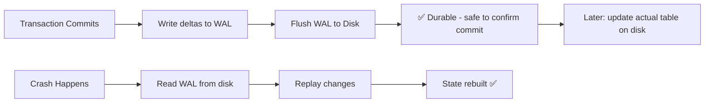
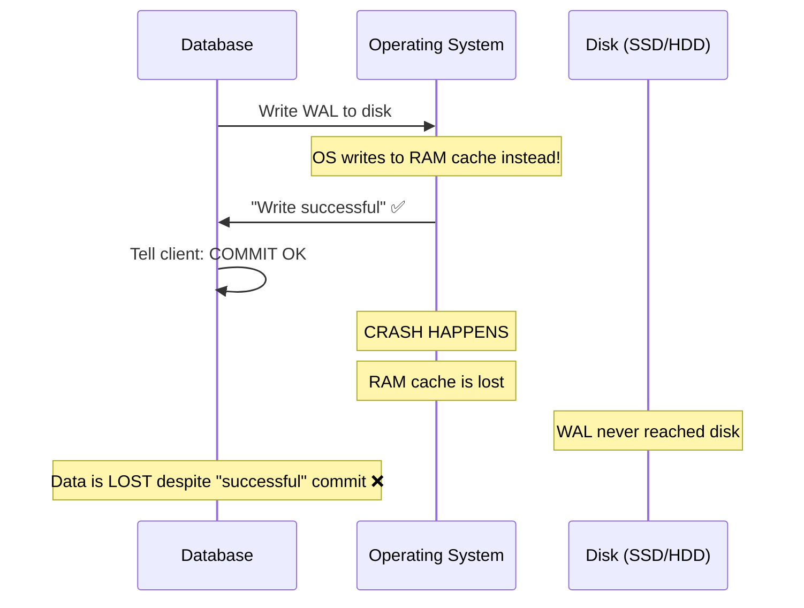

### What is Durability?
- Durability = once a transaction **commits**, the data is **permanently persisted** to non-volatile storage (SSD, hard drive)
- Even if the power goes out, the client crashes, or the database crashes **right after commit** — when you come back, the data **must be there**
- You might think this is obvious — but many databases **trade off durability** for faster writes
- Writing to disk is inherently **slow**, so databases get creative about how they persist data

---

### Why Durability is Hard

- Persisting every change to disk on every commit is **expensive**
- Tables, indexes, B-trees, columns, rows — writing all of these data structures to disk takes time
- The **write amplification** (one logical write causing multiple physical writes) makes it even worse
- So databases invented smarter ways to guarantee durability without the full cost

---

### Durability Techniques

##### 1. Write-Ahead Log (WAL)
- Instead of writing the **entire table/index** to disk on commit, write only the **deltas** (changes)
- These deltas are stored in a compact, append-only **WAL** (Write-Ahead Log)
- The WAL is **flushed to disk immediately** on commit → guarantees persistence
- The actual table data is updated **later** in the background
- On crash recovery: read the WAL entries and **rebuild the state** from the last persisted snapshot

##### 2. Asynchronous Snapshots
- Keep everything in **memory** for fast writes
- Periodically **snapshot** the entire in-memory state to disk in the background
- **Redis** uses this approach (RDB snapshots)
- Risk: if crash happens between snapshots, you **lose data** from that window

##### 3. Append-Only File (AOF)
- Similar to WAL — log every write operation to a file
- **Redis** also supports this (AOF mode)
- On crash: replay the file to reconstruct the state
- More durable than snapshots alone, but larger files over time

---

### The OS Cache Problem

This is one of the **sneakiest durability issues** in database systems:

**What's happening:**
1. The database asks the OS to write WAL to disk
2. The OS **lies** — it writes to its in-memory cache instead (for batching/performance)
3. The OS tells the database "write successful"
4. If the machine **crashes**, the cache (RAM) is lost → the WAL was never on disk → **data lost**

**The fix — `fsync`:**
- The `fsync` command **forces** the OS to bypass its cache and write directly to physical disk
- This makes the OS **actually flush** to disk before returning success
- But `fsync` is **slow** — you're bypassing the OS optimization layer

> **Why does the OS cache exist?** For most applications (text editors, browsers), it's fine. Crashes are rare, and batching writes improves performance. But databases **cannot afford** to lose committed data, so they must use `fsync`.

---

### Durability Trade-offs

| Approach | Durability | Write Speed | Example |
|----------|-----------|-------------|---------|
| **fsync on every commit** | ✅ Strongly durable | Slowest | PostgreSQL, MySQL (default) |
| **WAL + periodic flush** | ✅ Durable (slight risk) | Fast | Most relational DBs |
| **Async snapshots** | ⚠️ Eventually durable | Fastest | Redis (RDB mode) |
| **Memory only** | ❌ Not durable | Fastest | Pure in-memory caches |

**Redis** is interesting — it gives you the **option** to choose your durability level:
- **Strongly durable**: fsync on every write (slow)
- **Eventually durable**: fsync every few seconds (fast, but a crash in that window = data loss)
- **No durability**: pure in-memory (fastest, all data lost on crash)

Most relational databases don't give you this choice — durability is **mandatory**.

---

### Summary
- Durability = once committed, data **survives crashes, power loss, restarts**
- Databases use **WAL** (Write-Ahead Log) to persist only deltas instead of entire tables — compact and fast
- The OS cache is a **hidden danger** — the OS may lie about writing to disk; `fsync` forces actual disk writes
- `fsync` is **slow** but necessary for true durability
- Some databases (like Redis) let you **trade durability for speed** — strongly durable vs eventually durable
- It's always a **trade-off**: durability = slower writes, less durability = faster writes
- Murphy's Law applies — crashes are rare, but when they happen, you want your data safe
