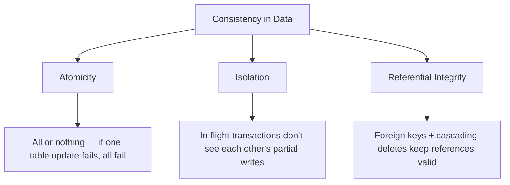
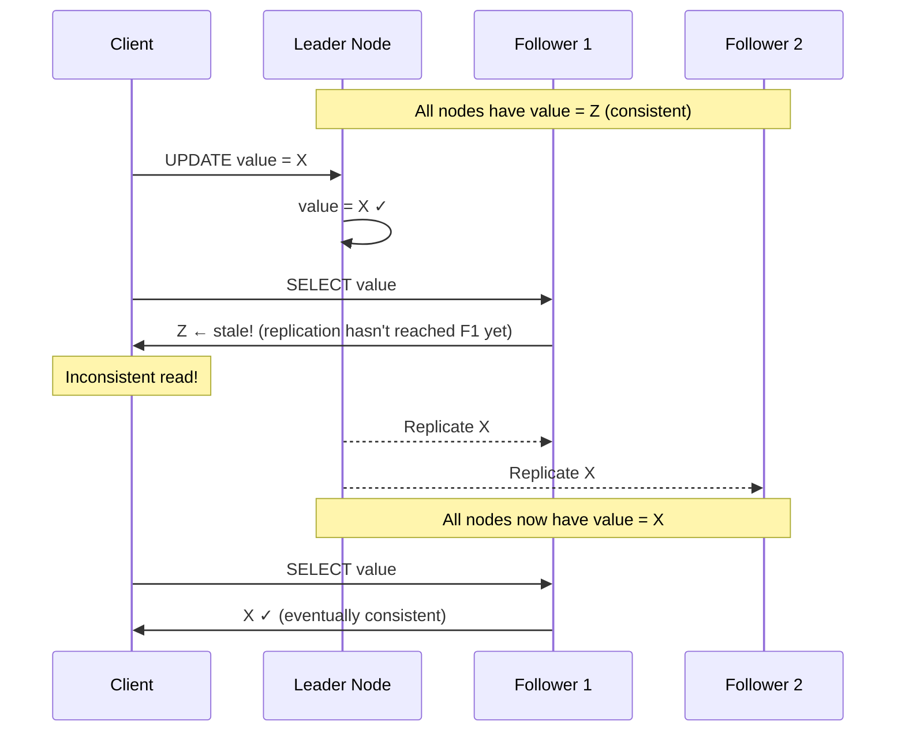
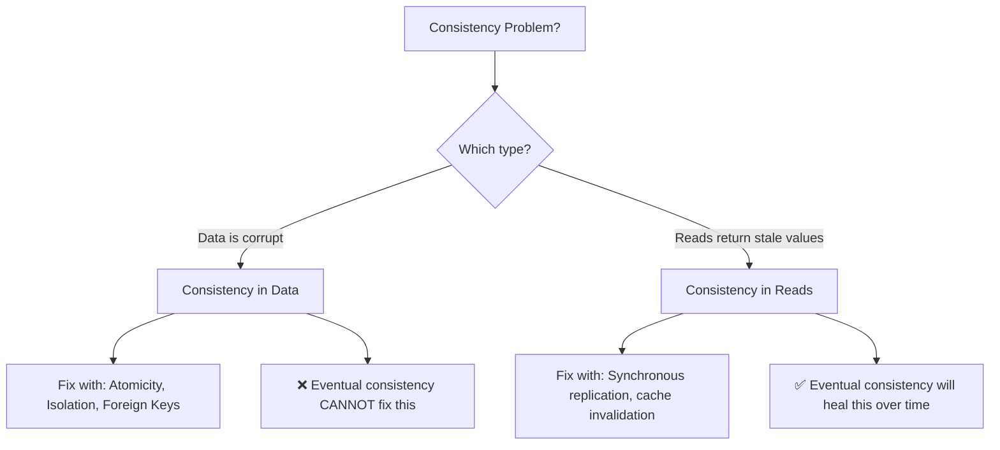

### What is Eventual Consistency?

- Eventual consistency means: **the system is not consistent right now, but given enough time, all nodes will converge to the same value**
- It was popularized with the rise of **NoSQL databases**, but it is **not exclusive** to NoSQL — relational databases suffer from it too
- To understand eventual consistency, you first need to understand the **two types of consistency**

---

### Two Types of Consistency

It's critical to **disambiguate** these — they are completely different concepts:

| Type | Question it answers |
|------|-------------------|
| **Consistency in Data** | Is the persisted data correct across all my tables/collections? |
| **Consistency in Reads** | When I read, do I get the latest committed value? |

---

### Consistency in Data

- Emerges when you have **multiple representations** of the same data — multiple tables, foreign keys, joins
- It's a **normalized view** problem — you split data across tables and they better agree with each other
- **Defined by you** (the developer / DBA) — you designed the schema, you define what "consistent" means

##### Example — Instagram Likes

| id | blob   | likes |
|----|--------|-------|
| 1  | 0xaabb | 2     |

| user   | picture_id |
|--------|------------|
| John   | 1          |
| Edmund | 1          |

- Picture 1 says `likes = 2` and the likes table has **2 records** → ✅ **Consistent**
- If picture 1 said `likes = 5` but only 2 records exist → ❌ **Inconsistent** — the data itself is corrupt

##### What Protects Data Consistency?

- **Atomicity** — if a transaction touches 7 tables and one fails, all 7 roll back
- **Isolation** — prevents other transactions from seeing half-finished writes
- **Referential integrity** — foreign keys, cascading deletes ensure references are valid
- **NoSQL databases** generally only guarantee atomicity within a **single collection** — cross-collection consistency is your problem

---

### Consistency in Reads

- Even if your data on disk is perfectly consistent, **reads can return stale values**
- This is: if I **write** a value, will a subsequent **read** return that new value?
- With a **single server** — no problem, reads always return the latest value
- In reality, you **never have one server** — you scale with replicas, caches, follower nodes

##### Why Reads Become Inconsistent

When you scale, you introduce:
1. **Follower/replica nodes** — offload reads from the leader
2. **Caches** (Redis, Memcached) — speed up reads
3. **Multiple database instances** — behind a load balancer

The moment your data lives in **two places**, you are inconsistent.

##### Example — Leader-Follower Replication

- The leader has `X`, but the follower still has `Z` → the system is **inconsistent**
- Given time, the replication completes and the follower catches up → **eventually consistent**
- This happens with **Postgres, MySQL, any replicated database** — it's not a NoSQL-only problem

---

### Eventual Consistency in Detail

- **Definition:** if no new updates are made, all replicas will **eventually** converge to the same value
- It's really just: **"I'm inconsistent right now, but I'll fix myself later"**
- The same thing happens with **caches** — the moment you cache data, you're serving a potentially stale copy

##### When Does It Matter?

| Scenario | Eventual Consistency OK? | Why |
|----------|------------------------|-----|
| Instagram likes count | ✅ Yes | Nobody verifies if Kylie Jenner has 7,000 or 7,011 likes |
| Social media feed ordering | ✅ Yes | A few seconds delay is fine |
| Bank account balance | ❌ No | Depositing $1,000 must be immediately visible |
| Double-spend prevention | ❌ No | Stale reads could allow withdrawing $2,000 from a $1,000 account |
| Inventory / booking systems | ❌ No | Stale reads could allow double-booking |

**It's up to you as a software engineer to decide: can your system tolerate stale reads?**

---

### The Critical Distinction

- If your **data itself is corrupt** (broken referential integrity, half-finished transactions) → **no amount of eventual consistency will fix it**
  - You updated 3 of 7 tables and crashed → the data is permanently corrupt
  - Without atomicity, there is no eventual consistency — your data is just **broken**
- If your **data is correct** but a replica is lagging → eventual consistency **will fix it** as replication catches up

---

### Sources of Eventual Consistency

| Source | How it introduces inconsistency |
|--------|-------------------------------|
| **Follower/replica nodes** | Async replication lag — followers behind the leader |
| **Caching layers** (Redis, Memcached) | Cache holds old value until invalidated/expired |
| **CDN edge nodes** | Static content cached at edge, stale until TTL expires |
| **Client-side caches** | Browser/app cache holds stale data |

The moment data exists in **two places**, you have eventual consistency as a possibility.

---

### Summary
- **Two types of consistency**: consistency in data (referential integrity) vs consistency in reads (stale replicas)
- **Consistency in data** is guaranteed by **atomicity, isolation, and referential integrity** — if you break these, your data is **permanently corrupt**
- **Consistency in reads** is broken the moment you introduce **replicas or caches**
- **Eventual consistency** only fixes **read inconsistency** — it means all nodes will converge given enough time
- It's **not a NoSQL-only problem** — any replicated Postgres/MySQL setup has eventual consistency
- Whether eventual consistency is acceptable **depends on your use case** — social media likes? Fine. Bank balances? Absolutely not
- If your data is inconsistent (corrupt), **there is no eventual consistency** — you just have broken data
