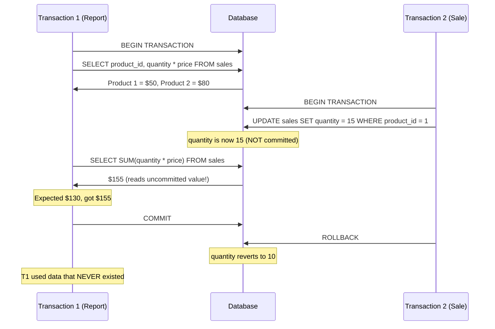
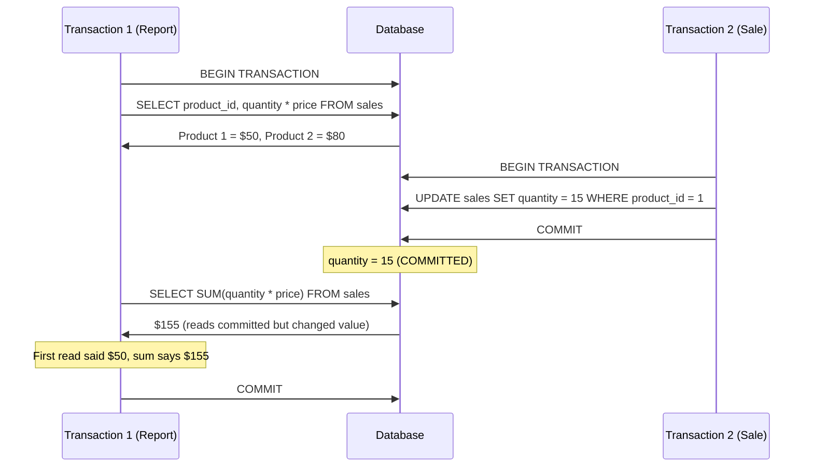
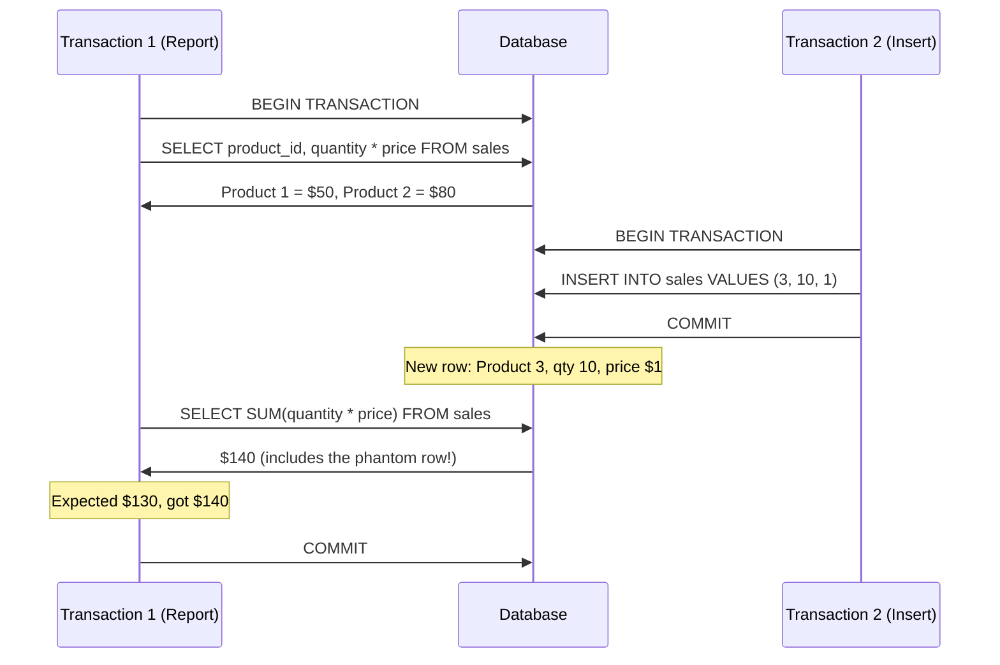
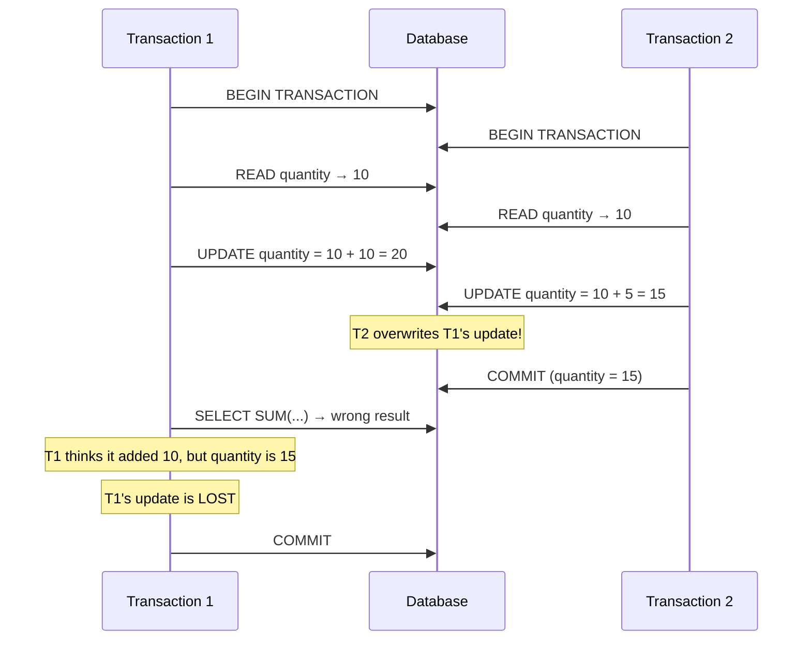
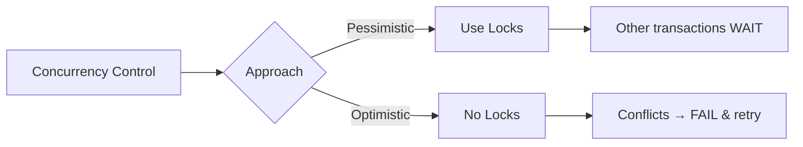

### What is Isolation?
- Isolation answers: **can my in-flight transaction see changes made by other in-flight (or recently committed) transactions?**
- With many concurrent TCP connections, multiple transactions can fight over the **same data**
- Isolation controls what a transaction **can and cannot see** from the outside world while it is running
- The answer is **not black or white** — it depends on what you're building and the isolation level you choose

---

### Read Phenomena — The Problems

These are **undesirable side effects** that can happen when transactions lack proper isolation. They are some of the **nastiest bugs to debug**.

##### 1. Dirty Read
- You read a value that another transaction **wrote but hasn't committed yet**
- That write could be **rolled back**, meaning you read data that never actually existed
- **Dirty** = the write isn't flushed/committed, it might change

##### 2. Non-Repeatable Read
- You read a value, then **later in the same transaction** you (or an aggregation function) reads it again and it **changed**
- This doesn't mean running the exact same `SELECT` twice — it can be two different queries that depend on the **same underlying row**
- Example: `SELECT price` then `SELECT SUM(price)` — both depend on the same row, but in between another transaction committed a change

##### 3. Phantom Read
- A **brand new row** is inserted by another transaction that satisfies your range query
- It's not a non-repeatable read because you **never read that row** in the first place — it didn't exist
- You can't lock a row that **doesn't exist yet** — that's why it's called a "phantom"

##### 4. Lost Update
- Two transactions read the **same value** and both update it based on that original value
- The second commit **overwrites** the first commit's update
- Example: both read quantity = 10, T1 sets it to 20, T2 sets it to 15 → T1's update is **lost**

---

### Example — Dirty Read

**Sales Table:**

| product_id | quantity | price |
|------------|----------|-------|
| 1          | 10       | 5     |
| 2          | 20       | 4     |

- T1 read a value that T2 **never committed** — the report is **wrong**
- Worse: T2 rolled back, so the data T1 used **never actually existed**

---

### Example — Non-Repeatable Read

- This time T2 **actually committed** — so it's not a dirty read
- But T1 read the value as 10, then an aggregation saw it as 15 → **inconsistent within the same transaction**
- The read was **not repeatable**

---

### Example — Phantom Read

- Product 3 **didn't exist** when T1 started — it's a **phantom**
- It's not a non-repeatable read because T1 never read product 3 in the first place
- You **can't lock a row that doesn't exist** — that's the core problem

---

### Example — Lost Update

- Both transactions **read the original value** (10) and computed based on it
- T2's commit **overwrote** T1's update → T1's 10 units are lost
- Fix: **row-level locks** — lock the row so no one else can change it until you're done

---

### Isolation Levels

Isolation levels were invented to **control which read phenomena** a transaction is exposed to.

| Isolation Level    | Dirty Read | Non-Repeatable Read | Phantom Read | Lost Update |
|--------------------|------------|---------------------|--------------|-------------|
| Read Uncommitted   | ✅ May occur | ✅ May occur         | ✅ May occur  | ✅ May occur |
| Read Committed     | ❌ Prevented | ✅ May occur         | ✅ May occur  | ✅ May occur |
| Repeatable Read    | ❌ Prevented | ❌ Prevented         | ✅ May occur  | ❌ Prevented |
| Snapshot           | ❌ Prevented | ❌ Prevented         | ❌ Prevented  | ❌ Prevented |
| Serializable       | ❌ Prevented | ❌ Prevented         | ❌ Prevented  | ❌ Prevented |

##### Read Uncommitted
- **No isolation at all** — you can see uncommitted changes from other transactions
- Dirty reads are possible → basically the worst level
- Theoretically fast because no overhead, but questionable in practice
- Almost no database uses this as default (SQL Server supports it)

##### Read Committed
- **Most popular** isolation level — default in many databases
- Each query only sees **committed** changes by other transactions
- If another transaction commits mid-way through yours, you **will see that change**
- Protects from dirty reads but **not** from non-repeatable or phantom reads

##### Repeatable Read
- Any row you **read** is guaranteed to stay the same for the duration of your transaction
- Fixes non-repeatable reads by locking (or versioning) the rows you've read
- Still vulnerable to **phantom reads** — new inserts can sneak in
- **Exception:** Postgres implements repeatable read as **snapshot isolation**, which also prevents phantom reads

##### Snapshot Isolation
- Takes a **versioned snapshot** of the database at the start of the transaction
- Every query sees the database **as it was** when the transaction began — no matter what commits happen later
- Eliminates **all read phenomena**
- Postgres `REPEATABLE READ` = snapshot isolation (they are identical in Postgres)

##### Serializable
- Transactions behave **as if they ran one after the other** — no concurrency
- Eliminates all read phenomena
- Usually implemented with **optimistic concurrency control** (not actual serial execution) — if conflicts are detected, the transaction is **failed** and must be retried

---

### How Databases Implement Isolation

##### Pessimistic Concurrency Control (Locks)
- Obtain **locks** when reading/writing data
- Other transactions **wait** until the lock is released
- Lock types: **row-level**, **page-level**, **table-level**
- Table locks are very expensive — lock escalation can accidentally promote row locks to table locks
- Lock management itself is expensive (tracking which rows are locked in memory)

##### Optimistic Concurrency Control (No Locks)
- No locks obtained — transactions run freely
- When transactions **conflict**, one is **failed** with a serialization error
- The application must **retry** the failed transaction
- NoSQL databases prefer this approach because locking is expensive

---

### How Postgres vs MySQL Handle Versioning

| Feature | Postgres | MySQL / Oracle |
|---------|----------|----------------|
| **On UPDATE** | Creates a **new version** of the row | Modifies the row **in place** |
| **Old value** | Old version still exists (MVCC) | Stored in an **undo log** on disk |
| **Reading old version** | Reads the old row version directly | Must crack open the undo log (can be expensive for long transactions) |
| **Repeatable Read** | Implemented as **snapshot isolation** (no phantom reads) | True repeatable read (phantom reads still possible) |

---

### Summary
- Isolation = controls **what a transaction can see** from other concurrent transactions
- Four read phenomena: **dirty reads**, **non-repeatable reads**, **phantom reads**, **lost updates**
- Five isolation levels (from weakest to strongest): **Read Uncommitted → Read Committed → Repeatable Read → Snapshot → Serializable**
- Most databases default to **Read Committed**
- Postgres `REPEATABLE READ` = snapshot isolation (prevents phantom reads too)
- Pessimistic = **locks** (other transactions wait), Optimistic = **no locks** (conflicts cause retry)
- Fixing isolation issues is **expensive** — understand what your application needs before choosing a level
