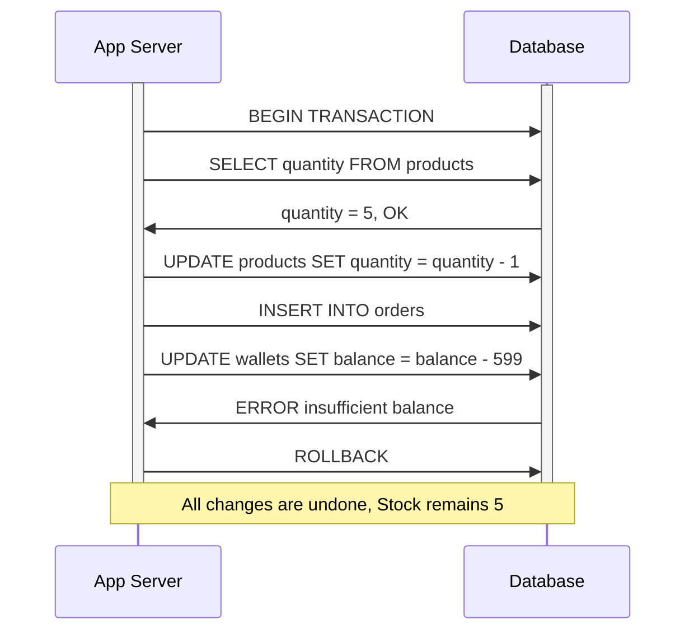
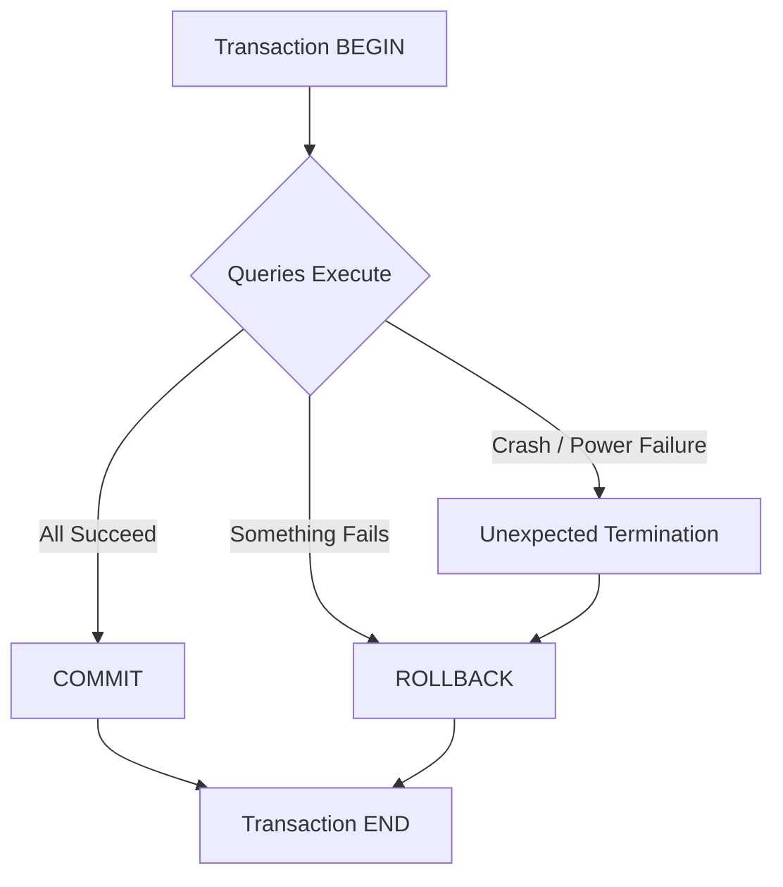
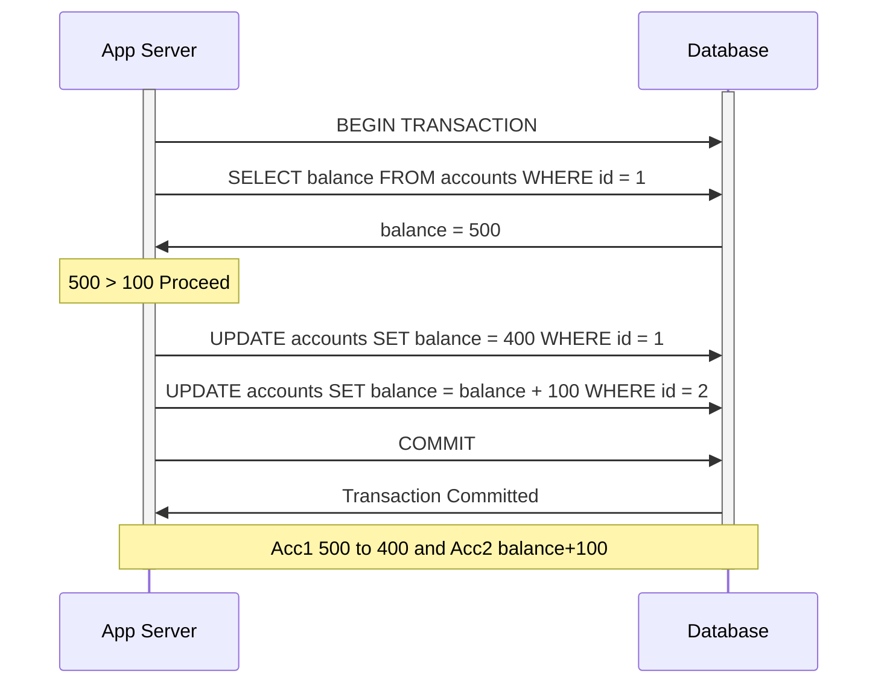

### What is a Transaction?
- A collection of queries is called as a transaction
- It can be a single query or multiple queries
- One unit of work is called as a transaction
- Treat the transaction as though all the queries are **one single operation**. Either all of them succeed or none of them do.

##### Real Life Analogy
Think of a transaction like a **bank transfer**. When you send money from Account A to Account B:
1. Money is **debited** from A
2. Money is **credited** to B

If step 2 fails, step 1 should also be **undone**. You can't just lose money in between — that's exactly what a transaction guarantees.

##### Example — Account Deposit
```sql
BEGIN TRANSACTION;
UPDATE accounts SET balance = balance - 100 WHERE account_id = 1;
UPDATE accounts SET balance = balance + 100 WHERE account_id = 2;
COMMIT;
```

##### Another Example — E-Commerce Order
Imagine placing an order on Amazon:
```sql
BEGIN TRANSACTION;
-- 1. Check if item is in stock
SELECT quantity FROM products WHERE product_id = 42;
-- 2. Reduce stock
UPDATE products SET quantity = quantity - 1 WHERE product_id = 42;
-- 3. Create the order
INSERT INTO orders (user_id, product_id, amount) VALUES (1, 42, 599);
-- 4. Deduct from wallet
UPDATE wallets SET balance = balance - 599 WHERE user_id = 1;
COMMIT;
```
If the wallet deduction fails (insufficient balance), the stock reduction and order creation should also **rollback**. That's the power of a transaction.



---

### Transaction Lifespan


- **BEGIN** — marks the start of the transaction
- **COMMIT** — all queries succeeded, persist the changes permanently
- **ROLLBACK** — something went wrong, undo all the changes made in this transaction
- **Unexpected Termination** — crash, power failure etc. The database will **automatically rollback** the transaction
- **END** — the transaction is done (whether committed or rolled back)

---

### Nature of Transaction
Usually transactions are used to **change and modify** data. However it is perfectly normal to have a **read-only transaction** as well.

##### Why read-only transactions?
When you want to generate a **report** and you need a **consistent snapshot** of the data at the time of the transaction.

**Example:** You are generating a monthly sales report. While generating, new orders might be coming in. A read-only transaction makes sure you get a **frozen view** of the data — no new orders will affect your report mid-generation.
```sql
BEGIN TRANSACTION READ ONLY;
SELECT SUM(amount) FROM orders WHERE month = 'January';
SELECT COUNT(*) FROM orders WHERE month = 'January';
-- Both queries see the SAME consistent snapshot
COMMIT;
```

---

### Creating a Transaction — Step by Step

**Scenario:** Send $100 from Account 1 to Account 2

```sql
-- Step 1: Check if sender has enough balance
BEGIN TRANSACTION;
SELECT balance FROM accounts WHERE id = 1;
-- Let's say balance = 500, so 500 > 100 ✅

-- Step 2: Debit from sender
UPDATE accounts SET balance = balance - 100 WHERE id = 1;

-- Step 3: Credit to receiver
UPDATE accounts SET balance = balance + 100 WHERE id = 2;

-- Step 4: Persist the changes
COMMIT;
```



---

### What happens without Transactions?

**Scenario:** No transaction, system crashes after step 2

```sql
-- No BEGIN TRANSACTION here!
UPDATE accounts SET balance = balance - 100 WHERE id = 1;  -- ✅ Done
-- 💥 SYSTEM CRASHES HERE
UPDATE accounts SET balance = balance + 100 WHERE id = 2;  -- ❌ Never executed
```

**Result:** Account 1 lost $100 but Account 2 never received it. The money just **vanished**. This is why transactions exist — to prevent exactly this kind of **data inconsistency**.