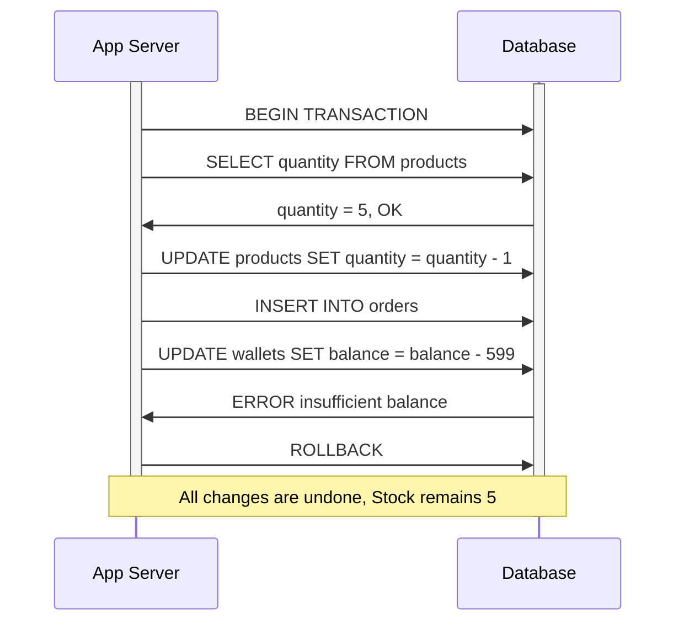
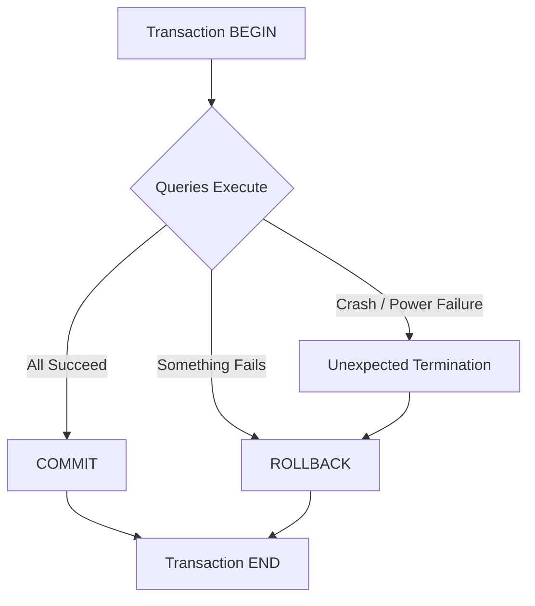
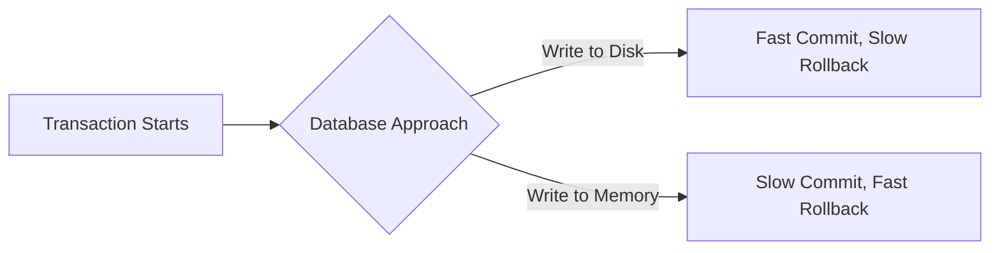
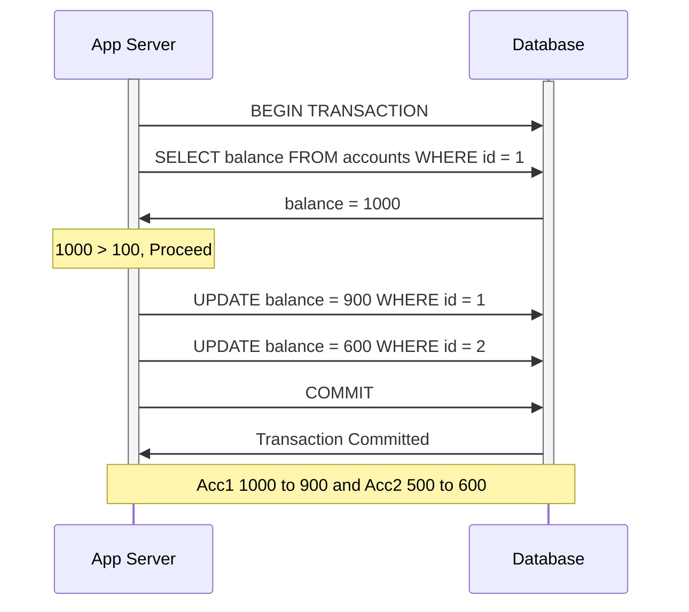

### What is a Transaction?
- A collection of queries that are treated as **one unit of work**
- It can be a single query or multiple queries
- The reason we need transactions — SQL data is **structured across many tables**, so it's very hard (sometimes impossible) to do everything in one query
- You need one or more queries to achieve what you logically want at the application level
- Treat the transaction as though all the queries are **one single operation**. Either all of them succeed or none of them do.

##### Important — Implicit Transactions
A transaction is **always** started whether you like it or not. If you execute a normal `UPDATE` or `INSERT` without a `BEGIN`, the database starts a transaction **implicitly** and immediately commits it.
```sql
-- This single query is ALSO a transaction internally
UPDATE accounts SET balance = balance - 100 WHERE id = 1;
-- The database wraps this as: BEGIN -> UPDATE -> COMMIT (automatically)
```
So we are **always** in a transaction — some are **user-defined** (explicit BEGIN) and some are **implicitly defined** by the database system.

##### Real Life Analogy
Think of a transaction like a **bank transfer**. When you send money from Account A to Account B:
1. Money is **debited** from A
2. Money is **credited** to B

If step 2 fails, step 1 should also be **undone**. You can't just lose money in between — that's exactly what a transaction guarantees.

##### Example — Account Deposit
```sql
BEGIN TRANSACTION;
UPDATE accounts SET balance = balance - 100 WHERE account_id = 1;
UPDATE accounts SET balance = balance + 100 WHERE account_id = 2;
COMMIT;
```

##### Another Example — E-Commerce Order
Imagine placing an order on Amazon:
```sql
BEGIN TRANSACTION;
-- 1. Check if item is in stock
SELECT quantity FROM products WHERE product_id = 42;
-- 2. Reduce stock
UPDATE products SET quantity = quantity - 1 WHERE product_id = 42;
-- 3. Create the order
INSERT INTO orders (user_id, product_id, amount) VALUES (1, 42, 599);
-- 4. Deduct from wallet
UPDATE wallets SET balance = balance - 599 WHERE user_id = 1;
COMMIT;
```
If the wallet deduction fails (insufficient balance), the stock reduction and order creation should also **rollback**. That's the power of a transaction.



---

### Transaction Lifespan


- **BEGIN** — tells the database you are about to start a brand new transaction with multiple queries
- **COMMIT** — you are satisfied with all the queries, persist the changes to disk permanently. Everything you wrote during the transaction is **not durable** until you say commit
- **ROLLBACK** — forget about all the changes. Do not persist them. You explicitly want to undo everything
- **Unexpected Termination** — crash, power failure etc. The database crashed mid-transaction. When it comes back, it **better know** to rollback. This is another code path that database engineers have to handle
- **END** — the transaction is done (whether committed or rolled back)

**Long running transactions are generally a bad idea.** If the database crashes 20,000 queries into your transaction, all of that work needs to be rolled back on restart.

---

### How Databases Handle Commits Internally

When you execute 1000 queries in a transaction, what is the database doing? Is it actually writing to disk with every query? **Every database does it differently.**

##### Approach 1 — Write to Disk During Transaction
- Every query in the transaction **actually writes to disk** as it executes
- Assumes you are going to commit (optimistic)
- **COMMIT is fast** — just mark the transaction as committed, all work is already on disk
- **ROLLBACK is slow** — has to go and undo all the changes already written to disk
- **Postgres** does this — commits are beautifully fast because they try to persist changes during the transaction. Lots of IO but fast commits

##### Approach 2 — Write to Memory, Flush on Commit
- Queries only **write to memory** during the transaction
- Nothing touches the disk until commit
- **Queries execute fast** because memory is fast
- **COMMIT is slow** — has to flush everything from memory to disk
- **ROLLBACK is fast** — just destroy what's in memory
- **SQL Server** leans more towards this — commits can be slower for large transactions



**There is no right or wrong — it's always a trade-off.**

##### The Scary Part — Crash During COMMIT
- If your commits are **fast** (Postgres), the chance of a crash during commit is **low**
- If your commits are **slow** (large transactions in SQL Server), the chance of a crash during commit is **higher**
- A crash during commit is the scariest thing — did my data get persisted or not?

---

### Nature of Transaction
Usually transactions are used to **change and modify** data. However it is perfectly normal to have a **read-only transaction** as well.

##### Why read-only transactions?
When you want to generate a **report** and you need a **consistent snapshot** of the data at the time of the transaction.

The power of a read-only transaction is **isolation** — anything you read is based on the **initial time** of the transaction. Even if something changed by a concurrent transaction, you don't care. You want to be isolated from those changes.

**Example:** You are generating a monthly sales report. While generating, new orders might be coming in. A read-only transaction makes sure you get a **frozen view** of the data — no new orders will affect your report mid-generation.
```sql
BEGIN TRANSACTION READ ONLY;
SELECT SUM(amount) FROM orders WHERE month = 'January';
SELECT COUNT(*) FROM orders WHERE month = 'January';
-- Both queries see the SAME consistent snapshot
COMMIT;
```

When you tell the database it's a read-only transaction, the database can **optimize itself** for reads.

---

### Creating a Transaction — Step by Step

**Scenario:** Send $100 from Account 1 to Account 2

| account_id | balance |
|------------|---------|
| 1          | 1000    |
| 2          | 500     |

We need to debit account 1 and credit account 2. We do it in a transaction because **both should happen together**.

You can put the balance check constraint at two levels:
- **Application level** — check in code before deducting (what we do below)
- **Database level** — add a constraint that balance should never go negative

If you ever see data that is negative (when it shouldn't be), that is indication of **inconsistent data**.

```sql
-- Step 1: Check if sender has enough balance
BEGIN TRANSACTION;
SELECT balance FROM accounts WHERE id = 1;
-- balance = 1000, so 1000 > 100, proceed

-- Step 2: Debit from sender
UPDATE accounts SET balance = balance - 100 WHERE id = 1;
-- Account 1 now has 900

-- Step 3: Credit to receiver
UPDATE accounts SET balance = balance + 100 WHERE id = 2;
-- Account 2 now has 600

-- Step 4: Persist the changes
COMMIT;
```



---

### What happens without Transactions?

**Scenario:** No transaction, system crashes after debit

```sql
-- No BEGIN TRANSACTION here!
UPDATE accounts SET balance = balance - 100 WHERE id = 1;  -- Done
-- SYSTEM CRASHES HERE
UPDATE accounts SET balance = balance + 100 WHERE id = 2;  -- Never executed
```

| account_id | balance | what happened |
|------------|---------|---------------|
| 1          | 900     | debited       |
| 2          | 500     | NOT credited  |

**$100 just vanished in thin air.** This is an inconsistent view. Not only did we lose actual money, we have no idea where it went because of technology. This is why transactions exist — to prevent exactly this kind of **data inconsistency**.

---

### Summary
- A transaction is a collection of queries treated as a **single unit of work**
- Transactions can **change data** or be **read-only** for consistent snapshots
- A transaction is **always** started — even without explicit BEGIN, the database creates an implicit transaction
- **BEGIN** -> queries -> **COMMIT** or **ROLLBACK**
- Databases handle commits differently — write to disk (fast commit) vs write to memory (fast rollback)
- **Postgres** optimizes for fast commits, **SQL Server** commits can be slower for large transactions
- Crash during commit = scariest scenario
- **Long transactions are a bad idea** — if crash happens, rollback takes ages