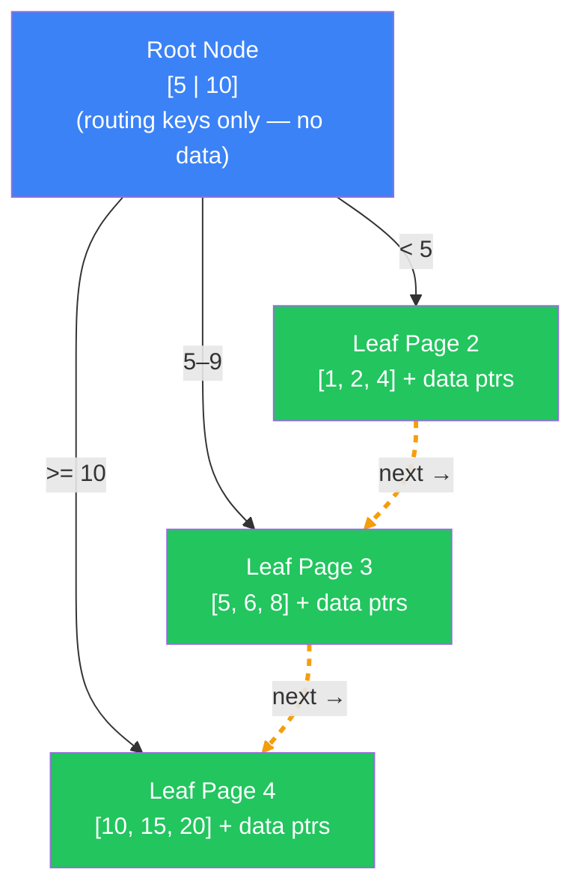
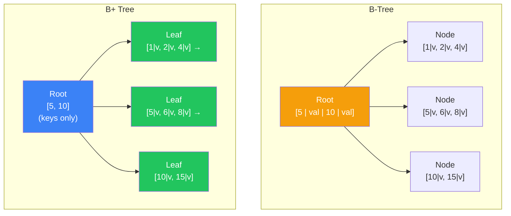
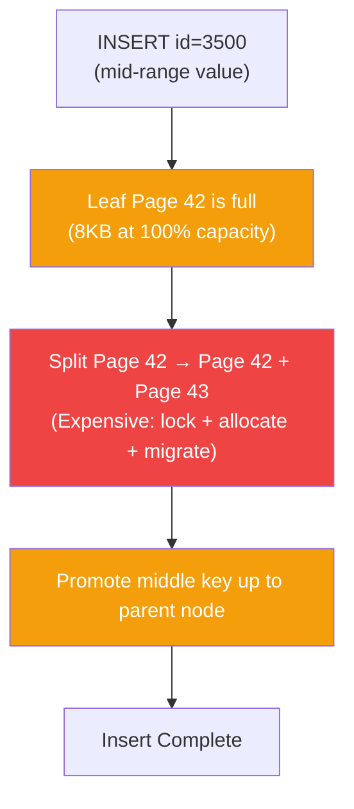
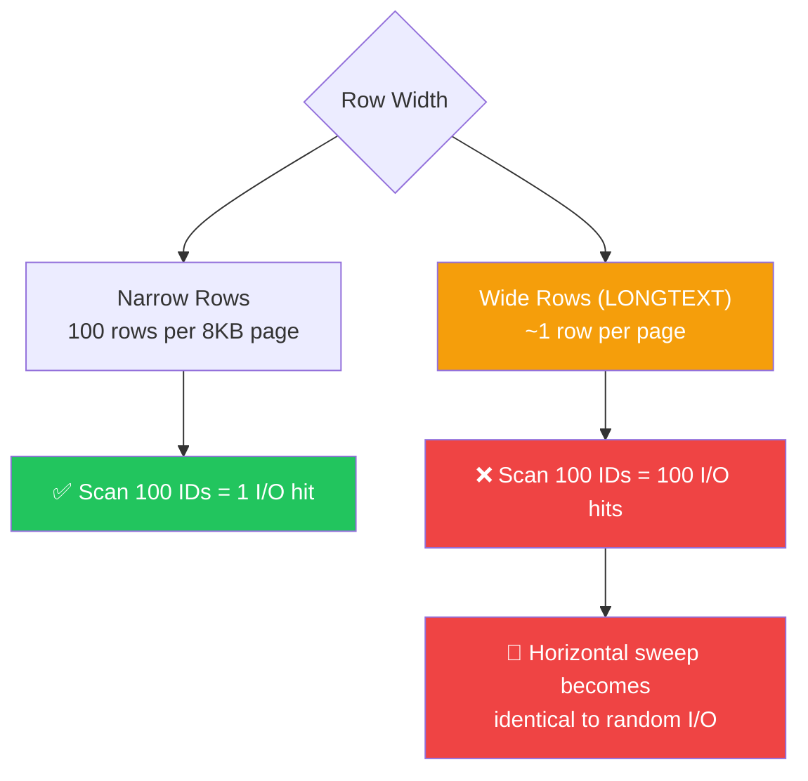

- A **B+ Tree** is an evolutionary improvement over the standard B-Tree, specifically engineered to optimize **sequential access** and **range queries**
- Unlike standard B-Trees, a B+ Tree stores actual data pointers **only in the leaf nodes**; internal nodes act purely as slim **routing signposts**
- **Leaf nodes are linked horizontally** like a linked list — no need to climb back up the tree when reading sequential ranges
- Internal nodes store keys only (no values), meaning far more routing keys fit per 8KB page — keeping more of the tree **hot in RAM**
- This design lets databases (PostgreSQL, MySQL/InnoDB) execute a massive range query in **4.85ms** instead of a thrashing **250ms**

---

### The Analogy — The Metro Station

```text
┌──────────────────────────────────────────────────────────┐
│                    THE METRO STATION                     │
│                                                          │
│  [Main Terminal (Root Node): Sign says "Lines 1-50"]     │
│       │                                                  │
│       └──▶ [Zone 1: 1-25]         [Zone 2: 26-50]        │
│                │                       │                 │
│                ▼                       ▼                 │
│  [Train 1] ══▶ [Train 2] ══▶ [Train 3] ══▶ [Train 4]    │
│  (Data 1-12)  (Data 13-25) (Data 26-38) (Data 39-50)    │
│                                                          │
│  Looking for Passengers 13 through 38?                   │
│  ❌ B-Tree: run back to Main Terminal for every train    │
│  ✅ B+ Tree: go to Train 2, walk through the door to     │
│     Train 3 directly (linked leaf pointers)              │
└──────────────────────────────────────────────────────────┘
```

---

### How B+ Tree Traversal Works

Internal nodes contain **only routing keys and child page pointers** — no data pointers. This makes them slim enough to fit hundreds of keys per 8KB page, keeping most of the tree structure permanently cached in RAM. All actual data pointers live in the leaf nodes, alongside a `next_leaf` pointer that chains them together.

> ⚠️ Key difference from B-Tree: search can **never** terminate early at an internal node. Every lookup must descend all the way to the leaf level to retrieve the value. The trade-off is that range queries become dramatically faster.



##### Tracing a Range Query: "ID 4 to 8"

```
Step 1: Check Root [5, 10]. 4 is < 5 → Follow left pointer.
Step 2: Reach Leaf Page 2 [1, 2, 4]. Found 4! Yield data.
Step 3: Follow horizontal next pointer → Leaf Page 3 [5, 6, 8]. Yield data.
Step 4: 8 is within range, yield. Next value (10) exceeds bound → stop.

Total: 2 sequential page reads instead of 5 random I/O jumps up and down the tree.
```

---

### B-Tree vs B+ Tree — The Core Difference



| Property | B-Tree | B+ Tree |
|----------|--------|---------|
| Values stored in | All nodes | Leaf nodes only |
| Internal nodes contain | Keys + data pointers | Keys only (slim) |
| Early termination | ✅ Yes (if key in internal node) | ❌ No (always reaches leaf) |
| Range queries | 💀 Random I/O per value | ⚡ Horizontal leaf sweep |
| RAM cache efficiency | Lower (fat internal nodes) | Higher (slim internal nodes) |

---

### Live Benchmark — 100 Million Rows

```sql
CREATE TABLE historical_logs (
    id      SERIAL PRIMARY KEY,  -- B+ Tree internally (Postgres default)
    log_msg TEXT
);
-- 100,000,000 rows inserted
```

---

##### Query 1 — Range Query `BETWEEN` ⚡

```sql
EXPLAIN ANALYZE SELECT log_msg FROM historical_logs WHERE id BETWEEN 1000 AND 6000;
```

```
Index Scan using historical_logs_pkey on historical_logs
  Index Cond: ((id >= 1000) AND (id <= 6000))
  Planning Time:  0.15 ms
  Execution Time: 4.85 ms  ← ⚡ 5,000 rows fetched almost instantly
```

**Why fast?**


- Locate the start bound (`1000`) via normal tree descent — one trip down
- Then **slide horizontally** across linked leaf pages reading sequential disk sectors
- No climbing back up to the root per value like B-Tree does

---

##### Query 2 — Insert Triggering a Page Split 💀

```sql
EXPLAIN ANALYZE INSERT INTO historical_logs (id, log_msg) VALUES (3500, 'Mid-range log');
```

```
Insert on historical_logs
  Planning Time:  0.08 ms
  Execution Time: 12.50 ms  ← 💀 Page Split Occurred
```

**Why slow?**



- Inserting between existing keys into a full leaf page forces the database to halt, allocate a new page, migrate half the data, and promote a boundary key upward
- Random UUID inserts hit this constantly — every insert lands on a different leaf page and fills it unpredictably

---

### Performance Comparison Table

| Query | Feature Used? | Scan Type | Time | Notes |
|-------|---------------|-----------|------|-------|
| `WHERE id = 5000` | ✅ Point lookup | Index Scan | **0.05 ms** | Standard descent O(log n) to leaf |
| `WHERE id BETWEEN 1 AND 5000` | ✅ Linked leaves | Index Scan | **4.85 ms** | Horizontal sweep — no vertical thrashing ⚡ |
| `INSERT` (mid-range, full page) | ❌ Page split | Index Update | **12.5 ms** | Page filled, tree had to split and rebalance 💀 |

---

### When B+ Trees Ignore Your Assumption

> **Gotcha**: MySQL/InnoDB uses a **Clustered Index** — it stores the **entire row data** inside the leaf node. If your rows have massive `TEXT` or `BLOB` columns, leaf pages explode in size and the horizontal sweep breaks down completely.

##### The "Fat Leaf" Clustered Index Trap

```sql
-- MySQL: entire row data lives in the B+ Tree leaf
CREATE TABLE posts (
    id        INT PRIMARY KEY,
    body_text LONGTEXT   -- 1MB of text per row
);
```

An 8KB leaf page that normally holds 100 narrow rows now can't even fit **one** row. The horizontal sweep that makes B+ Trees fast becomes 100 individual I/O hits instead of 1.



| Pattern | Works? | Why |
|---------|--------|-----|
| Clustered index, narrow rows | ✅ Yes | Hundreds of rows fit per page → sweeping is fast |
| Clustered index, wide blobs | ❌ No | Forces off-page storage or inflates page count → sweep = pain |
| Random UUID as primary key | ❌ No | Every insert hits a random leaf page → constant page splits |
| Sequential INT/BIGINT primary key | ✅ Yes | Inserts always append to rightmost leaf → zero splits |

---

### The Cost — Nothing is Free

| Benefit | Cost |
|---------|------|
| Superior range queries via horizontal leaf links | Keys duplicated — appear in routing nodes AND leaf nodes |
| Slim internal nodes fit entirely in RAM cache | Search can never stop early — must always reach a leaf |
| All leaves at identical depth — predictable query time | Random-order inserts trigger cascading page splits |
| Index-Only Scans possible for indexed columns | Clustered fat rows (MySQL) can negate the sweep advantage |

##### Rule of Thumb

```
✅ Use B+ Trees for time-series data, leaderboards, or anything with range scans
✅ Use sequential auto-increment IDs as primary keys to avoid page splits
✅ Use covering indexes to enable Index-Only Scans (zero heap fetches)
❌ Don't use random UUIDs as clustered primary keys — destroys insert performance
❌ Don't store massive TEXT/BLOB in clustered tables if you need fast range scans
```

---

### Index Types Comparison

| Type | Best For | How It Works |
|------|----------|--------------|
| **B-Tree** | Random point queries | Values in all nodes. Can stop early. Range queries = random I/O jumps |
| **B+ Tree** | Range scans, sorting | Values only in leaves. Horizontal leaf links. Slim cacheable routers |
| **LSM Tree** | Extreme write throughput | Buffers writes in memory, flushes to disk. Avoids page-split penalty entirely |
| **Hash Index** | Exact equality only | Direct bucket lookup. Zero range support |

---

### EXPLAIN ANALYZE — Your Best Friend

```sql
EXPLAIN (ANALYZE, BUFFERS) SELECT id FROM historical_logs WHERE id BETWEEN 10 AND 50;
```

##### What to Look For

| Field | Indicator | Meaning |
|-------|-----------|---------|
| **Index Only Scan** | ⚡ Best | Requested column is inside the B+ Tree leaf — heap never touched |
| **Index Scan** | ✅ Good | Leaf hit correctly, but extra columns pulled from table heap |
| **Heap Fetches: 0** | ⚡ Best | Perfect covering index — zero table I/O |
| **Buffers: shared hit** | ⚡ Best | Internal nodes served from RAM — no disk I/O |
| **Buffers: shared read** | 🚨 Bad | Fat rows or bloated index pushed pages out of cache → disk read |
| **Buffers: shared written** | 🚨 Bad | Read query triggered internal page structure update (page split during read) |
| **Seq Scan** | 💀 Worst | No usable index — every row scanned |

---

### Summary

- **Signpost Architecture**: Internal nodes store routing keys only — no data pointers. This keeps them slim enough to cache entirely in RAM, making tree traversal nearly free.
- **Horizontal Leaf Links**: All data pointers live in leaf nodes, which are chained together. Range queries become a single descent + a horizontal sweep — **4.85ms** for 5,000 rows on 100M row table.
- **Constant Depth**: Every lookup in a B+ Tree descends to the same leaf level. No early termination like B-Trees — but all queries have perfectly predictable I/O cost.
- **Page Split Penalty**: Inserting out-of-order keys (UUIDs) fills random leaf pages, triggering expensive split operations — **12.5ms** per split vs **0.05ms** for a clean append.
- **Clustered Index Trap**: MySQL/InnoDB stores entire rows in the leaf. Fat rows (LONGTEXT, BLOB) collapse page density and turn the horizontal sweep advantage into a per-row I/O nightmare.
- **Index-Only Scans**: If you only `SELECT` the indexed column, the database sweeps leaf nodes and never touches the heap — **0 heap fetches**, the fastest possible query path.
- **Duplicated Keys**: Unlike B-Trees, keys appear twice — once in the routing node and once in the leaf. Minor space overhead, massive range query payoff.
- **Every Major DB Uses This**: PostgreSQL, MySQL InnoDB, Oracle, SQL Server — all default to B+ Trees. Understanding this structure is understanding how every production database actually works.