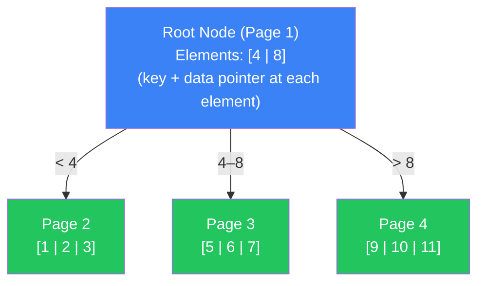
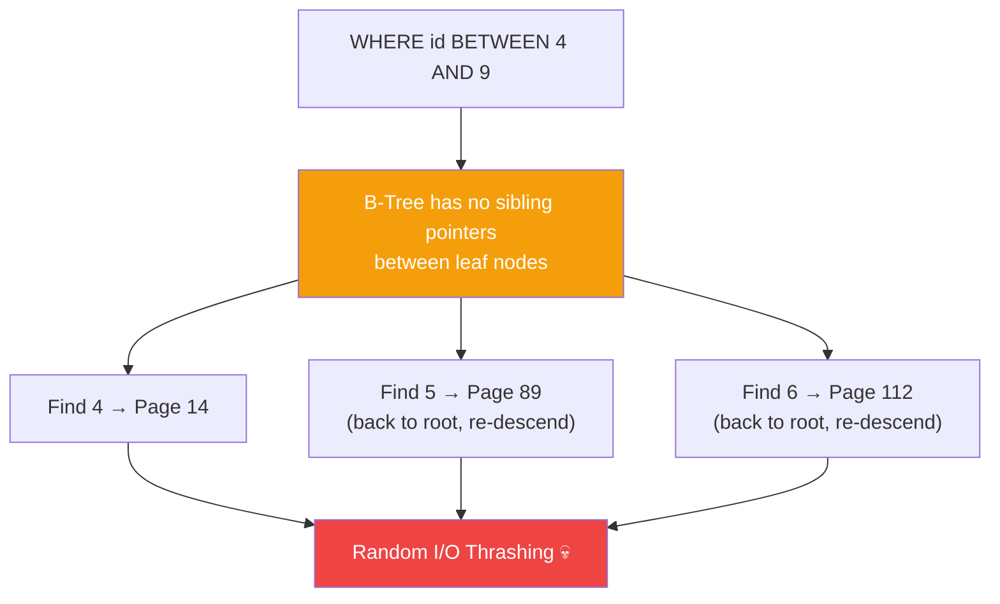
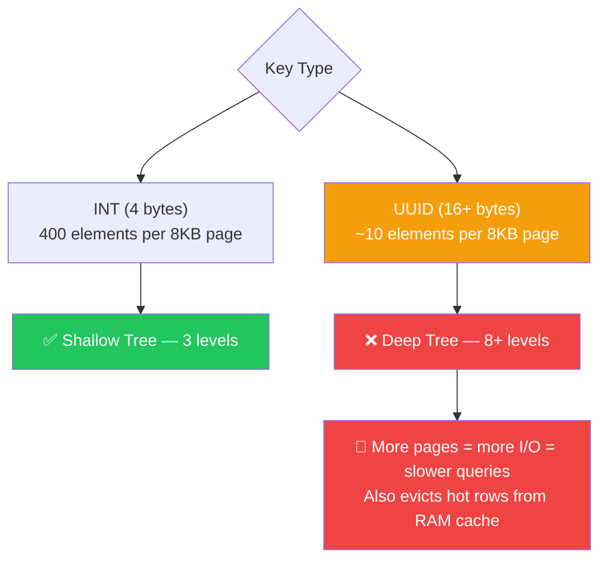

- A **B-Tree** is a self-balancing **data structure** designed to minimize disk I/O when traversing massive datasets
- Each **node** maps directly to a **disk page** (typically 8KB) — this is the most critical practical fact most textbooks skip
- A node of degree **M** holds up to **M children** and exactly **M-1 elements**; each element is a **key + value (data pointer)** pair stored at every level — root, internal, and leaf
- Unlike B+Trees, a standard B-Tree stores values inside **all nodes**, not just leaves — meaning a search can terminate early if it hits the key in an internal node
- The choice of key width is make-or-break: an **INT key** might fit 400 elements per 8KB page; a **UUID key** might only fit 10 — the difference between a **0.05ms** point lookup and an index-thrashing **250ms** range query

---

### The Analogy — The Bureaucratic Filing Cabinet

```text
┌──────────────────────────────────────────────────────────┐
│                 THE GLOBAL FILING SYSTEM                 │
│                                                          │
│  [CABINET A: IDs 1 - 1000]                               │
│      ├── Drawer 1: 1–250  (contains actual files!)       │
│      ├── Drawer 2: 251–500                               │
│      └── Drawer 3: 501–1000                              │
│                                                          │
│  [CABINET B: IDs 1001 - 2000]                            │
│      ├── Drawer 1: 1001–1250                             │
│      ├── Drawer 2: 1251–1500                             │
│      └── Drawer 3: 1501–2000                             │
│                                                          │
│  Looking for ID 252 AND ID 505?                          │
│  ❌ Open Drawer 2 → close it → walk to Drawer 3 → open   │
│     (2 separate round trips = random access thrash)      │
│  ✅ Point lookup: jump straight to exact drawer          │
│  ❌ Range lookup: no drawer links to the next drawer     │
└──────────────────────────────────────────────────────────┘
```

---

### How B-Tree Traversal Works

A B-Tree organizes elements within fixed-size nodes that map to disk pages (usually 8KB). A node of degree *M* holds up to *M* children and *M-1* elements. Because it stores the **key AND value** at every level, a search can stop early if the target is found in an internal node — it never has to reach a leaf. Traversal is **O(log n)**.

> ⚠️ Most textbooks draw B-Trees showing only keys in nodes — the values (data pointers) are always there, just hidden. The original 1970 paper admits it omits them from diagrams. This is what causes confusion between B-Trees and B+Trees.



##### Tracing a Search for ID = 5

```
Step 1: Read Root (Page 1) — [4, 8]. Is 5 here? No. 5 is between 4 and 8 → follow middle child pointer.
Step 2: Read Page 3 — [5, 6, 7]. Found 5! ✓
Step 3: Extract the data pointer from this element → jump to the exact heap page.

Total: 2 page reads instead of scanning millions of rows.
```

---

### Live Benchmark — 100 Million Rows

```sql
CREATE TABLE accounts (
    id      INTEGER PRIMARY KEY,
    status  TEXT
);
-- 100,000,000 rows inserted
```

---

##### Query 1 — Point Lookup (Index Scan) ⚡

```sql
EXPLAIN ANALYZE SELECT status FROM accounts WHERE id = 5000;
```

```
Index Scan using accounts_pkey on accounts
  Index Cond: (id = 5000)
  Planning Time: 0.12 ms
  Execution Time: 0.05 ms  ← ⚡ O(log n) descent
```

**Why fast?**


- Tree eliminates massive swaths of data at every level
- Early termination possible if key found in an internal node — never needs to reach a leaf

---

##### Query 2 — Range Query (The Structural Weakness) 💀

```sql
EXPLAIN ANALYZE SELECT status FROM accounts WHERE id BETWEEN 4 AND 9;
```

```
Index Scan using accounts_pkey on accounts
  Index Cond: (id >= 4 AND id <= 9)
  Planning Time: 0.25 ms
  Execution Time: 250.40 ms  ← 💀 5000x slower than point lookup
```

**Why slow?**



- Nodes have **no horizontal links** — finding the next sequential value means climbing back up the tree and re-descending
- 6 logically adjacent values require up to 6 separate tree traversals
- This is the exact limitation **B+Trees were invented to solve** (linked leaf nodes)

---

### Performance Comparison Table

| Query | Feature Used? | Scan Type | Time | Notes |
|-------|---------------|-----------|------|-------|
| `WHERE id = 5000` | ✅ Point lookup | Index Scan | **0.05 ms** | O(log n) — can stop early at internal node |
| `WHERE id BETWEEN 4 AND 9` | ❌ Range query | Index Scan | **250 ms** | No sibling pointers → random I/O thrash 💀 |
| `WHERE uuid_col = '...'` | ⚠️ Wide key | Index Scan | **1.2 ms** | Fast, but fat nodes push other pages out of RAM |

---

### When B-Trees Ignore Your Assumption

> **Gotcha**: Because B-Trees store **both key AND value** in every internal node, wide keys silently destroy your page efficiency — and nobody warns you about this.

##### The "Fat Node" Page Density Collapse

```sql
-- Innocent looking index on a UUID column
CREATE INDEX big_uuid_idx ON users(uuid_id);
```

A UUID is 128 bits (16 bytes). Combined with the data pointer, each element in every internal routing node becomes fat. An 8KB page that could hold **400 INT elements** now holds only **~10 UUID elements**.



| Pattern | Works? | Why |
|---------|--------|-----|
| Index on `INT` / `BIGINT` | ✅ Yes | Tiny key → 400 elements/page → shallow tree |
| Index on `UUID` | ⚠️ Medium | 16-byte key → ~10 elements/page → tree depth explodes |
| Index on large `TEXT` | ❌ No | Bloats every internal node → chokes RAM, massive I/O |
| Secondary index (MySQL/Oracle) | ⚠️ Note | Points to primary key, not tuple directly |
| Secondary index (Postgres) | ⚠️ Note | Points directly to tuple — different trade-off |

---

### The Cost — Nothing is Free

| Benefit | Cost |
|---------|------|
| Point queries are fast — **O(log n)** | Values stored in ALL nodes eats page space aggressively |
| Can terminate early at internal nodes | Range queries require separate traversal per value — no sibling links |
| Self-balancing keeps depth stable | Page splits during inserts are expensive — avoid random insert order |
| Works well when pages stay in RAM cache | Wide keys (UUID, TEXT) bloat internal nodes → evict hot data from cache |

##### Rule of Thumb

```
✅ Use B-Trees for isolated point lookups on integers or narrow identifiers
✅ Understand that a node = one physical disk page — key width directly affects tree depth
✅ Use sequential insert order (auto-increment IDs) to minimize page splits
❌ Don't index UUID or large strings without accepting the bloat trade-off
❌ Don't expect fast range queries — that's what B+Trees are for
```

---

### B-Tree Variant Types

| Type | Best For | How It Works |
|------|----------|--------------|
| **B-Tree** | Point lookups | Values in ALL nodes. Can stop early. Brutal for ranges — no sibling pointers |
| **B+Tree** | Range queries | Values ONLY in leaf nodes. Leaves are linked horizontally → range scans fly |
| **Hash Index** | Exact equality only | Hashes key → direct bucket. Zero support for ranges or sorting |
| **LSM Tree** | Write-heavy workloads | Log-structured buffering (RocksDB, Cassandra). Optimized for appends over reads |

---

### EXPLAIN ANALYZE — Your Best Friend

```sql
EXPLAIN (ANALYZE, BUFFERS) SELECT status FROM accounts WHERE id = 5000;
```

##### What to Look For

| Field | Indicator | Meaning |
|-------|-----------|---------|
| **Buffers: shared hit** | ⚡ Best | B-Tree pages served from RAM — no disk I/O |
| **Buffers: shared read** | 🚨 Bad | Fat index pushed pages out of cache → forced disk read |
| **Index Scan** | ✅ Good | Tree descended correctly, heap fetched for non-index columns |
| **Index Only Scan** | ⚡ Best | All needed columns were in the index — zero heap fetches |
| **Seq Scan** | 💀 Worst | No usable index — reading every single row |
| **Rows Removed by Filter** | 🚨 Warning | Many rows scanned but discarded — index may not be selective enough |

---

### Summary

- **Node = Disk Page**: A B-Tree node physically maps to one database disk page (typically 8KB). Fitting more elements per page is the entire optimization game.
- **Values Everywhere**: Unlike B+Trees, standard B-Trees store key + data pointer in ALL nodes — internal and leaf. This enables early termination but wastes page space.
- **O(log n) Point Reads**: Finding a single value is extremely fast (**0.05ms** on 100M rows) — the tree eliminates half the search space at every level.
- **Range Query Weakness**: Sequential values are scattered across non-linked nodes. Finding `id BETWEEN 4 AND 9` requires up to 6 separate traversals → **250ms** vs **0.05ms**. This is why B+Trees exist.
- **The Fat Node Trap**: Indexing UUIDs or large strings bloats every internal routing node. A page holding 400 INT elements holds only ~10 UUID elements — tree depth explodes geometrically.
- **LRU Cache Eviction**: A bloated B-Tree doesn't just slow queries — it physically evicts hot table rows from RAM because it consumes so much of the buffer pool.
- **Page Splits Hurt Writes**: Random insert order causes frequent node splits. Sequential IDs (auto-increment) minimize splits and keep the tree healthy.
- **Degree M**: The tree's degree is chosen automatically by the database based on page size — you can't configure it. It determines how many children (M) and elements (M-1) each node holds.
- **B-Tree → B+Tree**: B-Trees laid the mathematical foundation. B+Trees solved both the range query problem (horizontal leaf links) and the memory efficiency problem (values only in leaves) — which is why every major database uses B+Trees today.