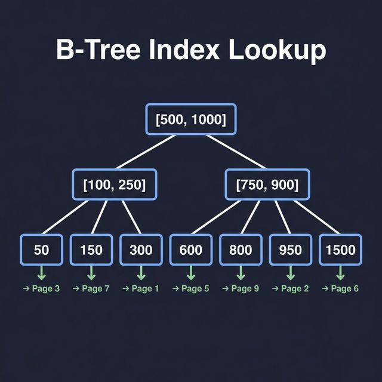
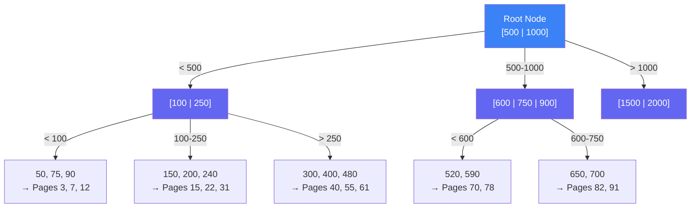
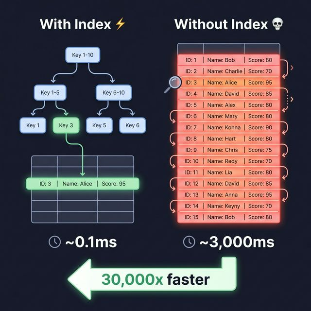
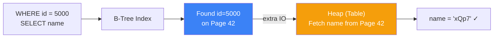
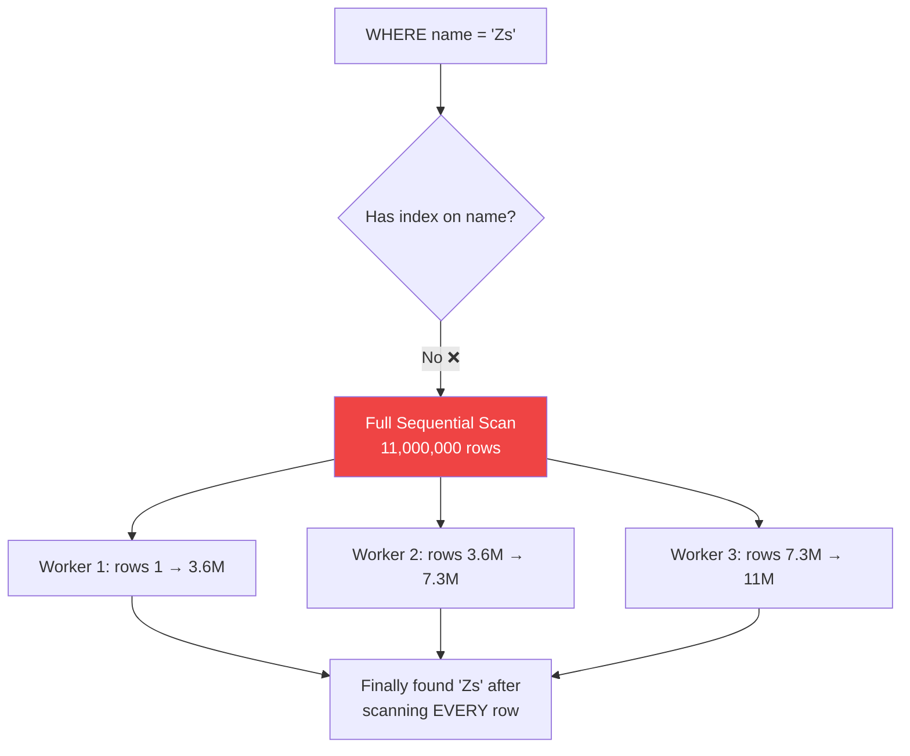
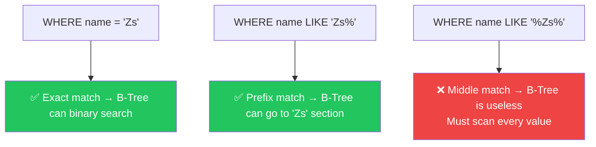
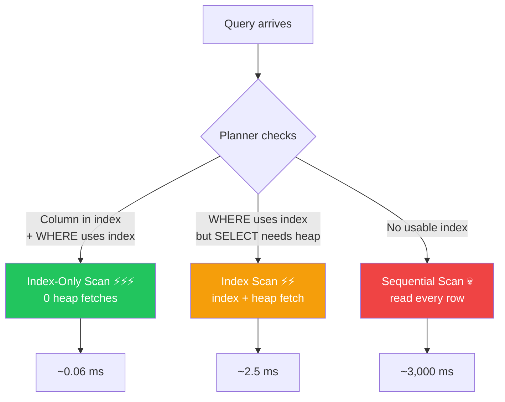
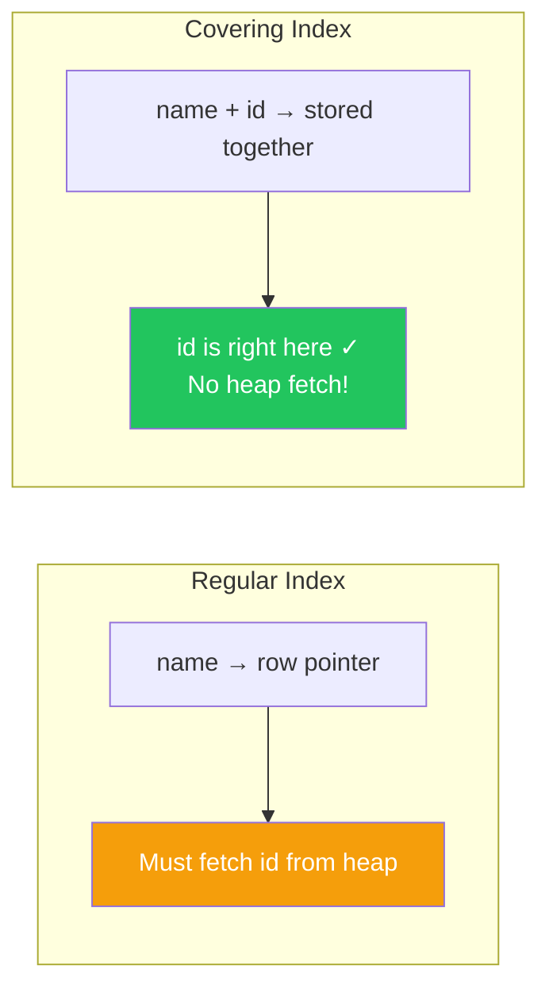

### Database Indexing

- An index is a **data structure** built on top of a table that creates **shortcuts** for finding rows
- Without an index, the database must scan **every single row** — with an index, it jumps directly to what you need
- Think of it like a **phone book** — instead of reading every page, you flip to the letter tab and search from there
- Every backend engineer must understand indexing — it's the difference between a **0.1ms** query and a **3,000ms** query

---

### The Analogy — Phone Book Index

```
┌──────────────────────────────────────────────────────────┐
│                     PHONE BOOK                            │
│                                                          │
│  ┌─────┐                                                 │
│  │  A  │──▶  Apple Corp, Amazon, Acme ...               │
│  ├─────┤                                                 │
│  │  B  │──▶  Boeing, Berkshire, BMW ...                  │
│  ├─────┤                                                 │
│  │  C  │──▶  Cisco, Chase, Coca-Cola ...                │
│  ├─────┤                                                 │
│  │ ... │                                                 │
│  ├─────┤                                                 │
│  │  Z  │──▶  Zebra, Zoom, Zillow ...                    │
│  └─────┘                                                 │
│                                                          │
│  Looking for "Zebra"?                                    │
│  ❌ Don't read A through Y (full scan)                   │
│  ✅ Jump to Z tab, search there (index scan)             │
└──────────────────────────────────────────────────────────┘
```

---

### How a B-Tree Index Works

The most common index type is a **B-Tree** (Balanced Tree). It organizes values in a tree structure so you can find any value in **O(log n)** time.





##### How the Search Works

To find `id = 700` in 11 million rows:

```
Step 1:  Root [500 | 1000] → 700 is between 500 and 1000 → go middle
Step 2:  Node [600 | 750 | 900] → 700 is between 600 and 750 → go there
Step 3:  Leaf [650, 700 ✓] → found! It's on Page 91

Total: 3 steps instead of scanning 11,000,000 rows
```

---

### Index Scan vs Full Table Scan



---

### Live Benchmark — 11 Million Rows

Setup: Postgres table with **11 million rows**, two columns:

```sql
CREATE TABLE employees (
    id    SERIAL PRIMARY KEY,   -- has B-Tree index by default
    name  TEXT                   -- NO index
);
-- 11,000,000 rows inserted
```

---

##### Query 1 — `SELECT id` with Index (Index-Only Scan)

```sql
EXPLAIN ANALYZE SELECT id FROM employees WHERE id = 2000;
```

```
Index Only Scan using employees_pkey on employees
  Index Cond: (id = 2000)
  Heap Fetches: 0          ← didn't touch the table at all!
  Planning Time:  0.15 ms
  Execution Time: 0.06 ms  ← ⚡ instant
```

**Why so fast?**


- The `id` column **is in the index** — no need to go to the heap
- This is called an **Index-Only Scan** — the sweetest query possible
- **0 heap fetches** = never touched the actual table

---

##### Query 2 — `SELECT name` with Index on `id` (Index Scan + Heap Fetch)

```sql
EXPLAIN ANALYZE SELECT name FROM employees WHERE id = 5000;
```

```
Index Scan using employees_pkey on employees
  Index Cond: (id = 5000)
  Planning Time:  0.12 ms
  Execution Time: 2.50 ms  ← still fast, but 25x slower than Query 1
```

**Why slower?**



- Found `id=5000` in the index instantly
- But `name` is **NOT in the index** — it's in the heap (the actual table on disk)
- Had to do an **extra disk read** to fetch the row from the heap → **2.5ms** instead of 0.06ms

---

##### Query 3 — No Index at All (Full Table Scan) 💀

```sql
EXPLAIN ANALYZE SELECT id FROM employees WHERE name = 'Zs';
```

```
Parallel Seq Scan on employees
  Filter: (name = 'Zs'::text)
  Workers Launched: 2
  Rows Removed by Filter: 10,999,999
  Planning Time:    0.83 ms
  Execution Time: 3,000 ms  ← 💀 THREE SECONDS
```

**Why so slow?**



- `name` has **no index** → database has no shortcut
- Must check **every single row** — all 11 million of them
- Postgres uses **parallel workers** to scan faster, but it's still ~3 seconds

---

##### Now Create an Index on `name`

```sql
CREATE INDEX employees_name ON employees(name);
-- Takes ~30 seconds to build (scanning all 11M rows to create the B-Tree)
```

##### Query 4 — Same Query, Now WITH Index

```sql
EXPLAIN ANALYZE SELECT id FROM employees WHERE name = 'Zs';
```

```
Bitmap Index Scan on employees_name
  Index Cond: (name = 'Zs'::text)
  Planning Time:  0.25 ms
  Execution Time: 0.47 ms  ← ⚡ 6,000x faster!
```

---

### Performance Comparison Table

| Query | Index Used? | Scan Type | Time | Notes |
|-------|-----------|-----------|------|-------|
| `SELECT id WHERE id = 2000` | ✅ Primary key | **Index-Only Scan** | **0.06 ms** | Value is IN the index → 0 heap fetches |
| `SELECT name WHERE id = 5000` | ✅ Primary key | **Index Scan + Heap** | **2.5 ms** | Found id in index, fetched name from heap |
| `SELECT id WHERE name = 'Zs'` | ❌ No index | **Full Table Scan** | **3,000 ms** | Scanned all 11M rows 💀 |
| `SELECT id WHERE name = 'Zs'` | ✅ After creating index | **Bitmap Index Scan** | **0.47 ms** | 6,000x faster ⚡ |
| `SELECT id WHERE name LIKE '%Zs%'` | ❌ Index exists but IGNORED | **Full Table Scan** | **1,100 ms** | Expression can't use B-Tree index |

---

### When the Database IGNORES Your Index

> Having an index **does not mean** the database will always use it. The **query planner** decides.

##### The `LIKE '%...%'` Trap

```sql
-- You have an index on name... but:
EXPLAIN ANALYZE SELECT id FROM employees WHERE name LIKE '%Zs%';
```

```
Parallel Seq Scan on employees      ← full table scan AGAIN!
  Filter: (name ~~ '%Zs%'::text)
  Execution Time: 1,100 ms           ← index completely ignored 💀
```

**Why?** The `%` wildcard at the **beginning** means: "match anything before Zs". A B-Tree index is sorted left-to-right — it can't search for something in the **middle** of a string.



| Pattern | Can Use B-Tree Index? | Why |
|---------|----------------------|-----|
| `WHERE name = 'Zs'` | ✅ Yes | Exact value → direct B-Tree lookup |
| `WHERE name LIKE 'Zs%'` | ✅ Yes | Prefix → B-Tree can go to the "Zs" section |
| `WHERE name LIKE '%Zs%'` | ❌ No | Wildcard at start → B-Tree can't narrow down |
| `WHERE name LIKE '%Zs'` | ❌ No | Wildcard at start → same problem |
| `WHERE LOWER(name) = 'zs'` | ❌ No | Function wrapping → need a **functional index** |

---

### Index-Only Scan vs Index Scan vs Seq Scan



| Scan Type | What Happens | Speed |
|-----------|-------------|-------|
| **Index-Only Scan** | Everything you need is IN the index — never touches the heap | ⚡⚡⚡ Fastest |
| **Index Scan** | Find row via index, then jump to heap for extra columns | ⚡⚡ Fast |
| **Bitmap Index Scan** | Collect matching row locations from index, then batch-fetch from heap | ⚡ Fast (for multiple matches) |
| **Sequential Scan** | Read every single row in the table from start to finish | 💀 Slowest |

---

### Covering Indexes — The Ultimate Optimization

If you frequently query `name` but also need `id`, you can **include extra columns** in the index:

```sql
-- Regular index: only stores name → row pointer
CREATE INDEX idx_name ON employees(name);

-- Covering index: stores name AND id in the index itself
CREATE INDEX idx_name_covering ON employees(name) INCLUDE (id);
```

Now `SELECT id FROM employees WHERE name = 'Zs'` becomes an **Index-Only Scan** — no heap fetch needed!



---

### The Cost of Indexes — Nothing is Free

| Benefit | Cost |
|---------|------|
| Reads are **much faster** | Writes are **slower** — every INSERT/UPDATE/DELETE must update the index too |
| Range queries become efficient | Index takes **disk space** — can be large for big tables |
| Can avoid heap fetches | **Building** the index on existing data is expensive (locks table) |
| Query planner can optimize | Too many indexes → write performance tanks |

##### Rule of Thumb

```
✅ Index columns you frequently search on (WHERE, JOIN, ORDER BY)
✅ Index columns used in range queries (BETWEEN, >, <)
✅ Use covering indexes for frequent SELECT + WHERE combos
❌ Don't index columns you rarely filter on
❌ Don't index columns with very low cardinality (e.g., boolean — only 2 values)
❌ Don't over-index write-heavy tables
```

---

### Index Types Beyond B-Tree

| Index Type | Best For | How It Works |
|-----------|---------|-------------|
| **B-Tree** | Equality, range queries, sorting | Balanced tree — O(log n) lookup. Default in most databases |
| **Hash** | Exact equality only (`=`) | Hash function → direct bucket lookup. Can't do ranges |
| **GIN** | Full-text search, arrays, JSONB | Inverted index — maps values to rows that contain them |
| **GiST** | Geometric data, ranges, nearest-neighbor | Generalized search tree for spatial queries |
| **BRIN** | Very large, naturally ordered tables | Block range index — tiny, fast for sequential data |
| **LSM Tree** | Write-heavy workloads | Used by RocksDB, Cassandra — optimized for writes over reads |

---

### Explain Analyze — Your Best Friend

Always use `EXPLAIN ANALYZE` to understand what the database is actually doing:

```sql
EXPLAIN ANALYZE SELECT name FROM employees WHERE id = 5000;
```

##### What to Look For

| Field | Meaning |
|-------|---------|
| **Seq Scan** | 🚨 Full table scan — probably missing an index |
| **Index Scan** | ✅ Using an index, but fetching from heap too |
| **Index Only Scan** | ⚡ Best case — everything is in the index |
| **Bitmap Index Scan** | ✅ Index used, results batched before heap fetch |
| **Heap Fetches: 0** | ⚡ Never touched the actual table |
| **Rows Removed by Filter** | How many rows were scanned but didn't match |
| **Planning Time** | Time to decide HOW to run the query |
| **Execution Time** | Time to actually DO the work |

---

### Summary

- An **index** is a data structure (usually B-Tree) that creates shortcuts for finding rows
- Without an index → **full table scan** → read every row → **slow** (3,000ms on 11M rows)
- With an index → **index scan** → jump directly to the right page → **fast** (0.06ms)
- **Index-Only Scan** is the best — when all requested columns are IN the index (0 heap fetches)
- `LIKE '%value%'` **cannot use B-Tree indexes** — the wildcard at the start defeats the tree structure
- **Having an index ≠ database will use it** — the query planner decides based on the query shape
- Indexes speed up reads but **slow down writes** — every INSERT/UPDATE/DELETE must update the index
- Use `EXPLAIN ANALYZE` to see exactly what the database is doing with your query
- **Only index what you search on** — don't over-index write-heavy tables