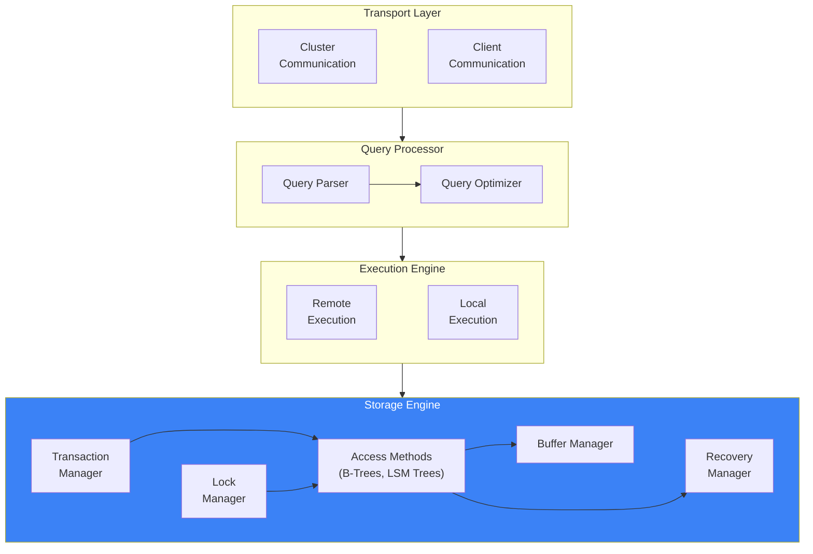
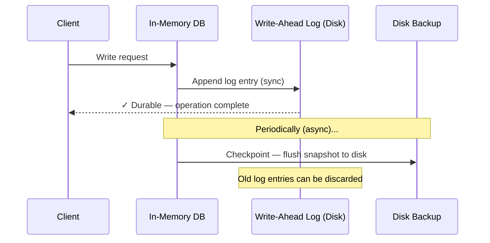
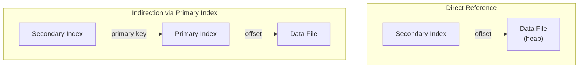
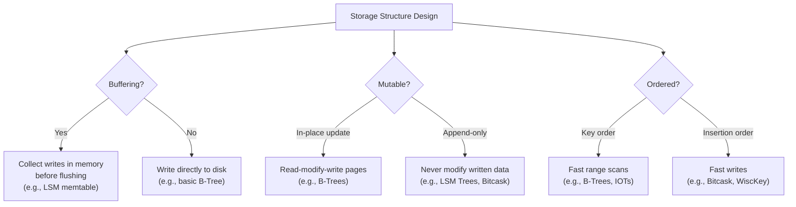

### Chapter 1 — Introduction and Overview

---

### Database Classification

| Type | What It Does | Example Workload |
|------|-------------|-----------------|
| **OLTP** (Online Transaction Processing) | Handles many short, user-facing transactions | User sign-ups, purchases, updates |
| **OLAP** (Online Analytical Processing) | Handles complex aggregations and long-running queries | Reports, dashboards, data warehousing |
| **HTAP** (Hybrid) | Combines both OLTP and OLAP | Real-time analytics on transactional data |

Other classifications: key-value stores, relational DBs, document stores, graph databases — but the concepts below apply to **all** of them.

---

### DBMS Architecture



##### What Each Component Does

| Component | Role |
|-----------|------|
| **Transport Layer** | Accepts client requests + communicates with other cluster nodes |
| **Query Parser** | Parses, interprets, and validates the SQL query |
| **Query Optimizer** | Finds the most efficient execution plan using statistics (index cardinality, data placement) |
| **Execution Engine** | Runs the plan — collects results from local and remote operations |
| **Transaction Manager** | Schedules transactions, ensures logical consistency |
| **Lock Manager** | Locks database objects so concurrent operations don't corrupt data |
| **Access Methods** | Manages data structures on disk — B-Trees, LSM Trees, heap files |
| **Buffer Manager** | Caches pages in memory |
| **Recovery Manager** | Maintains WAL (write-ahead log), restores state after crashes |

> **Transaction Manager + Lock Manager = Concurrency Control** — they work together to guarantee both logical and physical data integrity.

---

### Memory-Based vs Disk-Based DBMS

| | Memory-Based (In-Memory) | Disk-Based |
|--|--------------------------|------------|
| **Primary storage** | RAM | Disk (SSD/HDD) |
| **Disk usage** | Only for recovery logs + backups | Primary data store, memory used as cache |
| **Speed** | ⚡ Orders of magnitude faster | Slower — disk access is the bottleneck |
| **Durability** | Needs WAL + backups + UPS/battery-backed RAM | Inherently durable on disk |
| **Data structures** | Can use any structure — pointers are cheap | Must use wide, short trees (B-Trees) optimized for block reads |
| **Cost** | 💰 RAM is expensive | Cheaper per GB |
| **Examples** | Redis, MemSQL, VoltDB | PostgreSQL, MySQL, MongoDB |

##### How In-Memory DBs Stay Durable



- Every write goes to a **WAL** on disk before it's considered complete
- Periodically, a **checkpoint** flushes a snapshot to disk — so recovery doesn't replay the entire log
- **Checkpointing** keeps disk backup up-to-date without blocking clients

> ⚠️ An in-memory DB is **NOT** just "a disk DB with a huge cache" — in-memory stores use completely different data structures and optimizations.

---

### Row-Oriented vs Column-Oriented DBMS

##### Row-Oriented — Data stored row by row

All fields of a row are stored together on disk:

```
┌──────────────────────────────────────────────────────────┐
│  Page                                                     │
│                                                          │
│  [10, John, 01 Aug 1981, +1 111 222 333]                │
│  [20, Sam,  14 Sep 1988, +1 555 888 999]                │
│  [30, Keith, 07 Jan 1984, +1 333 444 555]               │
│                                                          │
│  ✅ Great for: SELECT * WHERE id = 10                    │
│  ❌ Bad for:  SELECT AVG(price) FROM stock               │
└──────────────────────────────────────────────────────────┘
```

| ID | Name | Birth Date | Phone Number |
|----|------|-----------|-------------|
| 10 | John | 01 Aug 1981 | +1 111 222 333 |
| 20 | Sam | 14 Sep 1988 | +1 555 888 999 |
| 30 | Keith | 07 Jan 1984 | +1 333 444 555 |

- One block read = **complete rows** with all columns
- Best when reading **entire records** (registration forms, user profiles)
- **Spatial locality** — related fields are next to each other on disk

---

##### Column-Oriented — Data stored column by column

Each column is stored separately:

```
┌───────────────────────────────────────────────────┐
│  Symbol column                                     │
│  [1:DOW, 2:DOW, 3:S&P, 4:S&P]                    │
├───────────────────────────────────────────────────┤
│  Date column                                       │
│  [1:08 Aug 2018, 2:09 Aug 2018, 3:08 Aug 2018,   │
│   4:09 Aug 2018]                                   │
├───────────────────────────────────────────────────┤
│  Price column                                      │
│  [1:24314.65, 2:24136.16, 3:2414.45, 4:2232.32]  │
└───────────────────────────────────────────────────┘
```

**Logical table (same data):**

| ID | Symbol | Date | Price |
|----|--------|------|-------|
| 1 | DOW | 08 Aug 2018 | 24,314.65 |
| 2 | DOW | 09 Aug 2018 | 24,136.16 |
| 3 | S&P | 08 Aug 2018 | 2,414.45 |
| 4 | S&P | 09 Aug 2018 | 2,232.32 |

**Physical layout — columns stored separately:**

```
Symbol:  1:DOW    2:DOW    3:S&P    4:S&P
Date:    1:08 Aug 2:09 Aug 3:08 Aug 4:09 Aug
Price:   1:24314  2:24136  3:2414   4:2232
```

- Each value carries a **row ID** to reconstruct tuples (or uses position as implicit ID)
- One block read = **many values of one column** → aggregations are fast

---

##### Column-Oriented Optimizations

| Optimization | How It Helps |
|-------------|-------------|
| **Better compression** | Same data types together → better compression ratios per column |
| **Vectorized processing** | CPU SIMD instructions can process multiple column values in a single instruction |
| **Cache efficiency** | Reading one column fills CPU cache with relevant data only |

##### When to Use What

| Access Pattern | Best Fit |
|---------------|----------|
| Read full records (`SELECT *`) | **Row store** |
| Point queries + range scans | **Row store** |
| Aggregations over few columns (`SUM`, `AVG`) | **Column store** |
| Scans spanning many rows | **Column store** |

**Row-oriented:** MySQL, PostgreSQL, most traditional RDBMS
**Column-oriented:** MonetDB, C-Store/Vertica, ClickHouse, Apache Parquet, Apache Kudu

---

##### Wide Column Stores — NOT the Same as Column-Oriented!

| | Column-Oriented | Wide Column Store |
|--|----------------|-------------------|
| **Storage** | Values of same column together | Rows grouped by **column families**, stored row-wise within each family |
| **Best for** | Aggregations, analytics | Key-based lookups, time-series |
| **Examples** | ClickHouse, Parquet | BigTable, HBase, Cassandra |

**Wide column = multidimensional sorted map:**

```
┌─────────────────────────────────────────────────────┐
│  Row Key: "com.cnn.www"                              │
│                                                     │
│  Column Family: contents                             │
│    "html" @ t5  → "<html>..."                       │
│    "html" @ t3  → "<html>..."  (older version)      │
│                                                     │
│  Column Family: anchor                               │
│    "cnnsi.com" @ t9  → "CNN"                        │
│    "my.look.ca" @ t8  → "CNN.com"                   │
└─────────────────────────────────────────────────────┘
```

- Data is indexed by **row key** → then by **column family** → then by **column + timestamp**
- Column families are stored **separately on disk**, but within each family data is stored **row-wise**
- Multiple **versions** of each cell (by timestamp)

---

### Data Files and Index Files

Why not just use flat files? Specialized file organization gives us:

| Goal | How |
|------|-----|
| **Storage efficiency** | Minimize overhead per record |
| **Access efficiency** | Locate records in fewest possible steps |
| **Update efficiency** | Minimize disk changes per update |

---

##### Data Files — 3 Types

| Type | How It Works | Pros | Cons |
|------|-------------|------|------|
| **Heap file** | Rows stored in insertion order, no sorting | Fast writes — just append | Needs separate indexes to search |
| **Hash file** | Hash of key determines which bucket stores the row | Fast point lookups | Can't do range scans |
| **IOT (Index-Organized Table)** | Data stored IN the index itself, sorted by key | Range scans are sequential reads | Writes must maintain order |

##### Index Files

- **Primary index** — built over the primary key, one entry per record
- **Secondary index** — built over other columns, can have multiple entries per key
- **Clustered** — data order matches index order (rows are physically sorted)
- **Nonclustered** — data order differs from index order (rows scattered)



| Approach | Pros | Cons |
|----------|------|------|
| **Direct reference** (offset to data file) | Fewer disk seeks on read | Must update all index pointers when rows move |
| **Indirection** (via primary key) | Cheaper pointer updates | Extra lookup through primary index on every read |

> **MySQL InnoDB** uses indirection — secondary indexes store the primary key, requiring two lookups (secondary → primary → data).

---

##### Deletion — Tombstones, Not Erasure

- Most storage engines **don't delete data from pages** directly
- Instead, they write a **tombstone** (deletion marker with key + timestamp)
- Actual space is reclaimed later during **garbage collection**

---

### Buffering, Immutability, and Ordering

Three fundamental design variables for any storage structure:

| Variable | Options | Trade-off |
|----------|---------|-----------|
| **Buffering** | Buffer writes in memory before flushing to disk | Amortizes IO cost, but risks data loss if crash before flush |
| **Mutability** | In-place updates vs append-only (immutable) | In-place = simpler reads, append-only = simpler writes + crash recovery |
| **Ordering** | Store records in key order vs insertion order | Key order = fast range scans, insertion order = fast writes |



| Storage Engine | Buffering | Mutability | Ordering |
|---------------|-----------|-----------|----------|
| **B-Tree** | Minimal | In-place update | Key order ✅ |
| **LSM Tree** | Heavy (memtable) | Append-only | Key order (after compaction) |
| **Bitcask** | Minimal | Append-only | Insertion order |
| **Bw-Tree** | Yes | Append-only (B-Tree inspired but immutable) | Key order |

---

### Summary

- **DBMS architecture** has 4 layers: transport → query processor → execution engine → storage engine
- **Storage engine** has 5 components: transaction manager, lock manager, access methods, buffer manager, recovery manager
- **In-memory vs disk-based** — RAM is fast but volatile + expensive; disk is slow but durable + cheap
- **Row store** = rows packed together → great for OLTP, full record reads
- **Column store** = columns packed together → great for OLAP, aggregations, compression
- **Wide column ≠ column store** — wide column (BigTable, HBase) groups columns into families stored row-wise
- **Data files** come in 3 types: heap (unordered), hash (bucketed), IOT (index-organized)
- **Indexes** can be primary/secondary, clustered/nonclustered, direct/indirect reference
- Every storage structure is a trade-off between **buffering, mutability, and ordering**