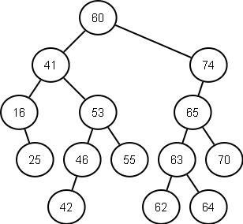
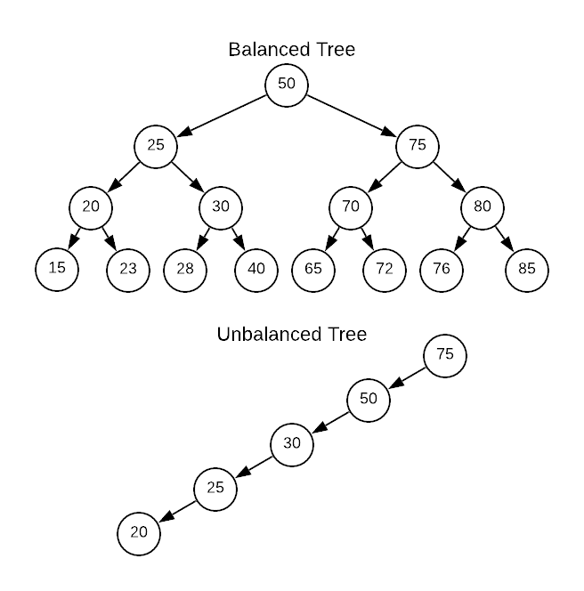
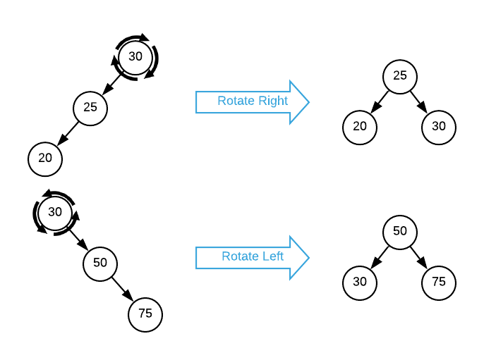
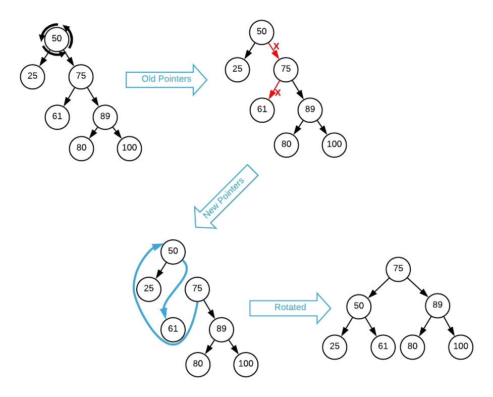
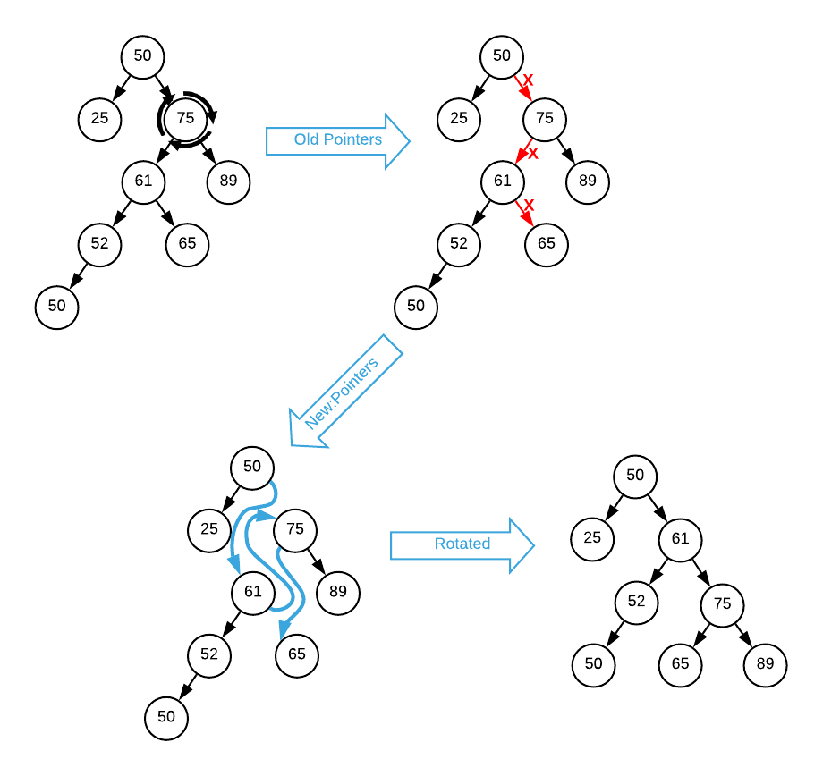
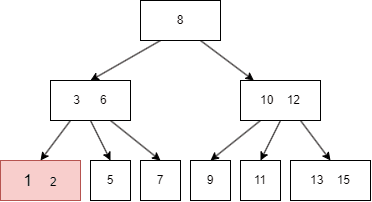
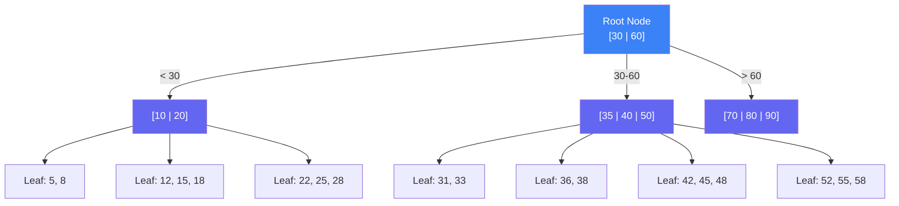
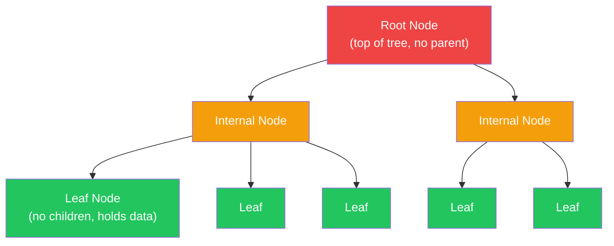
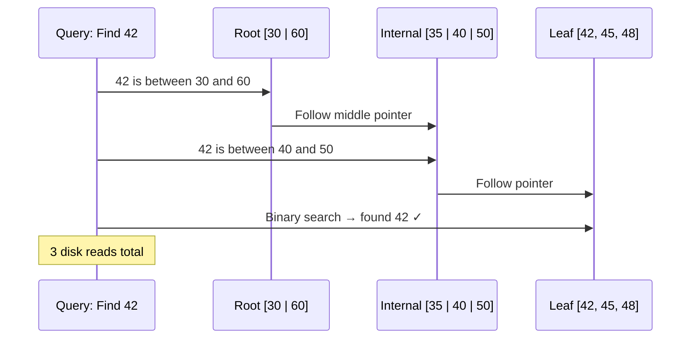
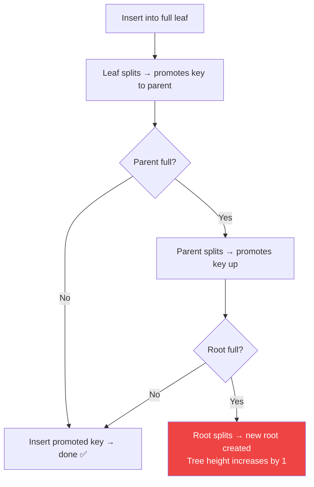

### Chapter 2 — B-Tree Basics

> 📖 **Must-Read:** [IO Devices and Latency — PlanetScale](https://planetscale.com/blog/io-devices-and-latency) — interactive journey through disk/SSD latency and why it matters for data structures
>
> 🎥 **Watch:** [B-Tree Explained](https://www.youtube.com/watch?v=K1a2Bk8NrYQ) | [B+ Tree Explained](https://www.youtube.com/watch?v=09E-tVAUqQw)

---

### Why Not Just Use Binary Search Trees?

A **Binary Search Tree (BST)** is a sorted in-memory tree where each node has at most 2 children:



- Each node holds **one key** + left and right child pointers
- **Left subtree** → all keys smaller than the node
- **Right subtree** → all keys greater than the node
- Lookups work by comparing and going left or right → **O(log N)** when balanced

---

##### The Balancing Problem

Without balancing, a BST can become a **linked list** → worst case **O(N)**:



- A **balanced tree** has height **log₂ N** — both subtrees differ in height by at most 1
- An **unbalanced tree** degrades to O(N) — you're scanning, not searching
- To fix this, we use **rotations** after inserts/deletes

---

##### How Rotations Work

Rotations swap a parent with one of its children to reduce tree height:



**Left Rotation** — parent swaps with its right child:



1. Parent of rotation node becomes parent of right child
2. Rotation node's right pointer → right child's left pointer
3. Right child's left pointer → rotation node

**Right Rotation** — mirror image:



1. Parent of rotation node becomes parent of left child
2. Rotation node's left pointer → left child's right pointer
3. Left child's right pointer → rotation node

---

### Why BSTs Fail on Disk

BSTs are great in memory, but **terrible on disk** for two reasons:

| Problem | Why It Hurts |
|---------|-------------|
| **Low fanout** | Only 2 children per node → tree is very tall → many disk seeks |
| **Poor locality** | Nodes added randomly → parent and child may be on different disk pages |
| **Frequent rebalancing** | Rotations constantly move nodes around → expensive pointer updates on disk |

```
BST with 4 billion items:
  Height = log₂(4,000,000,000) ≈ 32 levels
  = 32 disk seeks per lookup 💀

B-Tree with 4 billion items:
  Height = log₅₀₀(4,000,000,000) ≈ 3-4 levels
  = 3-4 disk seeks per lookup ⚡
```

> The smallest unit of disk I/O is a **block** (4-16 KB). If you fetch a block anyway, fill it with as many keys as possible → **high fanout** → **short tree**.

---

### What We Need for Disk

An ideal on-disk tree must have:

1. **High fanout** → more children per node → fewer levels → fewer disk seeks
2. **Low height** → fewer root-to-leaf traversals
3. **Good locality** → related keys on the same page

> Fanout and height are **inversely correlated** — higher fanout = lower height.

---

### HDD vs SSD — Why It Matters

| | HDD (Spinning Disk) | SSD (Solid State) |
|--|---------------------|-------------------|
| **Smallest read unit** | Sector (512B – 4KB) | Page (2–16 KB) |
| **Smallest write unit** | Sector | Page |
| **Smallest erase unit** | — | Block (64–512 pages) |
| **Random read** | 💀 Slow — mechanical head must move + disk must spin | ⚡ Fast — no moving parts |
| **Sequential read** | Fast (once head is positioned) | Fast |
| **Random vs Sequential gap** | Huge — 100x+ difference | Small — still some difference |
| **Write quirk** | Can overwrite in place | Must erase entire block before rewriting |

##### SSD Internal Structure

```
Die → Planes → Blocks → Pages → Cells
                  │          │
                  │          └─ Smallest READ/WRITE unit (2-16 KB)
                  └─ Smallest ERASE unit (128 KB – 8 MB)
```

- **Flash Translation Layer (FTL)** maps logical page IDs → physical locations
- FTL handles **garbage collection** — relocates live pages, erases freed blocks
- Writing full blocks + batching writes → fewer I/O operations

> 📖 **Deep dive:** [IO Devices and Latency — PlanetScale](https://planetscale.com/blog/io-devices-and-latency) covers tape → HDD → SSD → cloud storage latency with interactive visualizations.

---

### B-Trees — The Disk-Optimized Tree

B-Trees solve the BST problems by packing **many keys per node** (high fanout) and keeping the tree **short**:





##### Key Properties

| Property | Value |
|----------|-------|
| **Fanout** | Dozens to hundreds of children per node |
| **Keys per node** | Up to N keys, N+1 child pointers |
| **Height** | logₖ(M) where K=fanout, M=total items (typically 3–4 levels) |
| **Sorted** | Keys stored in order within each node → binary search inside node |
| **Balanced** | Always — grows bottom-up, splits/merges maintain balance |
| **Occupancy** | Can be as low as 50%, usually much higher |

---

### B-Tree Node Types



| Node Type | Role |
|-----------|------|
| **Root** | Top of the tree — no parent, entry point for all searches |
| **Internal** | Connect root to leaves — hold separator keys + child pointers |
| **Leaf** | Bottom of the tree — hold actual data (key-value pairs) |

> **Node = Page** → B-Trees organize fixed-size **pages** on disk. The terms are interchangeable.

---

### B-Tree vs B⁺-Tree

| | B-Tree | B⁺-Tree |
|--|--------|---------|
| **Values stored in** | All nodes (root, internal, leaf) | **Only leaf nodes** |
| **Internal nodes hold** | Keys + values + pointers | Keys + pointers only (separator keys) |
| **Leaf-level links** | No | Yes — leaves form a **linked list** for range scans |
| **What databases use** | Rarely in practice | ✅ Almost all databases (InnoDB, Postgres, etc.) |

> 🔑 When people say "B-Tree" in database context, they almost always mean **B⁺-Tree**. The book and MySQL InnoDB both use this convention.

---

### Separator Keys

Keys in B-Tree nodes are called **separator keys** — they divide the tree into subtrees:

```
Node: [K1 | K2 | K3]
       │    │    │    │
       ▼    ▼    ▼    ▼
    <K1  K1-K2 K2-K3  >K3
```

- First pointer → subtree with keys **less than** K1
- Between Ki and Ki+1 → subtree with keys **≥ Ki and < Ki+1**
- Last pointer → subtree with keys **≥ K3**

##### Sibling Pointers (B⁺-Tree)

```
[Leaf 1] ←→ [Leaf 2] ←→ [Leaf 3] ←→ [Leaf 4]
```

- Leaf nodes link to siblings → **range scans** don't need to go back up the tree
- Some implementations use double-linked lists → forward AND reverse iteration

---

### B-Tree Lookup

##### Algorithm

```
1. Start at root
2. Binary search within node for the right separator key
3. Follow the child pointer to the next level
4. Repeat until you reach a leaf
5. Find the key in the leaf (or conclude it's not there)
```



##### Lookup Complexity

| Perspective | Complexity | What It Means |
|-------------|-----------|--------------|
| **Disk transfers** | O(logₖ M) | K = fanout, M = total items. ~3-4 seeks for billions of rows |
| **Comparisons** | O(log₂ M) | Binary search within each node |

---

### Node Splits (Insert Overflow)

When a node is **full** and we need to insert → **split** into two nodes:

##### Leaf Node Split

```
Before (full):
  [5 | 8 | 11 | 13 | 15]  ← insert 11, node overflows

After split:
  Left:  [5 | 8 | 11]
  Right: [13 | 15]
  
  Promoted to parent: 13 (first key of right node)
```

##### Nonleaf Node Split

Same idea — split at midpoint, promote the middle key to parent.

##### Split Can Propagate



##### Split Steps

1. Allocate a new node
2. Copy half the elements to the new node
3. Insert the new element into the correct node
4. Promote a separator key + pointer to the parent

> The tree **only grows taller** when the root splits. Otherwise it grows **horizontally**.

---

### Node Merges (Delete Underflow)

When a node has **too few keys** after deletion → **merge** with a sibling:

##### When to Merge

- **Leaf:** combined keys of two siblings fit in one node
- **Nonleaf:** combined pointers of two siblings fit in one node

##### Merge Steps

1. Copy all elements from right sibling to left sibling
2. Remove separator key from parent (demote it for nonleaf merge)
3. Delete the now-empty right node

> Merges can also **propagate up** to the root — if the root ends up with one child, it's removed and the child becomes the new root (tree height decreases).

---

### B-Tree Design — Built Bottom-Up

Unlike BSTs (top-down), B-Trees grow **bottom-up**:

```
Insert 1, 2, 3, 4, 5 into B-Tree (max 3 keys per node):

Step 1: [1]
Step 2: [1 | 2]
Step 3: [1 | 2 | 3]  ← full
Step 4: Insert 4 → split!
           [3]
          /    \
     [1|2]    [3|4]

Step 5: Insert 5 → [3|4|5] full → split!
           [3 | 5]
          /   |    \
      [1|2] [3|4] [5]
```

- New leaves grow at the bottom → splits push separators **up**
- Height only increases when the **root** splits
- This guarantees the tree stays **perfectly balanced**

---

### Summary

- **BSTs** are great in memory but terrible on disk — low fanout (2), tall trees, poor locality
- **B-Trees** fix this with **high fanout** (hundreds of keys/node), **low height** (3-4 levels for billions of rows), and page-aligned nodes
- **B⁺-Trees** (what databases actually use) store values only in leaves and link leaves for range scans
- **Lookup:** root-to-leaf traversal with binary search at each level → **O(logₖ M)** disk seeks
- **Insert overflow → split** the node, promote a key to parent (can cascade to root)
- **Delete underflow → merge** siblings, pull separator from parent (can cascade to root)
- Tree grows **bottom-up** — only gets taller when the root splits
- **HDD:** random seeks are expensive → high fanout minimizes seeks
- **SSD:** random reads are faster but writes must erase entire blocks → batch writes, write full pages