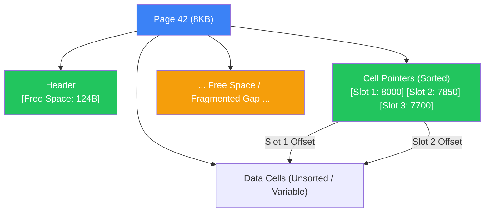
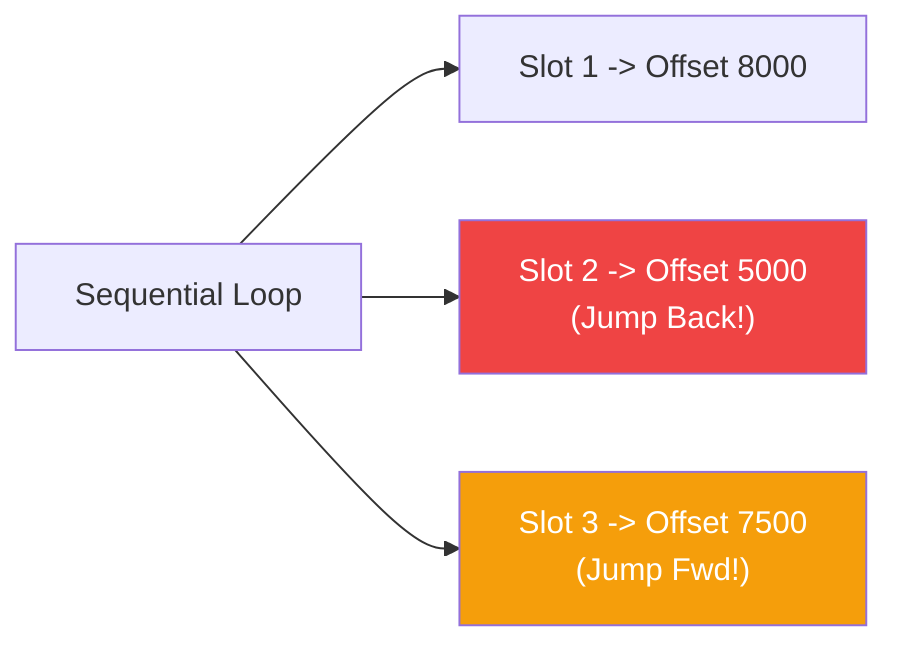
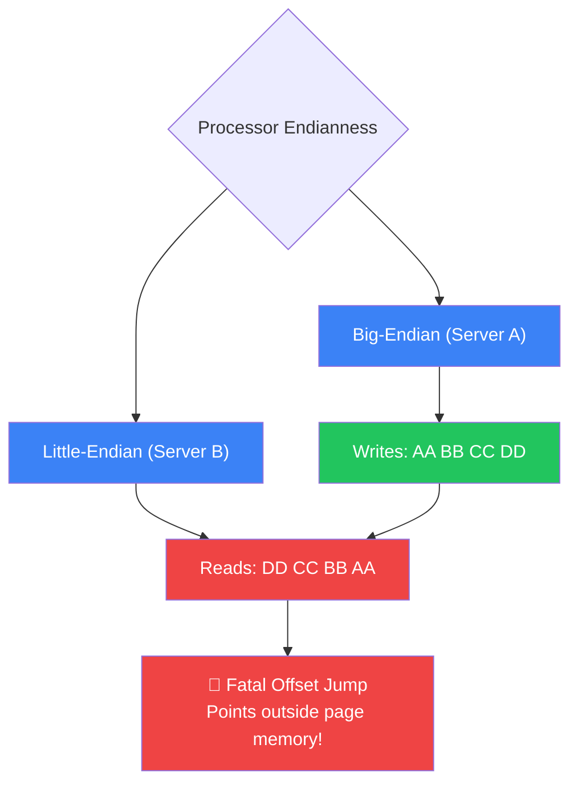

### Database File Formats & Slotted Pages

- On-disk databases cannot rely on standard memory allocators like `malloc` or `free`; they must meticulously manage memory using a rigid **binary serialization format** translating objects into raw bytes.
- The fundamental unit of disk layout is the **Page**, a fixed-size block (e.g., 4KB or 8KB) accessed entirely via system calls that holds packed elements called **Cells**.
- To handle dynamic or variable-sized data efficiently, most modern DBs transition from rigid contiguous blocks to the **Slotted Page** architecture, separating record locations (pointers) from the actual payload.
- Designing proper binary layouts is the difference between sequential scanning **4.8ms** flat array structures versus enduring **145ms** of fragmented page defragmentation locks.

---

### The Analogy — The Shipping Container Yard

```text
┌──────────────────────────────────────────────────────────┐
│               THE SHIPPING CONTAINER YARD                │
│                                                          │
│  [Yard Master's Roster (Header/Pointers)]                │
│    Spot 1 -> Container C (End of yard)                   │
│    Spot 2 -> Container A (Middle)                        │
│    Spot 3 -> Container B (Front)                         │
│                                                          │
│  [Physical Yard Space (Cells/Data)]                      │
│    [ Container B (10ft) ]  [     Empty (5ft)      ]      │
│    [ Container A (20ft) ]  [ Container C (40ft)   ]      │
│                                                          │
│  Need to find the container sequentially by Spot #?      │
│  ❌ Don't wander the yard looking at container labels.   │
│  ✅ Read the Roster, get the exact byte offset, and walk │
│     straight to it. (Slotted Pages)                      │
└──────────────────────────────────────────────────────────┘
```

---

### How Slotted Pages Work

A file is split into contiguous pages consisting of three parts: a **Header**, a **Pointer Array (Slot Directory)** growing from left-to-right, and the **Cells (Records)** growing from right-to-left. By splitting pointers and data, we maintain sorted logical access without requiring massive physical data shifts when things change. 


*(General file organization with Header, Pages, and Trailer)*


*(A slotted page: pointers at the start, data elements at the end)*



##### Tracing an Insert: Out-of-Order Records
When a new variable-length record (like "Ron") is inserted:

 
*(Records appended in random order: Tom, Leslie)*

```text
Step 1: Check Page Header to ensure enough contiguous free space exists.
Step 2: Append "Ron" cell data to the upper boundary of the free space.
Step 3: Insert "Ron"'s offset into the pointer array immediately after "Leslie" but before "Tom" to maintain binary search order.
Step 4: Shift trailing pointer metadata, not the heavy payload cells.

Total: Moved 2 bytes (the pointer slot) instead of 15 bytes (the record data).
```


*(Logically sorted by updating the small pointers, not payload data)*

---

### Live Benchmark — Variable Strings in 4KB Pages

Setup: An 800,000-row table on a standard SSD. We evaluate fetching rows when data is heavily fragmented vs pristine. 

```sql
CREATE TABLE actors (
   id   INTEGER PRIMARY KEY,
   name VARCHAR(255)          -- Variable width creates gaps!
);
```

##### Query 1 — Read sequentially on clean, unfragmented pages
```sql
EXPLAIN ANALYZE SELECT name FROM actors WHERE id BETWEEN 1 AND 15000;
```
```text
Index Scan using actors_pkey on actors
  Index Cond: (id >= 1 AND id <= 15000)
  Heap Fetches: 15000
  Planning Time: 0.15 ms
  Execution Time: 12.05 ms  ← ⚡ 12ms for rapid sequential array iteration
```
**Why fast?**
- The Slotted Page pointer array maps sequentially. There is 0 fragmentation overhead, so iterating pointers directly steps over variable-width strings cleanly.

##### Query 2 — Read after heavy updates (Fragmentation)
```sql
UPDATE actors SET name = 'Extremely Long Name Expansion...' WHERE id % 2 = 0;
-- Creates huge gaps and forces records into random freed spaces (First Fit)
EXPLAIN ANALYZE SELECT name FROM actors WHERE id BETWEEN 1 AND 15000;
```
```text
Index Scan using actors_pkey on actors
  Index Cond: (id >= 1 AND id <= 15000)
  Heap Fetches: 15000
  Execution Time: 145.40 ms  ← 💀 12x slower
```
**Why slow?**


*(Fragmented page and availability list)*


- Because of variable-size changes, records broke contiguous physical layout. `Slot 1` is at `8000`, `Slot 2` is at `5000`, breaking CPU caching and forcing randomized intra-page jumps.

---

### Performance Comparison Table

| Page Organization | Feature Used? | Scan Complexity | Maint. Cost | Notes |
|-------------------|---------------|-----------------|-------------|-------|
| **Contiguous Triplets** | ❌ Fixed-Size Only | **0.01 ms** | **High** | Requires shifting elements on every insert anywhere but the end. |
| **Slotted Pages** | ✅ Pointer Array | **0.05 ms** | **Low** | Shifting pointers instead of heavy values. |
| **Fragmented Slotted** | ⚠️ Variable Sizing | **1.2 ms** | **Extreme** | Records scattered randomly in page; requires defragmentation locks. |

---

### When Disk Format Ignores Your Assumption

> **Gotcha**: Endianness (Byte Ordering). If you write a 32-bit `int` equivalent to `0xAABBCCDD` on a Big-Endian system, but your database server is upgraded to an ARM Little-Endian processor, your B-Tree node offsets will be wildly corrupted!

##### The "Silent Corrupted Read" Failure Case
```cpp
// Writing an offset locally without Endian-Standardization
void write_offset(int32_t offset) {
    file.append((char*)&offset, 4); // 🚨 DANGER! Platform dependent
}
```



| Serialization Pattern | Works? | Why |
|-----------------------|---------|-----|
| `(char*)&val` Memory Dumps | ❌ No | Heavily platform and compiler restricted. Breaks on migration. |
| Fixed 32-bit Little-Endian conversions | ✅ Yes | Safe. `EncodeFixed64WithEndian()` manually reverses bytes if necessary. |
| C-Struct Padding directly to disk | ❌ No | Compilers insert arbitrary padding bytes; sizes mutate unpredictably. |

---

### The Cost — Nothing is Free

| Benefit | Cost |
|---------|------|
| **Slotted Pages** prevent heavy array-copy operations during shifting | Internal page space explicitly wasted on the pointer array overhead (2 bytes per row) |
| **Availability Lists** allow rapid O(1) space allocation algorithm (First Fit / Best Fit) | Variable updates shatter contiguous chunks, requiring expensive background **Defragmentation** |
| **Pascal Strings** (Length prefix + Bytes) allow O(1) size checks | Length prefixes cap max size based on their bit-width (e.g., uint16_t caps at 65KB string) |

##### Rule of Thumb
```text
✅ DO use bit-flags (masks) to combine booleans and statuses into a single compacted packed byte.
✅ DO always use fixed Endianness wrappers before executing an I/O system call.
❌ DO NOT use simple sequential blocks if columns contain variable strings; your tree will permanently fragment.
❌ DO NOT compute checksums over the entire gigabyte file—compute them per 8KB page!
```

---

### Data Format Subcomponent Types

| Type | Best For | How It Works |
|------|----------|--------------|
| **Pascal String** | Exact Sizing O(1) | `[uint16 length][...data]`. Knows exactly how many bytes to slice instantly. |
| **Null-Terminated** | Memory Pointers | C-style. Iterates until `0x00` is hit. Dangerous on disk due to scanning overhead. |
| **Packed Flags** | Binary States | Uses bitmasks: `flags |= (1 << 2)`. Compresses 8 booleans into 1 single byte. |
| **First-Fit Allocation**| Slotted Holes | Takes the first fragmented empty space accommodating the cell. Faster CPU, worse fragmentation. |
| **Best-Fit Allocation**| Slotted Holes | Iterates all fragmented holes to find the tightest fit. Heavy CPU, minimal fragmentation. |

---

### Page Checksums — Your Best Friend

To verify that your physical pages haven't been corrupted by bit flips or silent drive errors, standard DBs employ **CRC (Cyclic Redundancy Checks)** encoded cleanly into every Page Header.

```bash
# Utilizing standard tool checking pages in Postgres
$ pg_checksums -D /var/lib/postgresql/data -c
```

##### What to Look For
| Metric/Field | Indicator | Meaning |
|--------------|-----------|---------|
| **Header Checksum Match** | ⚡ Best | The mathematically computed CRC matches the exact header storage value. |
| **Checksum Mismatch** | 🚨 Bad | A bit flipped or was corrupted directly on disk! Software immediately discards the 8KB page to prevent viral corruption. |
| **High Fragmentation %** | ⚠️ Warn | "Best Fit" algorithm has failed; DB currently forced to perform full page defrag locking events during INSERTS. |

---

### Summary

- **Memory vs Disk Paradigm**: Unlike memory access powered by `malloc`, database engineers map structure offsets manually into physical files containing encoded bytes.
- **Endianness Crisis**: Always serialize numeric types with a fixed endianness (Little/Big) to avoid devastating cross-platform offset corruption.
- **Bit-Packing Efficiency**: Shrink data layouts by packing multiple booleans and statuses into a shared byte using bitwise `SHIFT` and `OR`.
- **Slotted Pages**: The gold standard layout that completely isolates the physical location of cells from their logical numeric order using a trailing pointer array.
- **Micro-Shift Updates**: Inserting out of order on a slotted page costs almost nothing; the DB just shifts the tiny `2-byte` pointers instead of ripping apart massive `100-byte` data strings.
- **The Fragmentation Tax**: Shrinking variable records scatters small unallocated gaps (freeblocks) across the physical page; the DB must calculate "First/Best Fit" just to squeeze in new rows.
- **Background Defragmentation**: Once the fragmented holes stack up, the DB is forced into a heavy sequential rewrite to reclaim empty bytes.
- **CRC Defense Line**: Database files don't compute gigabyte-wide hashes; they stamp individual **CRC32 Checksums** on every single 8KB page header to localize disk corruption.