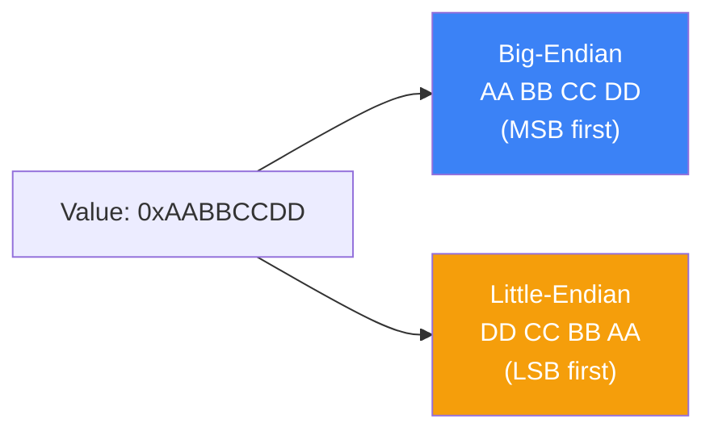
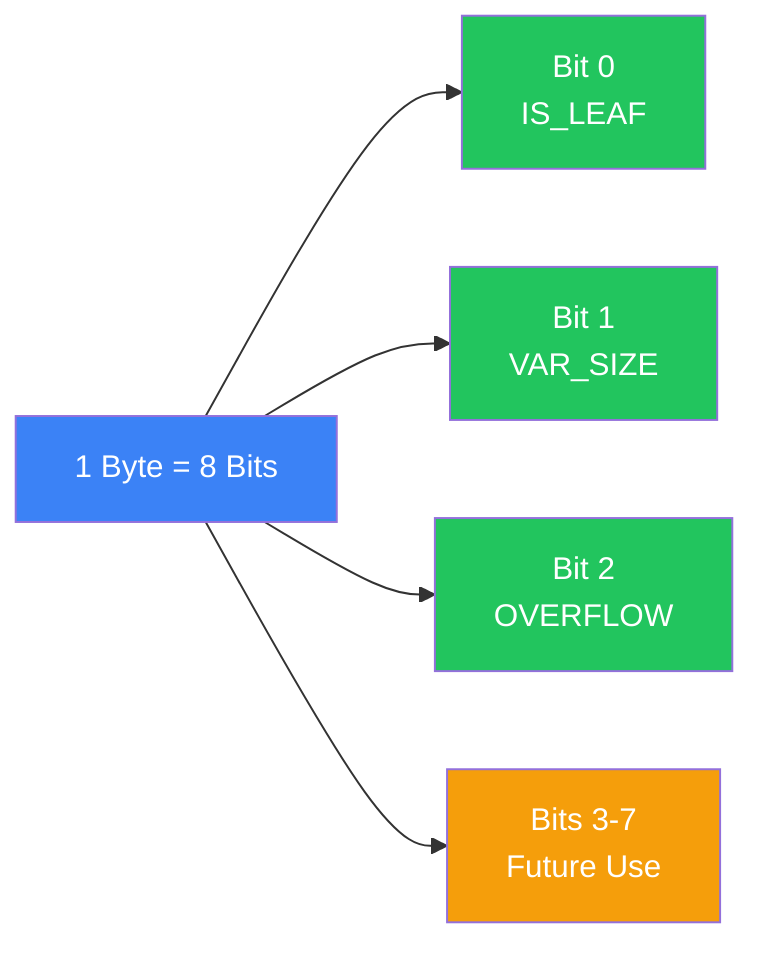
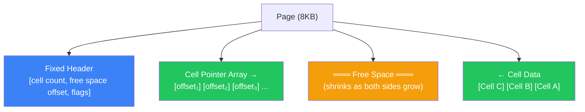
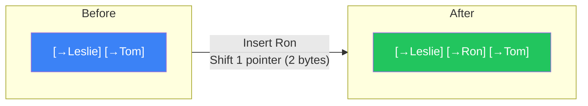
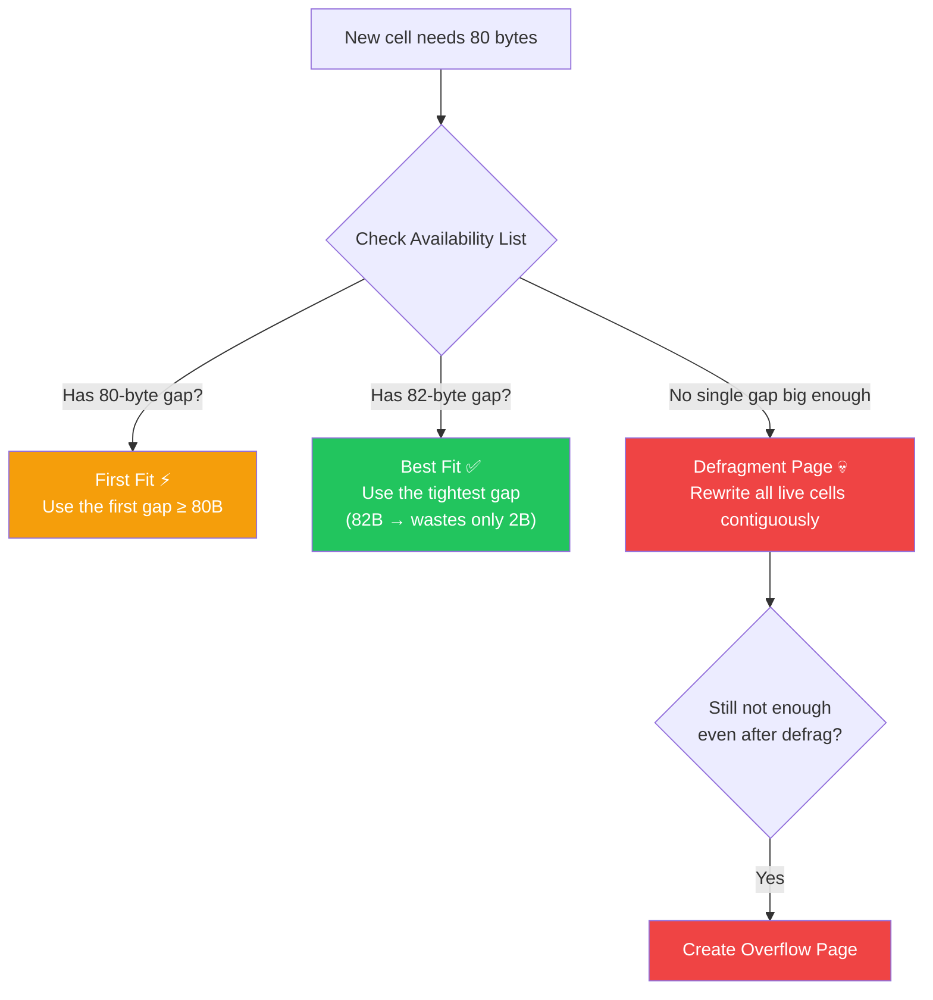
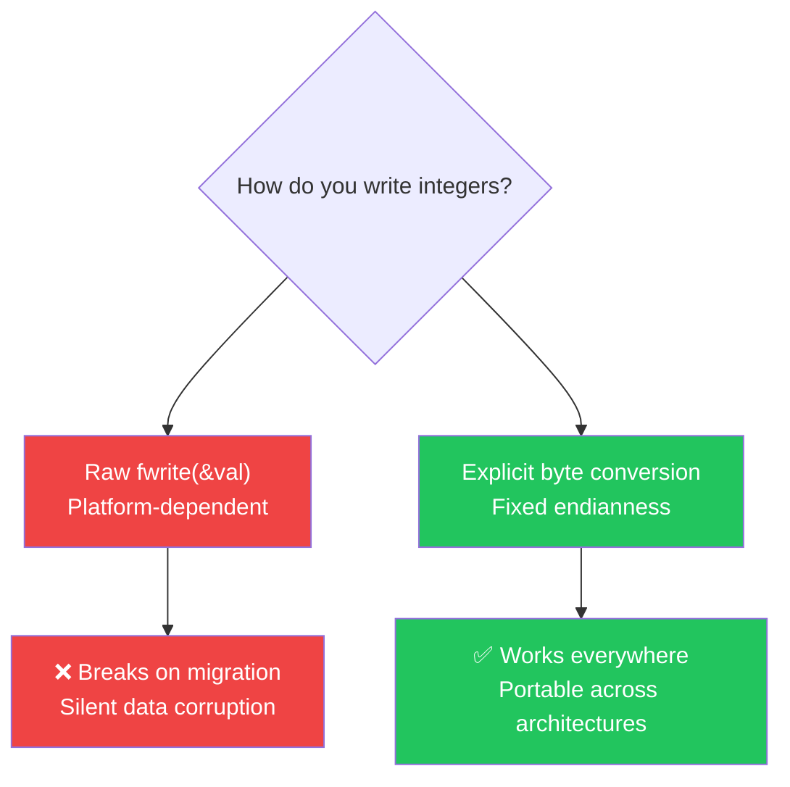
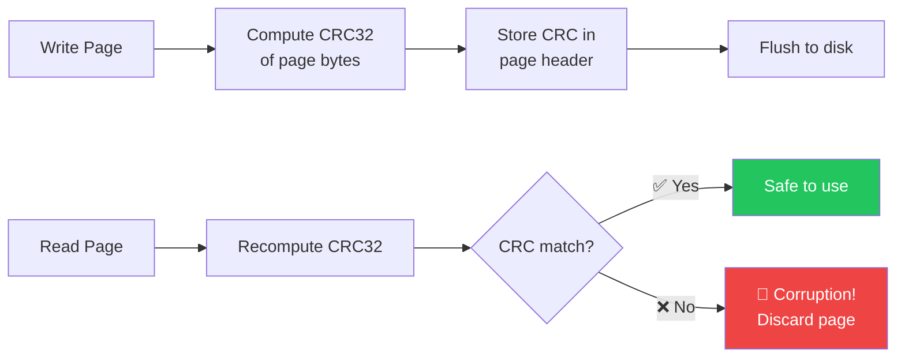

### Database File Formats — On-Disk Page Layouts

- A database file is **not** like accessing RAM with `malloc` — you only get raw `read()` and `write()` system calls, so every byte position must be **manually designed** into a binary format
- Files are chopped into fixed-size **pages** (4–16 KB each), and each page is the atomic unit the DB reads/writes from disk — **1 page = 1 disk I/O**
- The star of this chapter is the **Slotted Page**: a layout that separates a pointer array (growing →) from data cells (growing ←), solving variable-size record management without shifting heavy payloads
- Getting this layout right is the difference between a **0.05ms** pointer-only insert and a **12ms** full-page defragmentation lock 💀

---

### The Analogy — The Warehouse Index Board

```
┌──────────────────────────────────────────────────────────┐
│              THE WAREHOUSE (One 8KB Page)                │
│                                                          │
│  [INDEX BOARD at the door — fixed-size tags]             │
│    Tag #1 ──▶ Box at position 7800                       │
│    Tag #2 ──▶ Box at position 7500                       │
│    Tag #3 ──▶ Box at position 7200                       │
│                                                          │
│  [BOXES stacked from the back wall ◀── inward]           │
│    ... empty space ...  │ Box C │ Box B │ Box A │        │
│                         7200    7500    7800   8192       │
│                                                          │
│  New delivery "Box D" arrives:                           │
│  ❌ Don't rearrange all existing boxes to sort them      │
│  ✅ Stack Box D at position 6900, add Tag #4 at the     │
│     correct sorted spot on the INDEX BOARD               │
│     (shift 2-byte tags, not 200-byte boxes!)             │
└──────────────────────────────────────────────────────────┘
```

---

### How Binary Encoding Works

Before we can build pages, we need to know how to turn real values (integers, strings, booleans) into raw bytes on disk. Every complex structure is built from these primitives.

##### Primitive Types

| Type | Size | Notes |
|------|------|-------|
| `byte` | 1 byte (8 bits) | Smallest addressable unit |
| `short` | 2 bytes (16 bits) | Used for small counters, string lengths |
| `int` | 4 bytes (32 bits) | Page IDs, key sizes |
| `long` | 8 bytes (64 bits) | Large offsets, timestamps |
| `float` | 4 bytes (32 bits) | IEEE 754 single-precision (sign + exponent + fraction) |
| `double` | 8 bytes (64 bits) | IEEE 754 double-precision |

> ⚠️ **Endianness matters!** A 32-bit integer `0xAABBCCDD` is stored as `AA BB CC DD` on Big-Endian but `DD CC BB AA` on Little-Endian. If you write on one platform and read on another without conversion → **corrupted offsets** 💀



##### Strings — Pascal vs Null-Terminated

```
Pascal String (✅ preferred for DB files):
┌──────────────┬───────────────────────┐
│ [uint16] len │ [bytes] actual data   │
│     5        │  H E L L O            │
└──────────────┴───────────────────────┘
→ O(1) length lookup: just read the first 2 bytes

Null-Terminated (❌ avoid for on-disk formats):
┌───────────────────────────┬────┐
│  H E L L O                │ \0 │
└───────────────────────────┴────┘
→ O(n) length: must scan every byte until you hit \0
```

##### Bit-Packed Flags — Cramming 8 Booleans into 1 Byte

Instead of wasting an entire byte per boolean, pack them into a single byte using bitmasks:

```c
// Define masks (each is a power of 2 = one bit)
int IS_LEAF_MASK         = 0x01;  // bit #1
int VARIABLE_SIZE_VALUES = 0x02;  // bit #2
int HAS_OVERFLOW_PAGES   = 0x04;  // bit #3

// Set a flag
flags |= HAS_OVERFLOW_PAGES;     // turn ON bit #3

// Unset a flag  
flags &= ~HAS_OVERFLOW_PAGES;    // turn OFF bit #3

// Test a flag
is_set = (flags & HAS_OVERFLOW_PAGES) != 0;  // check bit #3
```



---

### General File Organization

A database file starts with a fixed-size **Header** (metadata, version info, magic numbers), ends with an optional **Trailer**, and everything in between is a series of fixed-size **Pages**:


- The **Header** stores info needed to decode the rest of the file (page size, version, schema)
- Each **Page** is the same fixed size (e.g., 8KB) — this makes offset calculation trivial: `page_offset = page_id × page_size`
- The optional **Trailer** can hold summary data or a lookup table pointing to different file sections

##### Fixed Schema = Smaller Files

With a fixed schema, you never repeat field names on disk — just store values by their positional index:

```
Employee Record Layout:
┌──────────────────────── Fixed-size area ────────────────────────┐
│ (4B) employee_id │ (4B) tax_number │ (3B) date │ (1B) gender  │
│ (2B) first_name_length │ (2B) last_name_length                 │
├──────────────────────── Variable-size area ─────────────────────┤
│ (first_name_length bytes) first_name                           │
│ (last_name_length bytes) last_name                             │
└────────────────────────────────────────────────────────────────┘
```

> **Key insight**: Fixed-size fields are placed first so they can be accessed at **static, precomputed offsets**. Variable fields come after and require reading a length prefix to locate.

---

### Page Structure — The Original B-Tree Layout

Each B-Tree node occupies one page. The original 1972 Bayer–McCreight paper organized pages as a simple flat concatenation of triplets: `[pointer | key | value | pointer | key | value | ... | pointer]`


This layout works for **fixed-size records only**, but it has serious problems:

| Problem | Why It Hurts |
|---------|-------------|
| Inserting in the middle | Must **shift everything** to the right to make room → O(n) per insert |
| Variable-size records | Impossible — every slot has a fixed byte width |
| Deleting a record | Leaves a hole that's hard to reclaim without rewriting |

> This is why modern databases abandoned this simple layout and moved to **Slotted Pages** ⚡

---

### Slotted Pages — The Modern Solution

The core problem with variable-size records is **free space management**. If you delete a 50-byte record, you have a 50-byte hole. A new 60-byte record can't fit there. A new 30-byte record fits but wastes 20 bytes. The holes pile up → **fragmentation**.

**Slotted Pages** solve this by splitting the page into two independent regions that grow **toward each other**:




##### Why This Fixes Everything

| Problem | How Slotted Pages Fix It |
|---------|------------------------|
| **Overhead** | Only cost is a small pointer array (2 bytes per record) |
| **Reclaiming space** | Defragment by rewriting cells contiguously; pointers auto-adjust |
| **External references** | Outside code references Slot IDs, not physical offsets — cells can move freely within the page |

---

### Cell Layout — What Goes Inside Each Cell

Cells are the actual data units living inside a page. There are two types:

##### Key Cells (Internal B-Tree Nodes)

Hold a separator key + pointer to a child page:

```
 0         4         8         8+key_size
 +---------+---------+-------------------+
 | key_size | page_id |    key bytes      |
 | (4B int) | (4B int)|  (variable)       |
 +---------+---------+-------------------+
```

##### Key-Value Cells (Leaf Nodes)

Hold a key + the actual data record:

```
 0    1         5           9         9+key_size    9+key_size+value_size
 +----+---------+-----------+---------+-------------+
 |flag| key_size | value_size|   key   | data_record |
 |(1B)| (4B int) | (4B int)  | (var)   |   (var)     |
 +----+---------+-----------+---------+-------------+
```

> **Design trick**: All fixed-size fields (`flag`, `key_size`, `value_size`) are grouped first. This way you can jump to any fixed field with a precomputed constant offset. Variable data is appended after.

---

### Combining Cells into Slotted Pages — Step by Step

Here's where it all comes together. Cells are appended to the **right side** (end) of the page, and offset pointers are maintained on the **left side**:


Keys can be inserted **out of order** physically, but the pointer array is always **sorted** by key value, enabling binary search.

##### Example: Inserting "Tom", then "Leslie"

Two names are added. "Tom" is inserted first (physically rightmost), "Leslie" is inserted second (physically next to Tom). But the **pointer array** is sorted alphabetically: Leslie's offset comes before Tom's.


```
Physical layout (insertion order):  ... | Leslie | Tom |
Pointer array (sorted key order):   [→Leslie] [→Tom]

To binary-search for "Leslie": check pointer #1 → jump to offset → found!
```

##### Now Insert "Ron"

"Ron" cell data is appended at the next free boundary. But in the pointer array, "Ron" sorts between "Leslie" and "Tom", so we **shift the Tom pointer one slot right** and insert Ron's pointer in the middle:


```
Physical layout:  ... | Ron | Leslie | Tom |     ← cells never moved!
Pointer array:    [→Leslie] [→Ron] [→Tom]       ← only shifted 2-byte pointers

Total data moved: 2 bytes (one pointer slot)
NOT moved: the actual "Tom" cell (could be 200+ bytes) ⚡
```



---

### Managing Variable-Size Data — Fragmentation & Reclamation

When you **delete** a cell, the DB doesn't physically remove and compact — that's too expensive. Instead:
1. The cell's pointer is **nullified** (or removed from the array)
2. The freed space is added to an **Availability List** tracking free segments


When inserting a new cell, the DB checks the availability list:



| Strategy | Speed | Space Waste | When to Use |
|----------|-------|-------------|-------------|
| **First Fit** | ⚡ Fast — take the first gap that works | 🚨 High — leftover fragments pile up | Write-heavy workloads where speed > space |
| **Best Fit** | Slower — must scan all gaps | ✅ Low — picks the tightest match | Read-heavy workloads where compactness matters |

---

### Performance Comparison Table

| Layout | Variable-Size? | Insert Cost | Delete Cost | Space Waste | Used By |
|--------|---------------|-------------|-------------|-------------|---------|
| **Flat Triplets** (Fig 3-4) | ❌ Fixed only | 💀 O(n) shift | 💀 O(n) shift | None | Original B-Tree paper (1972) |
| **Slotted Pages** (Fig 3-5) | ✅ Any size | ⚡ O(1) append + pointer sort | ⚡ Nullify pointer | ~2B per pointer | PostgreSQL, SQLite, most modern DBs |
| **Fixed Segments** (chunked) | ⚠️ Padded | ⚡ O(1) | ⚡ O(1) | 🚨 Up to 63B per record (for 64B segments) | Rarely used |

---

### When Your File Format Betrays You

> **Gotcha**: You built your B-Tree with `page_id` stored as a 4-byte int on a **Big-Endian** server. You migrate to a **Little-Endian** ARM machine. Every single child pointer in every internal node is now reading bytes in reverse → your tree is **completely corrupted** and silently returns wrong pages.

##### The Endianness Corruption Trap

```c
// 🚨 WRONG: platform-dependent raw memory dump
void write_page_id(int32_t id, FILE* f) {
    fwrite(&id, 4, 1, f);  // byte order depends on CPU!
}

// ✅ CORRECT: explicit endianness conversion  
void write_page_id(int32_t id, FILE* f) {
    uint8_t buf[4];
    buf[0] = (id >> 24) & 0xFF;  // always Big-Endian
    buf[1] = (id >> 16) & 0xFF;
    buf[2] = (id >> 8)  & 0xFF;
    buf[3] =  id        & 0xFF;
    fwrite(buf, 4, 1, f);
}
```



| Pattern | Works? | Why |
|---------|--------|-----|
| `fwrite(&val, 4, 1, f)` | ❌ No | Byte order follows CPU architecture — breaks on migration |
| Manual byte-shift encoding | ✅ Yes | Explicit endianness, portable across any hardware |
| C struct padding to disk | ❌ No | Compilers insert hidden padding bytes between fields |
| Length-prefixed Pascal strings | ✅ Yes | O(1) size lookup, no scanning needed |

---

### The Cost — Nothing is Free

| Benefit | Cost |
|---------|------|
| Slotted pages handle **any record size** without pre-allocation | 2 extra bytes per record for the pointer array |
| Deletions are **instant** (just nullify pointers) | Dead space accumulates → eventual defragmentation needed |
| Pointer array stays sorted → **binary search** works | Every insert must find the correct sorted position for the new pointer |
| Page checksums catch **silent bit-rot** | Computing CRC on every page write adds CPU overhead |
| Pascal strings give **O(1)** length | `uint16` prefix caps max string at 65,535 bytes |

##### Rule of Thumb

```
✅ Always use Pascal strings (length-prefixed) for on-disk variable data
✅ Pack booleans and flags into single bytes using bitmasks  
✅ Compute checksums per-page, not per-file (localize corruption)
✅ Use explicit endianness conversion for every multi-byte write
❌ Don't use flat triplet layouts if you have variable-size records
❌ Don't rely on C struct memory layout for disk serialization (compiler padding!)
❌ Don't compute file-wide checksums — a single corrupt page would invalidate the entire file
```

---

### File Format Component Types

| Component | Best For | How It Works |
|-----------|----------|--------------|
| **Pascal String** | Variable-size text on disk | `[uint16 length][bytes]` — O(1) size, direct slice |
| **Null-Terminated String** | In-memory C strings | Scan until `\0` — O(n) to find length, avoid on disk |
| **Packed Flags** | Multiple boolean states | `flags |= (1 << bit)` — 8 booleans in 1 byte |
| **Enums** | Node types, record types | Integer mapping: `ROOT=0, INTERNAL=1, LEAF=2` |
| **Slotted Page** | Variable-size record storage | Pointers grow →, cells grow ←, binary search on pointers |
| **Availability List** | Free space tracking after deletes | Stores `[offset, size]` pairs of freed segments |

---

### Checksums & Versioning — Your Safety Net

##### Versioning

Database formats evolve. You must always know which version you're reading:

| Strategy | Example | Tradeoff |
|----------|---------|----------|
| **Filename prefix** | Cassandra: `na-1-big-Data.db` (v4.0) vs `ma-` (v3.0) | Can identify version without opening file |
| **Separate file** | PostgreSQL: `PG_VERSION` file | Simple, but requires two file reads |
| **Header field** | Magic number + version in first 8 bytes | Self-contained, but header format must never change |

##### Checksumming

Before writing a page → compute its CRC → store in page header. On read → recompute → compare. Mismatch = **corruption detected** 🚨



| Check Type | Detects | Strength |
|------------|---------|----------|
| **Checksum** (XOR/sum) | Single-bit errors | ⚠️ Weakest — can't catch multi-bit corruption |
| **CRC32** | Burst errors (multiple consecutive bits) | ✅ Good — standard for storage and network |
| **Cryptographic hash** | Tampering + corruption | ⚡ Strongest — but way too slow for per-page checks |

> 🚨 **Never use CRC for security** — it's designed to catch accidental corruption, not intentional tampering. Use SHA-256 or better for that.

---

### Summary

- **Pages are king**: Every database file is sliced into fixed-size pages (4–16 KB). One page = one disk I/O. All design decisions revolve around packing the most useful data into each page.
- **Binary encoding fundamentals**: Integers, floats, and strings must be serialized into exact byte layouts. Endianness must be explicitly handled — a raw `fwrite(&val)` is a ticking time bomb across platforms.
- **Pascal > Null-terminated**: Length-prefixed strings give O(1) size lookup; null-terminated strings require O(n) scanning. On disk, always use Pascal strings.
- **Bit-packing**: 8 boolean flags crammed into 1 byte using bitmasks (`flags |= (1 << n)`) saves massive space across millions of records.
- **Slotted Pages**: The gold standard — pointers grow from the left, cells grow from the right, free space sits in the middle. Inserting "Ron" between "Leslie" and "Tom" shifts **2 bytes of pointers**, not **200 bytes of cell data** ⚡
- **Fragmentation is inevitable**: Deleting variable-size records leaves holes. The availability list tracks them. First Fit is fast but wasteful; Best Fit is slow but compact. When neither works → defragmentation → rewrite the whole page.
- **Checksums per page, not per file**: Computing CRC32 on each 8KB page localizes corruption. A file-wide checksum would force you to discard the entire file for one bad byte.
- **Versioning is non-negotiable**: Every database format changes over time. Embed version info in filenames, separate files, or headers — but always know what format you're reading before you start decoding.