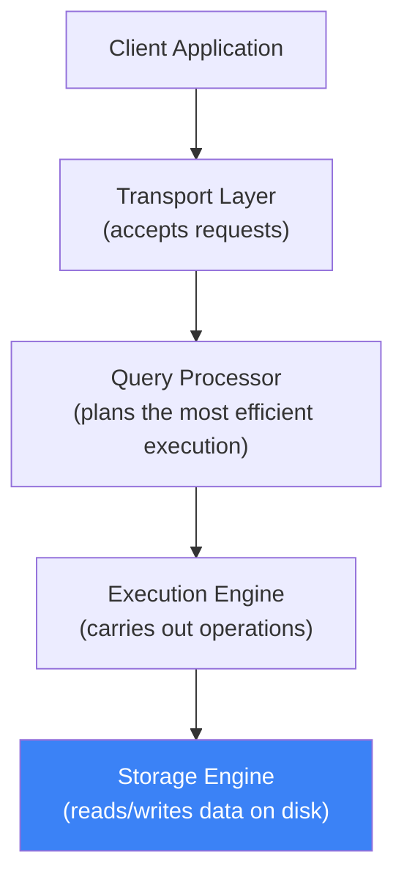
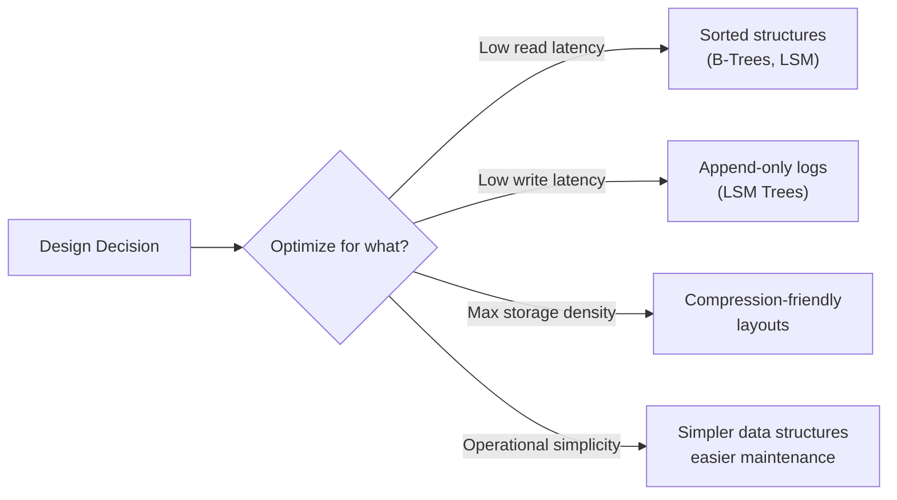

### Part I — Storage Engines (Introduction)

---

### What is a Storage Engine?

- A **storage engine** (or database engine) is the component responsible for **storing, retrieving, and managing data** in memory and on disk
- It's the lowest-level layer — everything else (queries, transactions, schemas) is built **on top** of it
- Storage engines offer a simple API: **Create, Read, Update, Delete** (CRUD)
- Keys and values are just **arbitrary bytes** — the engine doesn't care about types, that's handled by higher layers

> **Think of it this way:** the DBMS is an application built on top of the storage engine — it adds schema, query language, indexing, transactions, and other features.

---

### Pluggable Storage Engines

- Storage engines can be **swapped out** — they're developed independently from the DBMS
- This lets database developers focus on other subsystems while reusing existing storage engines

| Database | Available Storage Engines |
|----------|-------------------------|
| **MySQL** | InnoDB, MyISAM, RocksDB (MyRocks) |
| **MongoDB** | WiredTiger, In-Memory, MMAPv1 (deprecated) |

**Examples of standalone storage engines:** BerkeleyDB, LevelDB, RocksDB, LMDB, libmdbx, Sophia, HaloDB

---

### Comparing Databases — What Matters

- Database choice has **long-term consequences** — migrating later can be expensive
- Don't compare databases by popularity rankings, implementation language, or surface-level features
- **Simulate your actual workload** against different databases and measure what matters to you

##### Variables to Define Before Choosing

| Variable | Why It Matters |
|----------|---------------|
| Schema & record sizes | Affects storage layout and page efficiency |
| Number of clients | Concurrency and connection handling |
| Query types & access patterns | Read-heavy vs write-heavy, point lookups vs range scans |
| Read/write rates | Throughput requirements |
| Expected growth | Scalability and cluster expansion |

##### Questions to Answer

- Does the database support the queries I need?
- Can it handle my data volume?
- How many reads/writes per node?
- How do I scale the cluster?
- What's the maintenance overhead?

> **A database that slowly saves data is better than one that quickly loses it.**

---

### Benchmarking Tools

| Tool | Purpose |
|------|---------|
| **YCSB** (Yahoo! Cloud Serving Benchmark) | General-purpose benchmark for comparing data stores — use with caution, tailor to your workload |
| **TPC-C** | OLTP benchmark — measures transactions per minute with ACID compliance |

##### TPC-C Benchmark
- Simulates a mix of **read-only and update transactions** (common OLTP workloads)
- Main metric: **throughput** — transactions processed per minute
- Transactions must preserve **ACID** properties
- Includes abstract entities: warehouses, inventory, customers, orders

---

### Understanding Trade-Offs

- There is **no perfect storage engine** — every design involves trade-offs
- If you save records in insertion order → **writes are fast**, but reads in sorted order require re-sorting
- If you maintain sorted order → **reads are fast**, but writes have overhead to maintain order

##### The City Planning Analogy

| Approach | Database Equivalent | Trade-off |
|----------|-------------------|-----------|
| **Build up** (apartments, dense) | Optimize for density — pack more data per node | More complex, higher local traffic |
| **Build out** (houses, spread) | Optimize for simplicity — spread data across nodes | Simpler per-node, but longer "commutes" (network hops) |

---

### Summary

- **Storage engine** = the core component that manages data on disk — CRUD API, bytes in/bytes out
- **DBMS** = application layer built on top of storage engines (adds queries, schema, transactions)
- Storage engines are **pluggable** — MySQL has InnoDB/MyISAM/RocksDB, MongoDB has WiredTiger
- **Always benchmark with your real workload** — don't rely on rankings or generic comparisons
- Every storage engine design is a **trade-off** — optimize for reads, writes, density, or simplicity
- No single engine is perfect for every use case — **choose based on your workload**
