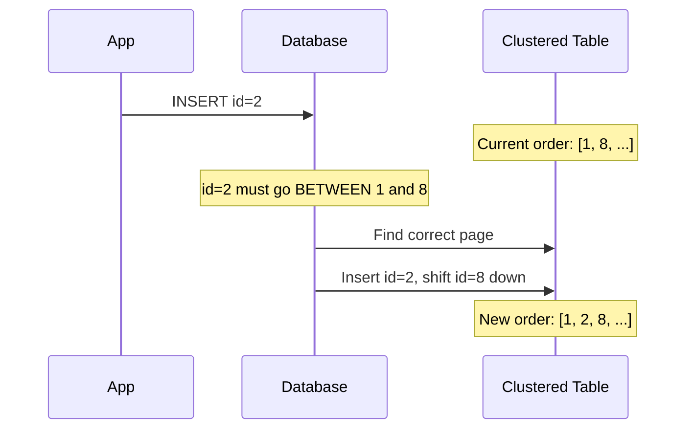
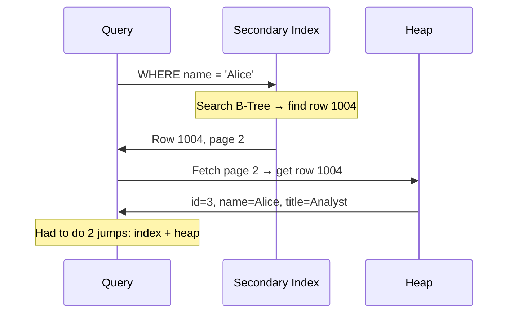
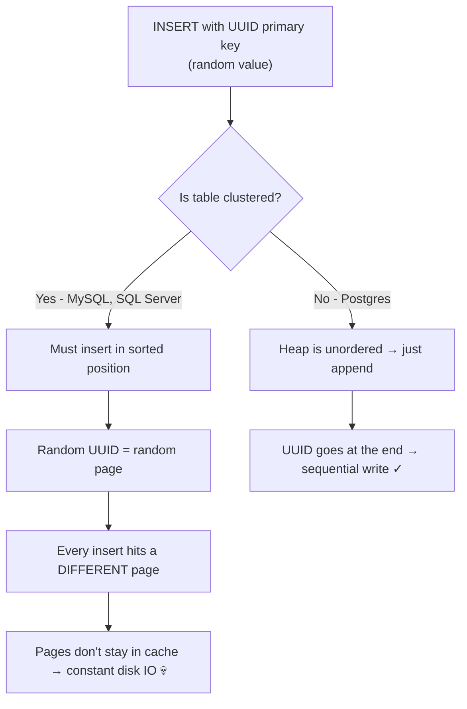
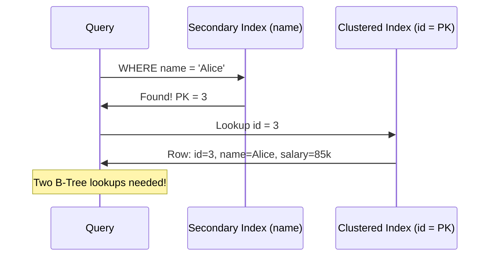

### Primary Key vs Secondary Key (Index)

- A **primary key** and a **secondary key** are not just about uniqueness — they fundamentally affect **how the table is stored on disk**
- Understanding this difference explains why some queries are fast, why UUIDs cause problems, and how to optimize your schema
- Also called: **primary index** vs **secondary index** — they are analogous concepts

---

### First — The Heap (No Primary Key)

Without any primary key, a table is stored as a **heap** — an unordered pile of rows:

```
┌─────────────────────────────────────┐
│  Heap (unordered)                   │
│                                     │
│  Row: id=7,  John,  Engineer        │
│  Row: id=1,  Sara,  Designer        │
│  Row: id=15, Omar,  Manager         │
│  Row: id=3,  Alice, Analyst         │
│  Row: id=42, Nora,  DevOps          │
│  Row: id=8,  Paul,  Engineer        │
│                                     │
│  (rows in insertion order — no      │
│   sorting, no structure)            │
└─────────────────────────────────────┘
```

- Rows are stored in **insertion order** — no sorting, no structure
- Finding a row requires a **full table scan** — worst case, you read every page
- This is called a **Heap-Organized Table (HOT)**

---

### Primary Key = Clustered Index

When you add a **primary key**, the table is **physically reorganized** around that key:

```
┌─────────────────────────────────────┐
│  Clustered Table (ordered by PK)    │
│                                     │
│  Row: id=1,  Sara,  Designer        │
│  Row: id=3,  Alice, Analyst         │
│  Row: id=7,  John,  Engineer        │
│  Row: id=8,  Paul,  Engineer        │
│  Row: id=15, Omar,  Manager         │
│  Row: id=42, Nora,  DevOps          │
│                                     │
│  (rows sorted by primary key —      │
│   the table IS the index)           │
└─────────────────────────────────────┘
```

- The table itself **is organized** around the primary key — it's called a **clustered index**
- Oracle calls this an **IOT (Index-Organized Table)** — the most descriptive name
- The opposite is a **HOT (Heap-Organized Table)** — no index organizes the data

##### What the Primary Key Implicitly Tells You

| Property | Meaning |
|----------|---------|
| **Unique** | No two rows share the same value |
| **Clustered** | The table is physically sorted by this key |
| **Fast range queries** | Consecutive values are on the same page → fewer IOs |
| **Insert cost** | New rows must be placed in sorted position → potential page splits |
| **One per table** | You can only cluster on **one** key |

---

### Insert Cost of a Clustered Index

When inserting into a clustered table, the row must go in the **right position** to maintain order:



- Databases are smart — they leave **gaps** in pages for future inserts
- But if the key is **random** (like a UUID), inserts scatter across random pages → **terrible performance**
- Sequential keys (auto-increment, UUIDv7) insert at the end → **no shuffling needed**

---

### Secondary Key = Separate Index Structure

A **secondary key** (or secondary index) lives **outside** the table — the heap stays unordered:

```
┌──────────────────────────────┐     ┌──────────────────────────────┐
│  Secondary Index (B-Tree)    │     │  Heap (unordered)            │
│                              │     │                              │
│  name="Alice" → row 1004    │────▶│  Row 1001: id=7,  John       │
│  name="John"  → row 1001    │────▶│  Row 1002: id=1,  Sara       │
│  name="Nora"  → row 1005    │────▶│  Row 1003: id=15, Omar       │
│  name="Omar"  → row 1003    │────▶│  Row 1004: id=3,  Alice      │
│  name="Paul"  → row 1006    │────▶│  Row 1005: id=42, Nora       │
│  name="Sara"  → row 1002    │────▶│  Row 1006: id=8,  Paul       │
│                              │     │                              │
│  (sorted by name)            │     │  (NOT sorted — insertion     │
│                              │     │   order, random mess)        │
└──────────────────────────────┘     └──────────────────────────────┘
```

##### How a Secondary Index Lookup Works



- The index only stores the **indexed column + row ID** — not all columns
- To get other columns (e.g., `SELECT *`), you must **jump to the heap** → extra IO
- You can have **many** secondary indexes per table (but each has a write cost)

---

### Primary Key vs Secondary Key — Side by Side

| Feature | Primary Key (Clustered Index) | Secondary Key (Secondary Index) |
|---------|------------------------------|-------------------------------|
| **Table organization** | Table IS sorted by this key | Table is unordered — index is separate |
| **Data location** | Data lives IN the index | Data lives in the heap — index has pointers |
| **Lookup cost** | One jump — data is right there | Two jumps — index → heap |
| **Range queries** | ⚡ Amazing — consecutive rows on same pages | 🐌 Slower — rows scattered across random pages |
| **How many per table?** | **Only 1** | Many |
| **Insert cost** | Higher — must maintain sort order | Lower — just append to heap + update index |
| **Oracle name** | IOT (Index-Organized Table) | Regular index on HOT (Heap-Organized Table) |

---

### Range Query — Clustered vs Non-Clustered

```sql
SELECT * FROM employees WHERE id BETWEEN 1 AND 9;
```

**With Primary Key (Clustered):**

```
┌─────────────────────────────────────┐
│  Page 0:  id=1, id=2, id=3          │ ← one IO gets 3 rows
│  Page 1:  id=4, id=5, id=6          │ ← one IO gets 3 more
│  Page 2:  id=7, id=8, id=9          │ ← one IO gets the rest
└─────────────────────────────────────┘
Total: 3 IOs — rows are contiguous ⚡
```

**With Secondary Index (Non-Clustered):**

```
┌──────────────────────────────────────────────────┐
│  Index says:                                      │
│  id=1 → page 17    id=4 → page 3     id=7 → page 22  │
│  id=2 → page 8     id=5 → page 41    id=8 → page 1   │
│  id=3 → page 31    id=6 → page 12    id=9 → page 7   │
└──────────────────────────────────────────────────┘
Total: 9+ IOs — each row on a different page 💀
```

- Clustered: rows are **right next to each other** on disk → sequential read
- Non-clustered: rows are **scattered** → random IO for every row

---

### Why Random UUIDs Are Terrible as Primary Keys



| Primary Key Type | Insert Behavior on Clustered Table |
|-----------------|-----------------------------------|
| **Auto-increment** (1, 2, 3...) | Always inserts at the end → fast, sequential |
| **UUIDv7** (time-sortable) | Mostly inserts at the end → fast |
| **UUIDv4** (random) | Inserts at random positions → slow, cache-hostile 💀 |
| **Timestamp** | Inserts at the end → fast for time-series |

---

### How Different Databases Handle This

| Database | Primary Key Behavior | Secondary Index | Notes |
|----------|---------------------|----------------|-------|
| **MySQL (InnoDB)** | Always a **clustered index** — table IS the primary key B-Tree | Points to the **primary key value** (not row ID) | If you don't define a PK, InnoDB creates a hidden 6-byte one |
| **Postgres** | Just a **secondary index** — no clustering by default | Points to **tuple ID (ctid)** | All indexes are secondary; you can `CLUSTER` a table manually but it's a one-time rewrite |
| **Oracle** | Optional **IOT** (Index-Organized Table) | Points to primary key or rowid | You choose: heap-organized (HOT) or index-organized (IOT) |
| **SQL Server** | **Clustered index** by default on primary key | Points to the **clustering key** | Can create a non-clustered primary key if needed |

##### Postgres — The Exception

```sql
-- Postgres: primary key is just a unique secondary index
CREATE TABLE employees (
    id SERIAL PRIMARY KEY,  -- secondary index, NOT clustered
    name TEXT,
    salary INT
);

-- You CAN cluster manually, but it's a one-time physical rewrite
-- (not maintained on future inserts!)
CLUSTER employees USING employees_pkey;
```

- In Postgres, **every** index (including primary key) is a secondary index pointing to `ctid`
- This means: if any row's `ctid` changes (e.g., after `UPDATE`), **all** indexes must be updated
- The HOT optimization helps avoid this when the new tuple fits in the same page

##### MySQL — The Opposite

```sql
-- MySQL: primary key IS the clustered index
CREATE TABLE employees (
    id INT PRIMARY KEY,       -- clustered index, table sorted by this
    name VARCHAR(100),
    salary INT,
    INDEX idx_name (name)     -- secondary index → points to `id` (the PK)
);
```

- The table is physically sorted by `id`
- The secondary index on `name` stores `name → id` (not a row pointer)
- To fetch a row via `idx_name`, MySQL must: search secondary index → get PK value → search clustered index → get row (**double lookup**)

---

### The Double Lookup Problem in MySQL



- In MySQL, secondary indexes store the **primary key value** as the pointer
- So a secondary index lookup needs **two B-Tree traversals**: secondary → clustered
- In Postgres, secondary indexes store the **ctid** → direct jump to heap (one lookup + one heap fetch)

---

### Summary

- **Primary key = clustered index** — the table is physically sorted by the key (in MySQL, SQL Server, optionally Oracle)
- **Secondary key = separate B-Tree** — points into an unordered heap
- Clustered indexes make **range queries blazing fast** — consecutive values on the same pages
- Random primary keys (UUIDv4) **kill clustered index performance** — use auto-increment or UUIDv7
- **Postgres is the oddball** — primary keys are just secondary indexes, no clustering by default
- **MySQL always clusters** — if you don't define a PK, InnoDB creates a hidden one
- Secondary indexes in MySQL have a **double lookup** cost (secondary → PK → row)
- You can only have **one clustered index** per table, but **many secondary indexes**
- Oracle's naming is the clearest: **IOT** (Index-Organized Table) vs **HOT** (Heap-Organized Table)
