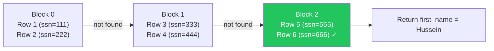
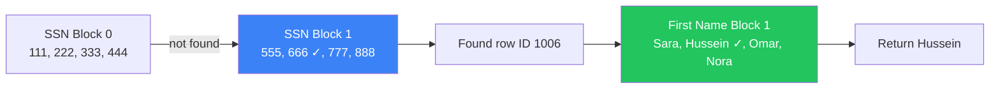
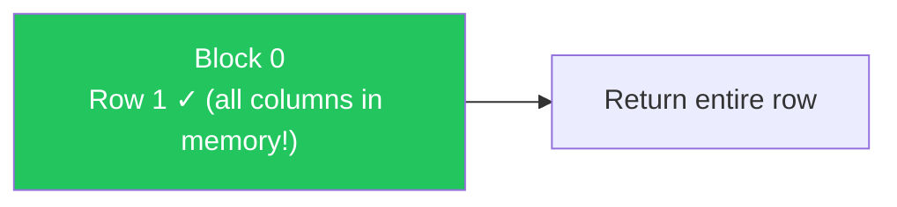
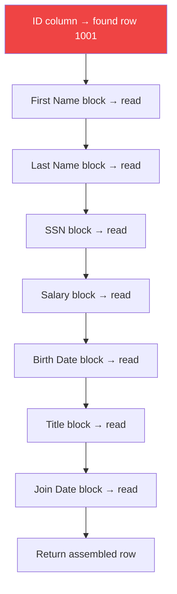
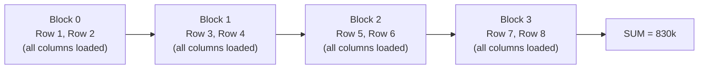
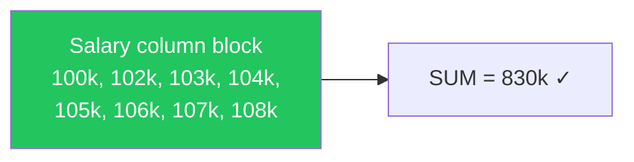
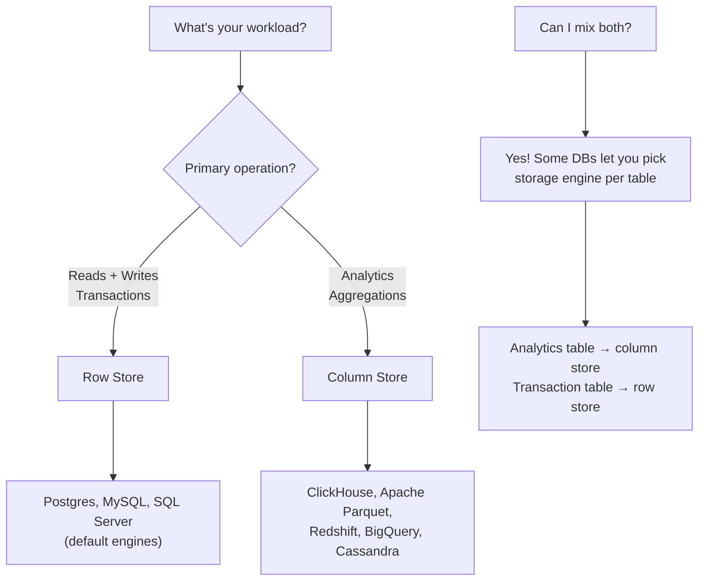

### Row vs Column Oriented Databases

- Row-oriented and column-oriented are two **storage models** — they define how tables are physically laid out on disk
- Neither is better — each has use cases where it shines and cases where it struggles
- Also known as: **row store** vs **column store** (aka **columnar database**)
- Most databases (Postgres, MySQL) default to **row store**, but some support swapping the storage engine per table

---

### How Row Store Works

- Rows are stored **contiguously** on disk — all columns of a row packed together, then the next row
- A single block/page IO gives you **a few complete rows** with all their columns

```
┌──────────────────────────────────────────────────────────────────────────────┐
│  Block 0                                                                     │
│  Row 1: [1, John, Smith, 111, 100k, 1990-01-15, Engineer, 2020-03-01]       │
│  Row 2: [2, Melissa, Adams, 222, 102k, 1988-05-20, Manager, 2019-07-12]    │
├──────────────────────────────────────────────────────────────────────────────┤
│  Block 1                                                                     │
│  Row 3: [3, Rick, Jones, 333, 103k, 1992-11-08, Analyst, 2021-01-15]       │
│  Row 4: [4, Paul, Brown, 444, 104k, 1985-09-25, DevOps, 2018-06-30]        │
├──────────────────────────────────────────────────────────────────────────────┤
│  Block 2                                                                     │
│  Row 5: [5, Sara, Wilson, 555, 105k, 1991-03-14, Designer, 2020-11-01]      │
│  Row 6: [6, Hussein, Nasser, 666, 106k, 1987-07-22, Engineer, 2017-02-15]  │
├──────────────────────────────────────────────────────────────────────────────┤
│  Block 3                                                                     │
│  Row 7: [7, Omar, Ali, 777, 107k, 1993-12-30, Manager, 2022-04-01]         │
│  Row 8: [8, Nora, Khan, 888, 108k, 1990-06-18, Analyst, 2019-09-20]        │
└──────────────────────────────────────────────────────────────────────────────┘
```

**Key insight:** one block read = multiple complete rows with **all** their columns, whether you want them or not.

---

### How Column Store Works

- Columns are stored **separately** — all values of one column packed together, then all values of the next column
- Each column value is tagged with its **row ID** so you can match values across columns
- A single block IO gives you **many values of one column**

```
┌──────────────────────────────────────────────────────────────────────┐
│  ID column                                                           │
│  [1:1001, 2:1002, 3:1003, 4:1004, 5:1005, 6:1006, 7:1007, 8:1008]  │
├──────────────────────────────────────────────────────────────────────┤
│  First Name column                                                   │
│  Block: [John:1001, Melissa:1002, Rick:1003, Paul:1004]             │
│  Block: [Sara:1005, Hussein:1006, Omar:1007, Nora:1008]             │
├──────────────────────────────────────────────────────────────────────┤
│  SSN column                                                          │
│  Block: [111:1001, 222:1002, 333:1003, 444:1004]                    │
│  Block: [555:1005, 666:1006, 777:1007, 888:1008]                    │
├──────────────────────────────────────────────────────────────────────┤
│  Salary column                                                       │
│  [100k:1001, 102k:1002, 103k:1003, 104k:1004, 105k:1005, ...]      │
├──────────────────────────────────────────────────────────────────────┤
│  ...more columns...                                                  │
└──────────────────────────────────────────────────────────────────────┘
```

**Key insight:** the row ID is **duplicated in every column** — this is the trade-off that makes writes expensive.

---

### Query Comparison — Same Queries, Different Storage

We'll run 3 queries on the same 8-row `employees` table using both storage models (no indexes).

---

##### Query 1: `SELECT first_name FROM employees WHERE ssn = '666'`
*Looking for one row, returning one column*

**Row Store:**



| Step | What happens |
|------|-------------|
| Block 0 | Pulled 2 rows with ALL columns — ssn not found |
| Block 1 | Pulled 2 more rows with ALL columns — ssn not found |
| Block 2 | Pulled 2 rows — found ssn=666! **first_name is already in memory** |
| **Total** | **3 IOs** — got first_name for free since it was in the same block |

**Column Store:**



| Step | What happens |
|------|-------------|
| SSN Block 0 | Read SSN values only — 666 not found |
| SSN Block 1 | Found 666 → row ID 1006 |
| First Name Block | Jump directly to the block containing row 1006 |
| **Total** | **3 IOs** — similar to row store for this query |

**Verdict:** roughly the same — both need ~3 IOs.

---

##### Query 2: `SELECT * FROM employees WHERE id = 1`
*Looking for one row, returning ALL columns*

**Row Store:**



| Step | What happens |
|------|-------------|
| Block 0 | Found id=1, ALL columns are already in the block |
| **Total** | **1 IO** — everything came for free in a row store |

**Column Store:**



| Step | What happens |
|------|-------------|
| ID column | Found id=1, row ID = 1001 |
| Each column | Must jump to **every column's block** to fetch that row's value |
| **Total** | **8 IOs** (1 per column!) — massive disk thrashing 💀 |

**Verdict:** Row store **destroys** column store on `SELECT *`. This is the worst query for column-oriented databases.

---

##### Query 3: `SELECT SUM(salary) FROM employees`
*Aggregate on a single column — scanning all rows*

**Row Store:**



| Step | What happens |
|------|-------------|
| Each block | Pulled ALL columns for every row — only used the salary field |
| Wasted | First name, last name, SSN, birthdate, title, join date — all pulled but never used |
| **Total** | **4 IOs** — read the **entire table** just to sum one column |

**Column Store:**



| Step | What happens |
|------|-------------|
| Salary block | Read ONLY the salary values — nothing else |
| **Total** | **1 IO** — only fetched exactly what was needed ⚡ |

**Verdict:** Column store **destroys** row store on aggregations. This is what column-oriented databases were built for.

---

### Column Store — Compression Advantage

Column stores have a unique advantage: since all values in a block are the **same data type** and often **similar values**, compression is extremely effective.

##### Example — Salary Deduplication

```
Before compression:
[100k:1001, 100k:1002, 100k:1003, 100k:1004, 105k:1005, 105k:1006]

After compression:
[100k → [1001, 1002, 1003, 1004], 105k → [1005, 1006]]
```

- Multiple rows with the **same salary** get collapsed into a single entry with a list of row IDs
- The block can now hold **far more rows** → even fewer IOs for aggregations
- Row stores **can't** compress as effectively because each row has **different data types** side by side — no repeating patterns

---

### Pros and Cons Summary

| | Row Store | Column Store |
|--|-----------|-------------|
| **Writes** | ✅ Fast — one block write per row | ❌ Slow — must update every column's structure |
| **Single row read** | ✅ Fast — all columns in one block | ❌ Slow — must jump to every column |
| **`SELECT *`** | ✅ Cheap — data is right there | ❌ Terrible — disk thrashing across all columns |
| **Aggregations** (`SUM`, `AVG`, `COUNT`) | ❌ Reads entire rows but uses one column | ✅ Reads only the needed column |
| **Compression** | ❌ Poor — mixed data types per block | ✅ Excellent — same types, deduplication possible |
| **OLTP** (transactions) | ✅ Built for this | ❌ Not suited |
| **OLAP** (analytics) | ❌ Reads too much data | ✅ Built for this |
| **Complexity** | ✅ Simple — rows are intuitive | ❌ Complex — row IDs duplicated everywhere |

---

### When to Use What?



| Use Case | Pick |
|----------|------|
| Web app with CRUD operations | **Row store** |
| Banking, e-commerce transactions | **Row store** |
| Data warehouse, reporting dashboards | **Column store** |
| Log analytics, time-series analysis | **Column store** |
| Mixed workload (some tables heavy reads, some heavy writes) | **Mix both** — per-table engine |

---

### Swapping Storage Engines Per Table

- Most databases let you **change the storage engine** for individual tables
- MySQL example: `CREATE TABLE logs (...) ENGINE=ColumnStore;`
- This means your transaction tables can be **row store** and your analytics tables can be **column store** — in the same database

> **Warning:** Joining a row-based table with a column-based table can be extremely slow — the database has to bridge two completely different storage formats. Some databases support it, but give them a break.

---

### Summary

- **Row store** = rows packed together on disk → great for OLTP, writes, `SELECT *`, single-row lookups
- **Column store** = columns packed together on disk → great for OLAP, aggregations (`SUM`, `AVG`), compression
- **`SELECT *` on column store is the worst query you can run** — it thrashes across every column on disk
- **Aggregation on row store is wasteful** — you read the entire table but only use one column
- Column stores compress **much better** because same-type values are next to each other (deduplication)
- Most databases default to **row store** — column store is used in data warehouses and analytics platforms
- You can **mix storage engines per table** in some databases — pick the right tool for each table's workload
