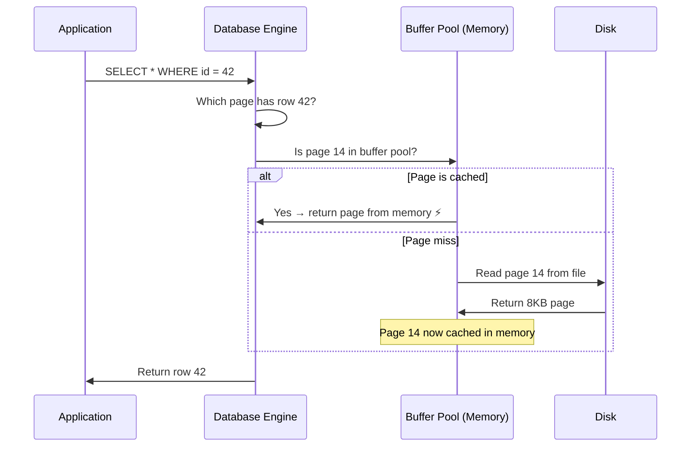
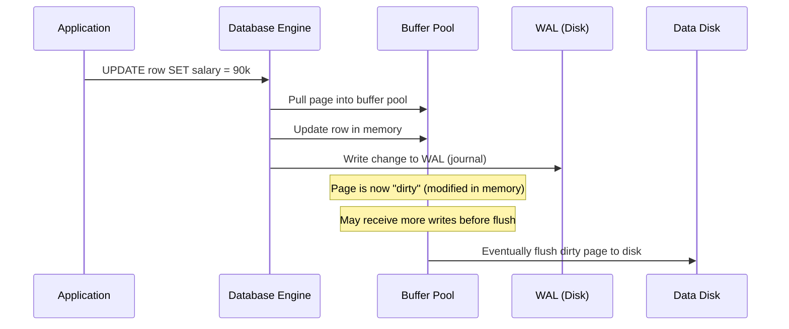
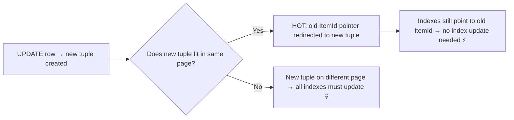
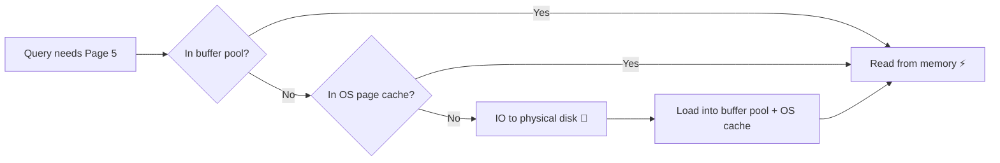
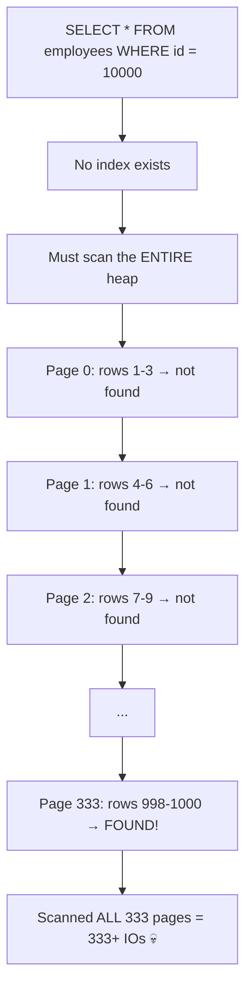
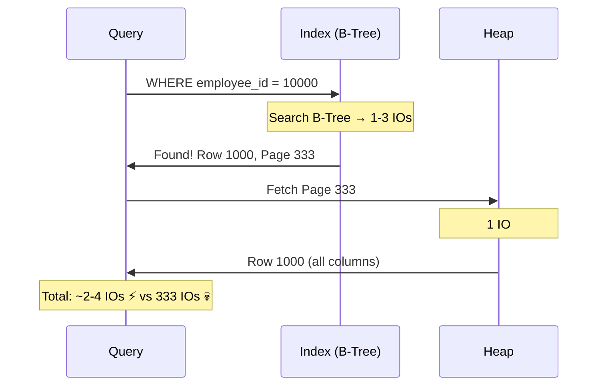
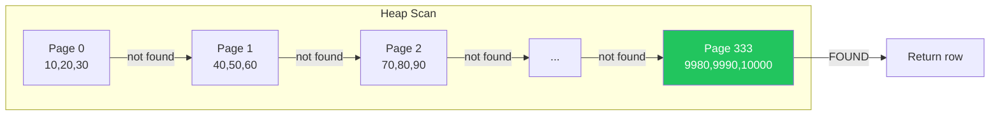
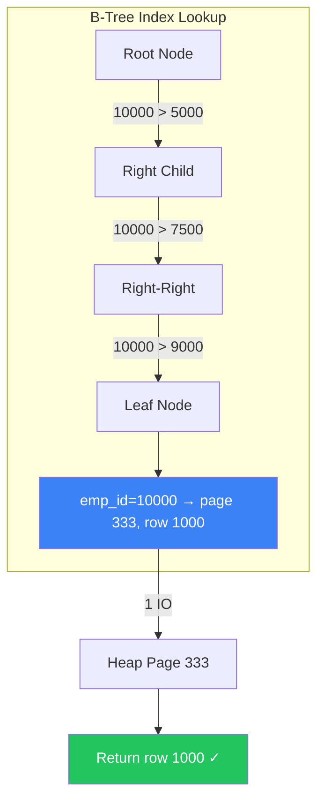
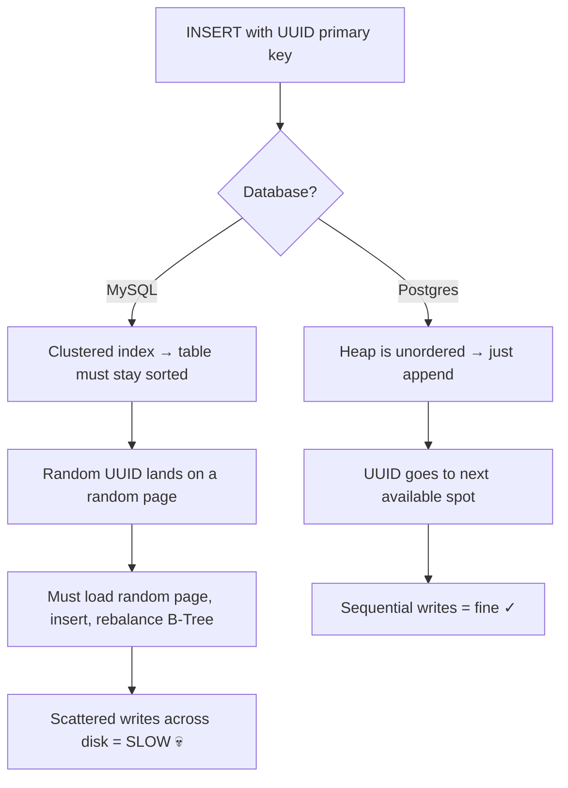

### How Databases Store Data on Disk

- Understanding how tables and indexes are stored on disk is one of the **most important fundamentals** in databases
- Everything — tables, indexes, queries — maps down to **pages, IOs, and bytes on disk**
- This is not just theory — it's what makes a query **fast or slow**

---

### Tables — Logical vs Physical

- A table is a **logical concept** — rows and columns that make sense to humans
- Physically, it's stored as a collection of **pages on disk** — just ones and zeros
- Whether you use rows, documents, or key-value pairs — at the end of the day, it's all **bits and bytes**

| Logical View | Physical View |
|-------------|--------------|
| Rows and columns | Pages of bytes on disk |
| Human-readable structure | Fixed-size memory/disk blocks |
| `SELECT * FROM employees` | Fetch pages → deserialize → filter |

---

### Row ID (Tuple ID)

- Most databases internally create a **system-maintained identifier** for each row — the **Row ID**
- This is **not** the primary key you define — it's an internal pointer managed by the database
- It uniquely identifies a row and tells the database **which page** the row lives on

| Database | Row ID Behavior |
|----------|----------------|
| **Postgres** | Creates its own Row ID called **tuple ID (ctid)** — separate from any user-defined column |
| **MySQL** | The **primary key** becomes the pseudo Row ID — if you don't define one, InnoDB creates a hidden 6-byte one |

```sql
-- Postgres: you can actually see the tuple ID
SELECT ctid, * FROM employees LIMIT 5;

-- ctid format: (page_number, row_offset)
-- Example: (0,1) means page 0, row 1
```

---

### Pages — The Unit of Storage

- Rows are stored in **pages** — a page is a **fixed-size block** of bytes on disk
- The database doesn't read individual rows — it reads **entire pages**
- One page can hold **many rows** depending on the row size

| Database | Default Page Size |
|----------|------------------|
| **Postgres** | 8 KB |
| **MySQL (InnoDB)** | 16 KB |
| **MongoDB (WiredTiger)** | 32 KB |
| **SQL Server** | 8 KB |
| **Oracle** | 8 KB |

##### How Rows Map to Pages

```
┌─────────────────────────────────────────────┐
│  Page 0 (8 KB)                              │
│  ┌──────────────────────────────────────┐   │
│  │ Row 1: (10, Alice, 1990-01-15, 70k)  │   │
│  │ Row 2: (20, Adam, 1985-03-22, 80k)   │   │
│  │ Row 3: (30, Ali, 1992-07-10, 65k)    │   │
│  └──────────────────────────────────────┘   │
├─────────────────────────────────────────────┤
│  Page 1 (8 KB)                              │
│  ┌──────────────────────────────────────┐   │
│  │ Row 4: (40, Sara, 1988-11-03, 90k)   │   │
│  │ Row 5: (50, Omar, 1995-06-18, 55k)   │   │
│  │ Row 6: (60, Nora, 1991-09-25, 72k)   │   │
│  └──────────────────────────────────────┘   │
├─────────────────────────────────────────────┤
│  Page 2 (8 KB)                              │
│  │ Row 7, Row 8, Row 9                  │   │
├─────────────────────────────────────────────┤
│  ...                                        │
│  Page 333 (8 KB)                            │
│  │ Row 998, Row 999, Row 1000           │   │
└─────────────────────────────────────────────┘
```

- With **3 rows per page** and **1000 rows**, you get ≈ **333 pages**
- These pages are what physically live on disk

---

### The Buffer Pool — Pages in Memory

- Databases allocate a pool of memory called the **shared buffer pool** (or **buffer pool**)
- Pages read from disk are placed into this pool — subsequent reads of the same page are served from **memory** instead of disk
- Once a page is in memory, you get access to the requested row **and** all other rows in the same page for free

##### How Reads Work Through the Buffer Pool



- The **smaller your rows**, the **more rows fit in a page**, the more useful data a single IO gives you
- This is why lean, well-modeled rows are important — fatter rows = fewer rows per page = more IOs

##### How Writes Work Through the Buffer Pool



- The database **does not write directly to the data file** on every update
- Instead, it updates the page **in memory** and writes a journal entry (**WAL — Write-Ahead Log**) to disk
- The dirty page can receive **more writes** before being flushed — this minimizes the number of IOs
- Deletes and inserts follow the same pattern

---

### What Goes Inside a Page? — Storage Models

What you store in pages depends on the storage model of the database:

| Storage Model | How Data is Packed in Pages | Optimized For |
|--------------|-----------------------------|---------------|
| **Row Store** | All columns of a row packed together → next row | OLTP (transactional writes, single-row lookups) |
| **Column Store** | All values of one column packed together | OLAP (aggregations like `SUM`, `AVG` on few columns) |
| **Document Store** | Compressed documents stored like rows | Flexible schemas, nested data |
| **Graph Store** | Connectivity/edges stored for traversal efficiency | Graph traversals (depth-first, breadth-first) |

**The goal is always the same:** pack your items in the page so that a single page read gives you **as much useful information as possible** for your workload.

> If you find yourself reading many pages to do tiny little work — **rethink your data model.**

---

### Small vs Large Pages — Trade-offs

| | Small Pages (e.g. 4-8 KB) | Large Pages (e.g. 16-32 KB) |
|--|---------------------------|-----------------------------|
| **Read/write speed** | Faster per IO (closer to disk block size) | Slower per IO (more bytes to transfer) |
| **Metadata overhead** | High — header is a bigger % of the page | Low — header is tiny relative to data |
| **Page splits** | More frequent (less room per page) | Less frequent |
| **Cold read cost** | Lower (less data to pull) | Higher (pulling 32 KB when you need 1 row) |
| **Range scan efficiency** | More IOs needed | Fewer IOs (more rows per page) |

- Database defaults work for **most cases**, but knowing them helps you tune for edge cases
- As you get closer to the hardware (SSD/NVMe), things get more complex — **Zoned Namespaces** and **KV-store NVMe** are emerging technologies optimizing host-to-media IO

---

### How Pages Are Stored on Disk

- A common approach: each table gets its own **file** on disk, structured as an **array of fixed-size pages**
- Page 0, followed by page 1, followed by page 2 — laid out sequentially

##### Reading a Page from Disk

To read a page, you need three things:
1. **File name** — which table's file
2. **Offset** — where in the file the page starts
3. **Length** — how many bytes to read (the page size)

```
Offset = page_number × page_size
Length = number_of_pages × page_size
```

##### Example: Reading Pages 2–9 from a Table (8 KB pages)

```
┌────────┬────────┬────────┬────────┬────────┬────────┬────────┬────────┬────────┬────────┐
│ Page 0 │ Page 1 │ Page 2 │ Page 3 │ Page 4 │ Page 5 │ Page 6 │ Page 7 │ Page 8 │ Page 9 │
└────────┴────────┴────────┴────────┴────────┴────────┴────────┴────────┴────────┴────────┘
                  ▲ offset                                                      ▲ end
```

```
File:    table_test data file
Offset:  2 × 8192 = 16,384 bytes
Length:  8 × 8192 = 65,536 bytes (8 pages)
```

- The OS issues a single read from byte 16,384 for 65,536 bytes — and you get pages 2 through 9
- This is why **sequential reads** are fast — the pages are right next to each other on disk

---

### Postgres Page Layout — Deep Dive

Here's how a single 8 KB page looks inside Postgres:

```
┌──────────────────────────────────────────────────────┐
│  Page Header (24 bytes)                              │
│  - metadata: free space, page pointers, flags        │
├──────────────────────────────────────────────────────┤
│  ItemId Array (4 bytes each)                         │
│  - pointer 1 → offset:length of tuple 1             │
│  - pointer 2 → offset:length of tuple 2             │
│  - pointer 3 → offset:length of tuple 3             │
│  - ...grows downward →                              │
├──────────────────────────────────────────────────────┤
│                                                      │
│              Free Space                              │
│                                                      │
├──────────────────────────────────────────────────────┤
│  ← grows upward...                                  │
│  Tuple 3 (variable length)                           │
│  Tuple 2 (variable length)                           │
│  Tuple 1 (variable length)                           │
├──────────────────────────────────────────────────────┤
│  Special Space (B+Tree leaf pages only)              │
│  - pointers to previous/next leaf pages              │
└──────────────────────────────────────────────────────┘
```

##### Page Header — 24 bytes
- Fixed-size metadata describing the page contents
- Includes: free space offset, page flags, pointers to start/end of items

##### ItemId Array — 4 bytes per item
- An array of **pointers** (not the data itself) — each 4-byte entry says: **"the tuple is at offset X and is Y bytes long"**
- Grows **downward** from the top of the page
- This indirection is what enables the **HOT (Heap-Only Tuple)** optimization

##### HOT Optimization (Heap-Only Tuple)



- When a row is updated, Postgres creates a **new tuple** (MVCC)
- If the new tuple fits in the **same page**, the old ItemId is simply re-pointed → **indexes don't need updating**
- This is hugely powerful for performance on frequent updates

##### Criticism: ItemId Overhead
- Each ItemId is **4 bytes** — if a page holds 1000 items, that's **4 KB just for pointers** (half the 8 KB page!)
- Trade-off between indirection flexibility and space efficiency

##### Row vs Tuple vs Item — Terminology

| Term | Meaning |
|------|---------|
| **Row** | What the user sees — the logical record |
| **Tuple** | A physical instance of the row stored in a page |
| **Item** | Same as tuple — the actual bytes in the page |

- The **same row** can have **multiple tuples** — one active, several for older transactions (MVCC), and dead tuples waiting for `VACUUM`

##### Special Space — B+Tree Leaf Pages Only
- Only used in **index pages** (not data pages)
- Stores pointers to **previous and next leaf pages** for B+Tree traversal

---

### IO (Input/Output) — The Currency of Databases

- An **IO** is a read request to the disk to fetch one or more pages
- **IO is the most expensive operation** in a database — minimizing IO is the #1 goal
- The less IO your query makes, the **faster** it is

##### Key Rules of IO

| Rule | Explanation |
|------|------------|
| An IO fetches **pages**, not rows | You cannot ask the disk for a single row |
| One IO = one or more pages | Depends on disk partitions and OS settings |
| You get **everything in the page** | Can't say "give me this page but only the name column" |
| Extra rows come **for free** | If your row is on page 5, you get all other rows on page 5 too |

##### Why `SELECT *` and even `SELECT name` are expensive

```sql
-- Both of these require fetching the FULL page from disk
SELECT * FROM employees WHERE id = 42;
SELECT name FROM employees WHERE id = 42;
```

- In a **row store**, the entire row is stored together on the page
- Even if you only want `name`, the IO fetches the **entire page** with all columns
- The database then **discards** the columns you didn't ask for — but the IO cost is already paid
- The cost of **deserializing** bytes back into usable data structures adds up

##### IO and Caching

- Not every IO actually hits the physical disk — it can be served from the **buffer pool** or the **OS page cache**
- **Postgres** relies heavily on the operating system's page cache on top of its own shared buffers
- If a page was recently read, it may still be in memory → much faster than disk



---

### The Heap — Where All the Data Lives

- The **heap** is the entire collection of pages that make up a table
- It has **everything** — every row, every column, all the data
- It's called a "heap" because there's **no particular order** — data is just piled in

##### Why Scanning the Heap is Expensive



- Without an index, the database has **no choice** but to read **every page** to find your row
- This is called a **full table scan** — extremely expensive for large tables
- Some databases use **parallel threads** to scan from multiple points, but it's still costly

---

### Indexes — The Shortcut into the Heap

- An index is a **separate data structure** that helps you find exactly which page to read in the heap
- Instead of scanning 333 pages, the index tells you: **"go to page 333, row 1000"**
- Think of it like a **book's index** — instead of reading every page, go straight to the right one

##### How an Index Works

An index stores:
1. The **indexed column value** (e.g., employee_id)
2. A **pointer** to the row — the row ID + page number in the heap

```
┌──────────────────────────────────────────────┐
│  Index on employee_id                        │
│                                              │
│  emp_id → (row_id, page)                     │
│  ──────────────────────                      │
│  10     → (row 1,  page 0)                   │
│  20     → (row 2,  page 0)                   │
│  30     → (row 3,  page 0)                   │
│  40     → (row 4,  page 1)                   │
│  50     → (row 5,  page 1)                   │
│  ...                                         │
│  10000  → (row 1000, page 333)               │
└──────────────────────────────────────────────┘
```

##### Index Lookup vs Heap Scan

```sql
-- With index on employee_id:
SELECT * FROM employees WHERE employee_id = 10000;
```



##### Important Facts About Indexes

| Fact | Explanation |
|------|------------|
| Indexes are **stored on disk** too | They have their own pages and require IO to read |
| Indexes use **B-Trees** | A tree structure — go left if less, right if more |
| Not all indexes fit in **memory** | Large indexes may need disk IO just to search the index itself |
| Smaller indexes = faster | The smaller the index, the more of it fits in memory = fewer IOs |
| You can't index **everything** | Index only what you **search** on — each index has a write cost |

---

### Query Example — Without Index (Heap Scan)

```sql
SELECT * FROM employees WHERE employee_id = 10000;
-- No index on employee_id
```



- **333 IOs** — had to scan every single page
- The row we wanted was on the **very last page**
- This is the worst case — but even average case means scanning ~half the pages

---

### Query Example — With Index (B-Tree Lookup)

```sql
SELECT * FROM employees WHERE employee_id = 10000;
-- Index exists on employee_id
```



- **~3-4 IOs total** — a few for the B-Tree traversal + 1 for the heap page
- Went directly to the correct page — no scanning

---

### Clustered vs Non-Clustered Indexes

##### Non-Clustered Index (Secondary Index)
- The index is a **separate structure** from the heap
- The heap itself is **unordered** — rows are wherever they were inserted
- After finding the row in the index, you must do an **extra IO** to go to the heap

##### Clustered Index (Index-Organized Table)
- The heap is **physically ordered** around a single index
- The table **IS** the index — no separate structure, no extra heap lookup
- Also called **IOT (Index-Organized Table)** in Oracle terminology

| Feature | Clustered Index | Non-Clustered Index |
|---------|----------------|-------------------|
| Heap order | Sorted by index key | Unordered |
| Extra heap lookup | ❌ No — data is in the index | ✅ Yes — must jump to heap |
| How many per table? | **Only 1** | Many |
| Range queries | Very fast (data is contiguous) | Slower (random page jumps) |

---

### Postgres vs MySQL — Index Behavior

| Feature | Postgres | MySQL (InnoDB) |
|---------|----------|----------------|
| **Primary key** | Just a **secondary index** — no special treatment | **Clustered index** — table is organized around it |
| **Row ID** | System-maintained **tuple ID (ctid)** | Primary key **IS** the row ID |
| **All indexes point to** | The tuple ID (ctid) | The primary key value |
| **Update impact** | All indexes get updated (because ctid changes) | Only affected secondary indexes update |
| **UUID as primary key** | Fine — heap is unordered anyway | **Terrible** — random UUIDs scatter writes across random pages |

##### Why Random UUIDs Kill MySQL Performance



- In MySQL, the table is **physically ordered** by primary key
- A random UUID means each insert hits a **different page** → cache misses, random disk IO
- **Use auto-increment or UUIDv7** (time-sortable) for clustered index primary keys

---

### Summary

- **Table** = logical concept (rows & columns) stored as **pages on disk**
- **Row ID** = internal system identifier for each row (tuple ID in Postgres, primary key in MySQL)
- **Page** = fixed-size block (8 KB in Postgres, 16 KB in MySQL, 32 KB in MongoDB) that holds multiple rows
- **Buffer Pool** = in-memory cache of pages — avoids repeated disk reads
- **WAL** = write-ahead log — changes are journaled before dirty pages are flushed, minimizing IOs
- **IO** = reading a page from disk — the **currency of database performance**, minimize at all costs
- **Heap** = unordered collection of all pages in a table — scanning it is **expensive**
- **Index** = separate data structure (B-Tree) with pointers into the heap — tells you **exactly which page to read**
- **Clustered index** = the heap is sorted by the index key (MySQL default) — range queries are fast but random inserts are slow
- **Non-clustered index** = separate from heap (Postgres default) — requires extra heap lookup
- Pages are stored on disk as **arrays in files** — `offset = page_number × page_size`
- Postgres pages have a **24-byte header**, **ItemId array** (4 bytes each), **tuples**, and optional **special space**
- **HOT optimization** — if a new tuple fits in the same page, indexes don't need updating
- **Goal:** minimize IOs by using indexes, keeping rows lean, and leveraging the buffer pool
