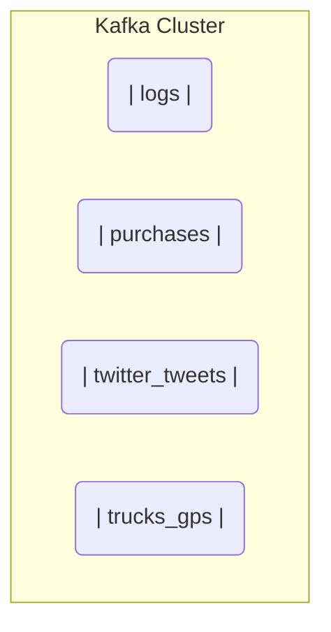

### Topics :- A particullar stream of data
Topics are like table in a database but without any queryig capability. 
We use producers to write the data in the topic and consumers to consume the data from a topic.
Topics can consume any type of message formate.
The sequence of message is called a data stream.
Topics are split into partition.



### Partitions
You can imagine them as the column of the table in a database.
When we write message into them they automatically get assigned a auto increamenting id which is called offsets
- Once the data is written to a partition it cannot be changed(immutability).
- Data is kept for a limited time (default is one week - configurable).

![[Pasted image 20240630163647.png]]


- Once the offset(id) is provided its not reused even if the message is deleted.
- Order of messsage is guranteed in a partition not acrosss the partitions.
### Producer
- Producer writes data to topics(which are made of partition).
- Producer knows which partition to write and which kafka broker has it.
- In case Kafka broker fails producer knows how to recover.
![[Pasted image 20240630164256.png]]
### Message Keys
- Producer can choose to send a key along with the message
- A message can be `string`,`number`,`binary` etc.
- If the key is null then the messages will be send in round robin form to all the partitions
- If the key is provided then kafka will hash that key using **murmur2 algorithm** and then decide which partition to send this message
- If the key is consistent across the message then all those messages with go the same partition.
![[Pasted image 20250109193825.png]]
### Message 
![[Pasted image 20240630170045.png]]
- Kafka only accepts bytes as an input and output bytes to the consumers.This means we have to serialize our message into bytes because they are just in memory objects as of now.
- Kafka producers comes with several common serializers like, `string(json)`,`Avro`,`protobuf`,`int`,`float`
![[Pasted image 20250109193526.png]]
### Consumer
- Consumers in kafka are based on pull model.
- **consumers periodically poll the broker for new messages**.There is no direct way so that they can know there is new message in the partition.
- Consumers reads the data from the partition in order according to the order of messages.**Data is read in low to high within each partition**
![[Pasted image 20250109194851.png]]
- Affter receiving message consumer have to desires it from **bytes** into its programming language 
- Kafka consumer comes with default serializers like `Avro`,`String`,`Protobuf`
#### Its fine to have multiple consumer groups on a same topic
- But within a consumer group we can only assign one consumer to a partition.
![[Pasted image 20250109195534.png]]
- Kafka stores a offset which a consumer group has been reading.
- The offset committed by consumer are known  as _____consumer_offsets__ .
- These offsets are helpfull when consumer crashes and restarts again.
- When a consumer has processed data the received from kafka, it should be periodically commiting the offsets (the kafka will write to _____consumer_offsets__ not the group itself)
- If a consumer dies it will be able to read back from where it left off thanks ot committed consumer offset
![[Pasted image 20250109200500.png]]
### Kafka broker
- Kafka cluster is composed of multiple brokers.
- A broker is a just a server, they are called brokers because they receive and send data.
- A broker is identified with its **ID** which is an integer.
- After connecting to any broker (called a bootstrap broker) you will be connected to the entire cluster (kafka clients have smart mechanics for that).
![[Pasted image 20250109201323.png]]
### Partition replication
![[Pasted image 20240630184923.png]]

![[Pasted image 20240630184808.png]]

![[Pasted image 20240630185156.png]]

![[Pasted image 20240630185724.png]]
### Producer writes acknowledgments
![[Pasted image 20240630190747.png]]
### Kafka CLI
```bash
kafka-topics --bootstrap-server localhost:9092 --create --partition 3 --replication-factor 3
# by default there will be only 1 partition 
# by default replication factor will be of 1, but remember that if we want to have replication more than 1 then we will need brokers more than 1 because these replications are stored in other brokers.
# So number of replication-factor should be less or equal to the number of broker.
```

```bash
# to get all the available topic
kafka-topics --bootstrap-server localhost:9092 --list

# to delete a top
kafka-topics --bootstrap-server localhost:9092 --delete  --topic first_topic

#to get the info for a topic
kafka-topics --bootstrap-server localhost:9092 --describe --topic first_topic
```