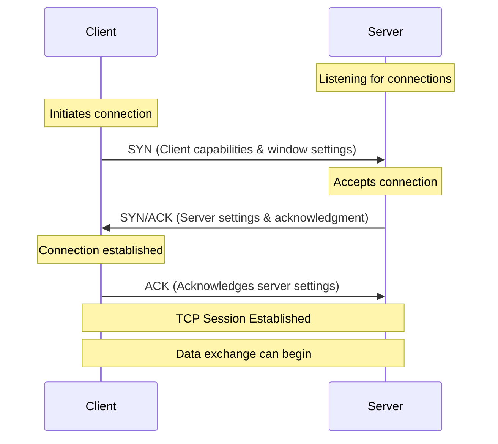
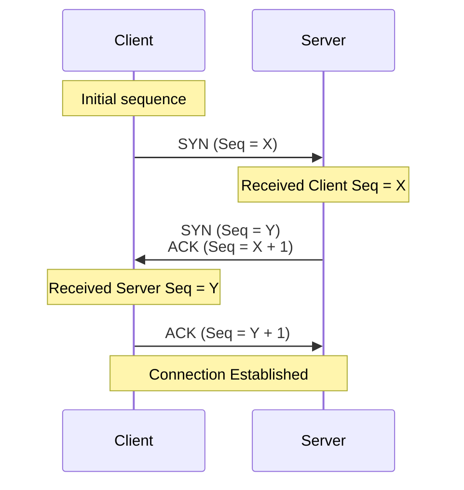
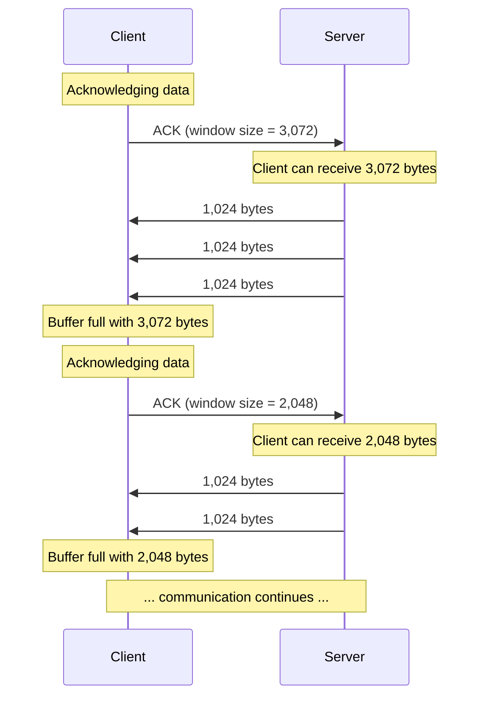
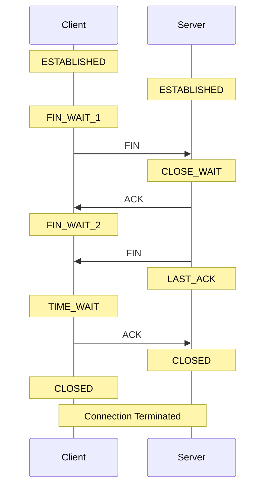

#### What makes TCP reliable
TCP ensures reliable data transmission through several key mechanisms:

1. Flow Control
- Adapts data transfer rates to prevent network congestion
- Optimizes speed while minimizing packet loss
- Responds to changing network conditions

2. Packet Loss Management
- Tracks received packets
- Retransmits lost or unacknowledged packets
- Handles network issues like interference or congestion

3. Packet Ordering
- Organizes packets received out of sequence
- Processes data in correct order regardless of routing changes
- Manages packets taking different network paths

These features work together to provide reliable end-to-end data transmission, though TCP's effectiveness is still ultimately limited by the underlying network hardware quality.

#### Working with TCP session
Let me summarize the text about TCP sessions and handshake process:

TCP Sessions Overview:
1. Purpose:
- Allows delivery of data streams of any size
- Provides confirmation of data receipt
- Enables real-time error correction through continuous feedback

2. Three-Way Handshake Process:
- Server must first listen for incoming connections
- Client initiates with SYN packet (containing capabilities and window settings)
- Server responds with SYN/ACK packet (acknowledging and sharing its settings)
- Client completes with ACK packet
- After handshake, TCP session is established

3. Important Notes:
- TCP doesn't inherently define client/server roles - these terms refer to listening and dialing nodes
- Sessions remain idle until data needs to be transmitted
- Unmanaged idle sessions can waste memory
- In Go programming:
  - The 'net' package handles handshake implementation
  - Developers get either a connection object or error
  - No need to manually manage the handshake process
#### Acknowledging Receipt of Packets by Using Their Sequence Numbers
Here's a summary of the text about TCP sequence numbers and acknowledgments:

Key Points:
1. Sequence Numbers:
- Each TCP packet contains a sequence number
- Used for packet ordering and acknowledgment
- Initial sequence numbers (X,Y) are determined by operating systems during handshake
- Both client and server exchange their sequence numbers during handshake

2. Acknowledgment (ACK) System:
- ACK packets confirm receipt of data up to specific sequence numbers
- One ACK can acknowledge multiple packets
- Helps identify missing packets needing retransmission
- Example: If sender sends packets up to 100 but receives ACK for 90, packets 91-100 need retransmission

3. Selective Acknowledgments (SACKs):
- Special ACK packets acknowledging receipt of subset of packets
- Example: In a 100-packet transmission, if packets 60-80 are missing, SACK can acknowledge receipt of packets 1-59 and 81-100

4. Implementation Note:
- Go handles all these low-level details automatically
- Developers don't need to manage sequence numbers and acknowledgments
- Wireshark recommended for debugging and understanding network traffic
#### Receive Buffers and Window Sizes
TCP Receive Buffers and Window Sizes:

1. Receive Buffer:
- A block of memory reserved for incoming network data
- Allows nodes to accept data without immediate application processing
- Both client and server maintain their own per-connection buffers
- Go applications read data from this buffer

2. Window Size:
- Included in ACK packets
- Indicates how many bytes sender can transmit without needing acknowledgment
- A window size of zero means receiver's buffer is full
- Example: Window size of 24,537 means server can send that many bytes before needing another ACK

3. Sliding Window Mechanism:
- Both client and server track each other's window size
- Aim to fill each other's receive buffers efficiently
- Process involves:
  * Receiving window size in ACK
  * Sending data up to that size
  * Getting updated window size in next ACK
  * Sending more data accordingly

4. Implementation Detail:
- Go handles all these buffer and window management complexities
- Developers only need to focus on reading/writing to connection objects
- Errors are returned if issues occur

The text provides an example where a client with a 3,072-byte window receives three 1,024-byte packets, then updates its window size to 2,048 bytes after processing some data, demonstrating the dynamic nature of the sliding window protocol.
#### Gracefully Terminating TCP Sessions
Here's a summary of how TCP sessions are gracefully terminated:

1. Termination Process:
- Either client or server can initiate termination with a FIN packet
- Involves exchange of multiple packets similar to handshake
- Process ensures both sides complete their data transmission

2. State Changes During Termination:
Client Side:
- ESTABLISHED → FIN_WAIT_1 (after sending FIN)
- FIN_WAIT_1 → TIME_WAIT (after final exchange)
- TIME_WAIT → CLOSED (after waiting period)

Server Side:
- ESTABLISHED → CLOSE_WAIT (after receiving client's FIN)
- CLOSE_WAIT → LAST_ACK (after sending own FIN)
- LAST_ACK → CLOSED (after receiving final ACK)

3. TIME_WAIT State:
- Purpose: Ensures final ACK reaches server
- Duration: Twice the maximum segment lifetime (typically 4 minutes)
- Can be configurable in operating system settings

4. Implementation Note:
- Go manages all termination details automatically
- Developers only need to close the connection object
- No need to handle state changes manually

The process ensures a clean shutdown where both parties acknowledge the termination of communication, preventing data loss during disconnection.
#### Handling Less Graceful Terminations
Here's a summary of ungraceful TCP connection terminations:

1. Abrupt Connection Closure:
- Can occur when an application crashes or stops unexpectedly
- Results in immediate connection termination
- No orderly shutdown sequence followed

2. Reset (RST) Packet Mechanism:
- When a terminated connection receives packets, it responds with RST packet
- RST packet signals:
  * Connection is closed
  * No more data will be accepted
  * Previously unacknowledged data was ignored
  * Other side should close its connection

3. Network Intermediaries:
- Firewalls and other intermediate nodes can send RST packets
- Can force-terminate connections from the middle
- Affects both endpoints of the connection

This contrasts with graceful termination where both parties coordinate the shutdown, showing how TCP handles unexpected connection losses by ensuring both sides become aware of the termination.