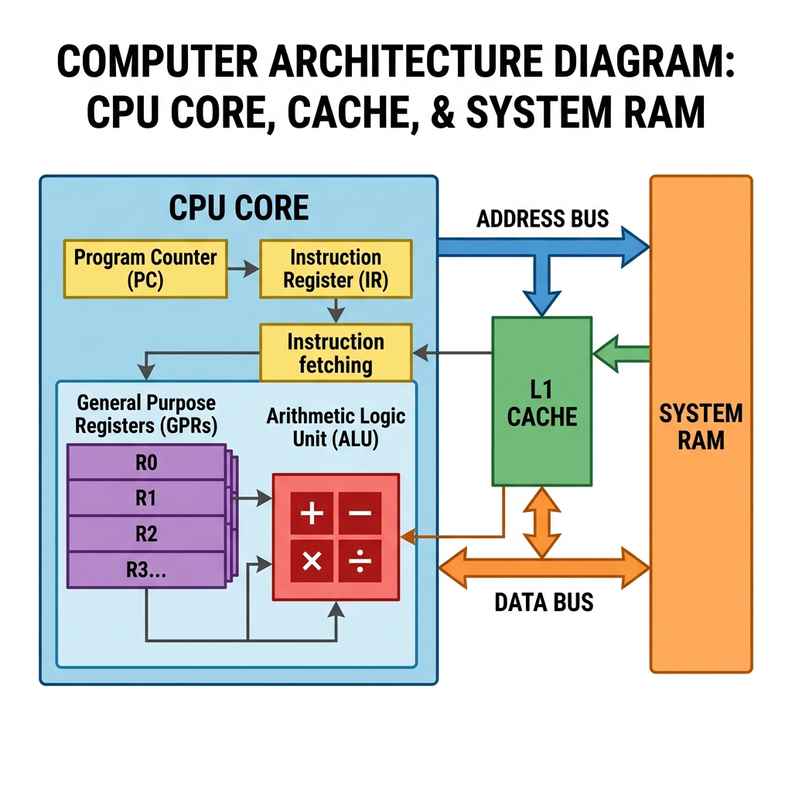

# Section 02 — How a Process Executes

**Course:** Fundamentals of Operating Systems · Hussein Nasser

---

## 1. Intuition

Imagine you have a cooking recipe book. The book itself is a **program** — a static set of instructions written on paper. But the recipe doesn't cook itself. Cooking only happens when a chef (the **CPU**) opens the book to a specific page, reads the first step, executes it (e.g., "chop onions"), moves to the next step, and repeats the process until the meal is complete. 

When a process runs on a computer, a similar sequence occurs. The compiled machine code sitting in RAM is completely static. What breathes life into it is a relentless, high-speed loop performed by the CPU billions of times per second:

$$\text{Fetch} \longrightarrow \text{Decode} \longrightarrow \text{Execute}$$

The CPU needs a bookmark to keep track of its position in the recipe. That bookmark is a specialized CPU register called the **Program Counter (PC)** (or **Instruction Pointer**). Every loop, condition, function call, and variable change in your code is simply a byproduct of this single, loop-driven mechanism marching the PC forward through memory.

---

## 2. Why This Exists

A CPU is a hardware device with no inherent intelligence or concept of "software," "applications," or "processes." At its hardware level, a CPU core is simply a state machine that executes arithmetic and logical operations on binary data. 

Without the **Program Counter** and the **Fetch-Decode-Execute cycle**:
* The CPU would not know where the code begins in memory.
* It would have no way to remember which instruction to run next after completing the current one.
* Control flow structures — such as loops (`for`, `while`), branching (`if`/`else`), and function calls — would be impossible, because the CPU would have no mechanism to "jump" to another memory address and resume execution.

The PC solves this by acting as a dedicated hardware register that holds the memory address of the next instruction. By updating the PC (either by incrementing it sequentially or overwriting it during a branch), the CPU gains the ability to traverse complex code paths.

> [!note] Von Neumann Architecture
> The Fetch-Decode-Execute loop is the practical implementation of the **Von Neumann Architecture** (1945), the theoretical design underlying virtually every general-purpose computer built since. The key insight: instructions and data share the same memory bus, so the CPU must *fetch* instructions from RAM just like any other data.

---

## 3. Core Concept

Here are the formal definitions of the components driving process execution:

| Term | Formal Definition | Hardware Implementation |
|:---|:---|:---|
| **Program Counter (PC)** | A processor register that holds the memory address of the next instruction to be fetched from memory. | Dedicated CPU register (`PC` in ARM, `RIP` in x86-64). |
| **Instruction Register (IR)** | A temporary internal CPU register that holds the instruction bytes currently being decoded and executed. | Internal control unit buffer (not programmer-accessible). |
| **Fetch Stage** | The hardware action of reading instruction bytes from the memory address specified by the PC and copying them into the IR. | Initiated by the CPU control unit via the system bus or L1 Instruction Cache. |
| **Decode Stage** | The process of parsing the bits in the IR to identify the operation to be performed and the location of the operands. | Performed by hardware Instruction Decoders inside the CPU's Control Unit. |
| **Execute Stage** | The step where the CPU performs the decoded operation. | Executed by the Arithmetic Logic Unit (ALU), Floating Point Unit (FPU), or memory controller. |

> [!important] The Hardware Loop
> The loop is hardwired into the CPU silicon:
> 1. **Fetch**: Read instruction from RAM/Cache at address `[PC]` into the `IR`.
> 2. **Increment**: Update `PC = PC + Instruction_Size` (e.g., 4 bytes for 32-bit instructions).
> 3. **Decode**: Interpret opcode and operand bits in the `IR`.
> 4. **Execute**: Run the operation.
> 5. **Go to step 1**.

---

## 4. Internal Working

Let's explore the internal hardware mechanics that occur behind the scenes during execution.

### The Entry Point: Bootstrapping the PC

When you run an executable (e.g., an ELF binary on Linux), the process is bootstrapped as follows:

```
[ Disk ELF Binary ]
        │
        ▼
[ OS Loader reads ELF Header → finds Entry Point address ]
        │
        ▼
[ Kernel maps .text, .data, .bss pages into virtual memory ]
        │
        ▼
[ Writes Entry Point address into CPU Program Counter (PC) ]
        │
        ▼
[ CPU begins first Fetch cycle at [PC] ]
```

1. The OS loader (kernel space) allocates virtual memory pages for the new process.
2. The loader reads the **ELF Header** (or PE Header on Windows), which contains a specific metadata field called the **Entry Point** (typically pointing to the `_start` symbol in C).
3. The loader performs a context switch to the new process, writing this entry point address directly into the CPU's **Program Counter (PC)**.
4. The CPU transitions from kernel mode to user mode, enabling the hardware clock to trigger the first Fetch cycle at the address now sitting in the PC.

> [!tip] Inspect the Entry Point yourself (Linux)
> ```sh
> readelf -h /usr/bin/ls | grep "Entry point"
> # Entry point address: 0x5980
> ```
> This shows the exact virtual address the OS loader writes into the PC when `ls` starts running.

### The Cycle in Detail

> **📷 CPU Execution Bus Flow**
>
> 
>
> *Figure 1: CPU core execution and bus flow diagram showing PC, IR, registers, ALU, and cache connections.*

#### 1. Fetch
The CPU control unit places the address stored in the PC onto the address bus. The memory controller fetches the instructions at that address and returns them via the data bus into the Instruction Register (IR). 
* **Latency Check:** If the instruction is served from RAM, this takes **~100 ns** (a massive bottleneck). If it is served from the **L1 Instruction Cache**, it takes only **~1 ns**.

#### 2. Decode
The instruction bytes are routed to the decoder circuitry. For example, a 32-bit binary instruction `0xE0803001` (in ARM) is decoded as:
* Opcode: `ADD`
* Destination Register: `R3`
* Operand 1: `R0`
* Operand 2: `R1`

#### 3. Execute
The control unit routes the inputs to the ALU. The ALU adds the values in registers `R0` and `R1` and writes the output into register `R3`.

#### 4. PC Update
Under normal sequential execution, the hardware automatically increments the PC by the size of the instruction.
* On 32-bit architectures (ARMv7, x86-32), instructions are 4 bytes wide: `PC = PC + 4`.
* On 64-bit architectures (x86-64), instructions are 8 bytes wide: `PC = PC + 8` (or variable sizes on x86 CISC).
* In the event of a **Branch** (e.g., `jmp`, `b`, or function `call`), the execution phase overwrites the PC register with the target jump address, forcing the next fetch cycle to occur at the target location.

> [!warning] PC updates are in-register only
> A common misconception is that the PC's state is written back to RAM every instruction cycle. This is false. Writing to RAM takes ~100 ns. If the CPU had to write the PC to RAM on every step, execution speeds would drop by 99%. The PC is kept in the CPU register. It is only written to RAM (specifically, to the **Process Control Block (PCB)**) during a **Context Switch**, when the OS pauses the process.

### Memory Latency and Caching Locality

The relative speeds of memory components dictate why caching is vital to execution speed:

| Component | Access Clock Cycles | Typical Latency (ns) | Cost Relative to CPU Register |
|:---|:---|:---|:---|
| **CPU Register** | 1 cycle | ~0.5 ns | 1x (Baseline) |
| **L1 Cache** | 2–4 cycles | ~1–2 ns | ~3x slower |
| **L2 Cache** | 10–20 cycles | ~7 ns | ~14x slower |
| **L3 Cache** (Shared) | 40–60 cycles | ~15 ns | ~30x slower |
| **System RAM** | 200–300 cycles | ~100 ns | **~200x slower** |

#### Cache Line Bursts (Spatial Locality)
When the CPU fetches an instruction from address `0x1000` in RAM, it doesn't just read the 4 bytes it needs. The memory controller pulls a full **Cache Line** (typically **64 bytes**) into the L1 Instruction Cache. 
Because code is stored sequentially, the next 15 instructions (`15 * 4 bytes = 60 bytes`) are preloaded into L1 cache for free. The first fetch pays the 100 ns RAM tax, but the subsequent 15 fetches are served from L1 at ~1 ns each.

```
First Fetch (RAM hit, ~100 ns):
  Address 0x1000 ──▶ [64-byte cache line pulled into L1]
  └── Inst @0x1000 ✔  └── Inst @0x1004 ✔  └── Inst @0x1008 ✔ ... (15 more)

Subsequent Fetches (L1 cache hit, ~1 ns each):
  Address 0x1004 ──▶ [Already in L1] ✔ free!
  Address 0x1008 ──▶ [Already in L1] ✔ free!
```

> [!caution] The branch penalty
> Sequential code enjoys this cache burst benefit. However, a **branch instruction** (`jmp`, `call`) causes the CPU to jump to a distant address, potentially evicting the cached burst and forcing a new ~100 ns RAM fetch — this is called a **branch penalty**. Minimising branches in hot code paths is one reason why low-level performance code prefers lookup tables and branchless arithmetic.

---

## 5. Step-by-Step Execution

Let's examine a small C program and trace its translation to assembly and the subsequent changes inside the CPU and memory during execution.

### The C Code
```c
int main() {
    int x = 5;
    int y = 10;
    x = x + y;
    return 0;
}
```

### Compiled Assembly Stream
```assembly
# Address (Hex)  # Assembly Instruction
0x00400500        mov r0, #5          ; x = 5
0x00400504        mov r1, #10         ; y = 10
0x00400508        add r0, r0, r1      ; x = x + y
0x0040050C        ret                 ; return
```

### Execution Trace

Let's trace this step-by-step:

#### State 0: Initial State
* **PC** = `0x00400500` (points to the first instruction of `main`)
* **IR** = `0x00000000` (empty)
* **Registers**: `r0 = 0`, `r1 = 0`
* **Memory State**: The instructions are loaded in the Text segment at addresses `0x00400500` through `0x0040050C`.

```md
> **📷 Image Placeholder: Step 0 Memory Map**
>
> <!-- IMAGE: trace-step-0.png -->
>
> This image should show the initial state of the CPU registers (PC, IR, R0, R1) alongside the text section loaded in RAM, with the PC pointing to the address 0x00400500.
```

#### Cycle 1: Executing `mov r0, #5`
1. **Fetch**: The control unit reads the 4 bytes at address `0x00400500` (PC) from memory and copies them into the IR.
   * *Latency*: L1 Instruction Cache Hit (~1 ns).
2. **PC Update**: The PC is incremented: `PC = 0x00400500 + 4 = 0x00400504`.
3. **Decode**: The decoder circuitry interprets the bits in the IR as a `MOV` operation, targeting `r0` with the immediate value `5`.
4. **Execute**: The control unit writes the value `5` into CPU register `r0`.
* **State at end of Cycle 1**: `PC = 0x00400504`, `IR = mov r0, #5`, `r0 = 5`, `r1 = 0`.

#### Cycle 2: Executing `mov r1, #10`
1. **Fetch**: Reads 4 bytes at `0x00400504` (PC) into the IR.
2. **PC Update**: The PC is incremented: `PC = 0x00400504 + 4 = 0x00400508`.
3. **Decode**: Interpreted as `MOV`, targeting `r1` with immediate value `10`.
4. **Execute**: Writes `10` into register `r1`.
* **State at end of Cycle 2**: `PC = 0x00400508`, `IR = mov r1, #10`, `r0 = 5`, `r1 = 10`.

#### Cycle 3: Executing `add r0, r0, r1`
1. **Fetch**: Reads 4 bytes at `0x00400508` (PC) into the IR.
2. **PC Update**: The PC is incremented: `PC = 0x00400508 + 4 = 0x0040050C`.
3. **Decode**: Interpreted as `ADD` operation: Add `r0` and `r1`, store result in `r0`.
4. **Execute**: The ALU reads `r0` (5) and `r1` (10), performs the addition, and writes `15` back to `r0`.
* **State at end of Cycle 3**: `PC = 0x0040050C`, `IR = add r0, r0, r1`, `r0 = 15`, `r1 = 10`.

> [!important] The Hidden Calculations
> Even though there is only one explicit mathematical instruction in this assembly block (`add r0, r0, r1`), the CPU performed **four additions** total because the PC was incremented three times (`PC = PC + 4`).

---

## 6. Real Implementation Notes

Superscalar CPU architectures optimize the simple Fetch-Decode-Execute pipeline to avoid stalls:

### Pipelining
CPUs execute stages concurrently. While instruction $N$ is in the Execute stage, instruction $N+1$ is being Decoded, and instruction $N+2$ is being Fetched. 

```
Clock Cycle:   1    2    3    4    5
Inst 1:       [F]  [D]  [E]
Inst 2:            [F]  [D]  [E]
Inst 3:                 [F]  [D]  [E]

Branch Flush scenario:
Clock Cycle:   1    2    3    4    5    6
Inst 1 (jmp): [F]  [D]  [E] ← branch taken!
Inst 2:            [F]  [D]  ✖ FLUSHED
Inst 3:                 [F]  ✖ FLUSHED
Inst(target):               [F]  [D]  [E]  ← restart from jump target
```

If a branch instruction occurs, the pipeline must be **flushed**, discarding the fetched instructions, which introduces a performance penalty.

> [!note] Modern CPUs can have 14–20 stage pipelines
> Intel's Skylake architecture has a 14-19 stage pipeline. A mispredicted branch on such a deep pipeline wastes up to 19 cycles of work — which at 3 GHz costs ~6 ns. This compounds dramatically in tight loops called millions of times per second.

### Out-of-Order Execution (OoOE) & Speculative Execution
CPUs analyze the instruction stream and execute instructions out of order if they do not depend on each other. If a conditional branch is hit (e.g., `if (x > 0)`), the CPU uses a **Branch Predictor** to guess which way the code will branch and speculatively fetches and executes those instructions. If the guess was wrong, the CPU rolls back the register changes.

> [!caution] Spectre & Meltdown (2018)
> Speculative execution was the root cause of the **Spectre** and **Meltdown** CPU vulnerabilities discovered in 2018. Attackers could craft code that caused the CPU to speculatively read privileged kernel memory, then use timing side-channels to leak those speculatively-read values — even though the CPU rolled back the operation. The fix required expensive OS-level mitigations (`KPTI` on Linux) that slowed some workloads by 5–30%.

### Linux vs. Windows Process Bootstrapping

```
Linux (ELF):
  execve() ──▶ kernel maps ELF ──▶ ld.so resolves libs ──▶ _start ──▶ __libc_start_main ──▶ main()

Windows (PE):
  CreateProcess() ──▶ loader maps PE ──▶ resolves IAT ──▶ mainCRTStartup ──▶ main()
```

* **Linux**: When `execve()` is called, the kernel maps the ELF binary into virtual memory, sets up the user-space stack, and jumps to the Entry Point address defined in the ELF header (typically pointing to the `_start` symbol provided by `glibc`, which calls `__libc_start_main` before jumping to `main`).
* **Windows**: The OS loader maps the PE binary, resolves dynamic imports via the Import Address Table (IAT), and calls the entry point defined in the PE header (usually `mainCRTStartup` or `WinMainCRTStartup`), which handles runtime initialization before calling `main` or `WinMain`.

> [!tip] See Linux process startup live
> ```sh
> strace -e trace=execve,mmap,read /usr/bin/ls 2>&1 | head -30
> ```
> This shows the exact system calls (`mmap`, `openat`) the kernel makes to map the ELF binary and its libraries into memory before `main()` gets control.

---

## 7. Comparison Tables

### Instruction Stages Comparison

| Feature | Fetch Stage | Decode Stage | Execute Stage |
|:---|:---|:---|:---|
| **Primary Goal** | Load instruction from memory | Interpret instruction bits | Run the command |
| **Location** | System Bus / L1 Instruction Cache | CPU Control Unit Decoders | CPU execution units (ALU/FPU) |
| **Memory Access** | **Always** (reads code section) | **Never** | **Optional** (reads/writes data) |
| **Hardware Used** | Address bus, L1i cache, IR | Combinational logic decoders | ALU, registers, cache controllers |
| **Latency Penalty**| Up to ~100 ns on L1 cache miss | Near-instant (~1 cycle) | Near-instant for registers; ~100 ns for RAM |

---

## 8. Interview Questions

### Beginner
* **Q: What is the Program Counter (PC) and what role does it play in process execution?**
  * **A:** The Program Counter is a hardware register in the CPU that holds the memory address of the next instruction to be fetched and executed. It acts as the CPU's execution bookmark, automatically incrementing sequentially or jumping to a target address on branches.

### Intermediate
* **Q: How does the CPU minimize memory access overhead during the Fetch stage?**
  * **A:** The CPU utilizes cache hierarchies (L1, L2, L3) and fetches memory in 64-byte blocks (cache lines) rather than individual instruction bytes. Due to spatial locality, loading one instruction pulls adjacent sequential instructions into the ultra-fast L1 Instruction Cache (~1-2 ns latency), avoiding the ~100 ns RAM access cost for subsequent steps.

### Advanced
* **Q: Explain what happens to the Program Counter during a context switch.**
  * **A:** During a context switch, the OS kernel interrupts the running process, reads the current value of the PC (and other CPU registers), and writes them to the process's **Process Control Block (PCB)** in RAM. The kernel then loads the saved registers and PC of the next process from its PCB into the CPU hardware registers, effectively resuming execution of the new process from where it was paused.

---

## 9. Common Mistakes

* **Mistake:** Thinking that the PC points to the instruction currently executing.
  * **Why it's wrong:** The PC is updated (incremented) immediately during or after the Fetch stage. While the ALU is executing the instruction, the PC is already pointing to the *next* instruction in memory.
* **Mistake:** Believing that the PC register is continuously written back to the process's PCB in RAM on every instruction.
  * **Why it's wrong:** RAM writes are slow (~100 ns). The PC remains strictly inside a hardware register on the CPU during active execution. It is only written to the PCB in RAM when the process is swapped out during a context switch.

---

## 10. Revision Notes

### Key Points
* All process execution is governed by the CPU's hardwired **Fetch-Decode-Execute** cycle.
* The **Program Counter (PC)** holds the memory address of the next instruction to fetch.
* **Instruction Register (IR)** holds the raw bytes of the fetched instruction during decoding.
* Sequential code execution is highly cache-friendly due to **L1 cache line preloading (64-byte bursts)**.
* Pipeline stalls and flushes occur when branching instructions interrupt sequential execution.

### Important Definitions
* **Fetch-Decode-Execute Cycle**: The fundamental loop of CPU operations.
* **Pipelining**: Execution technique that overlaps instruction processing phases.
* **Speculative Execution**: Pre-calculating instructions along a guessed branch path to optimize CPU cycle utilization.

### Memory Tricks
* **"FDE, then PC+"**: Fetch the bytes, Decode the bits, Execute the logic, and increment the Program Counter.
* **"RAM is a slow walk, Registers are a sprint"**: Avoid RAM accesses (100 ns) by keeping variables and execution flow localized to L1 caches and registers.

---

## 11. Image Suggestions

* Fetch-Decode-Execute cycle diagram
* CPU register layout (PC, IR, general-purpose registers)
* Memory hierarchy latency chart (register → L1 → L2 → L3 → RAM → SSD → disk)
* Instruction stream with PC marching through sequential addresses
