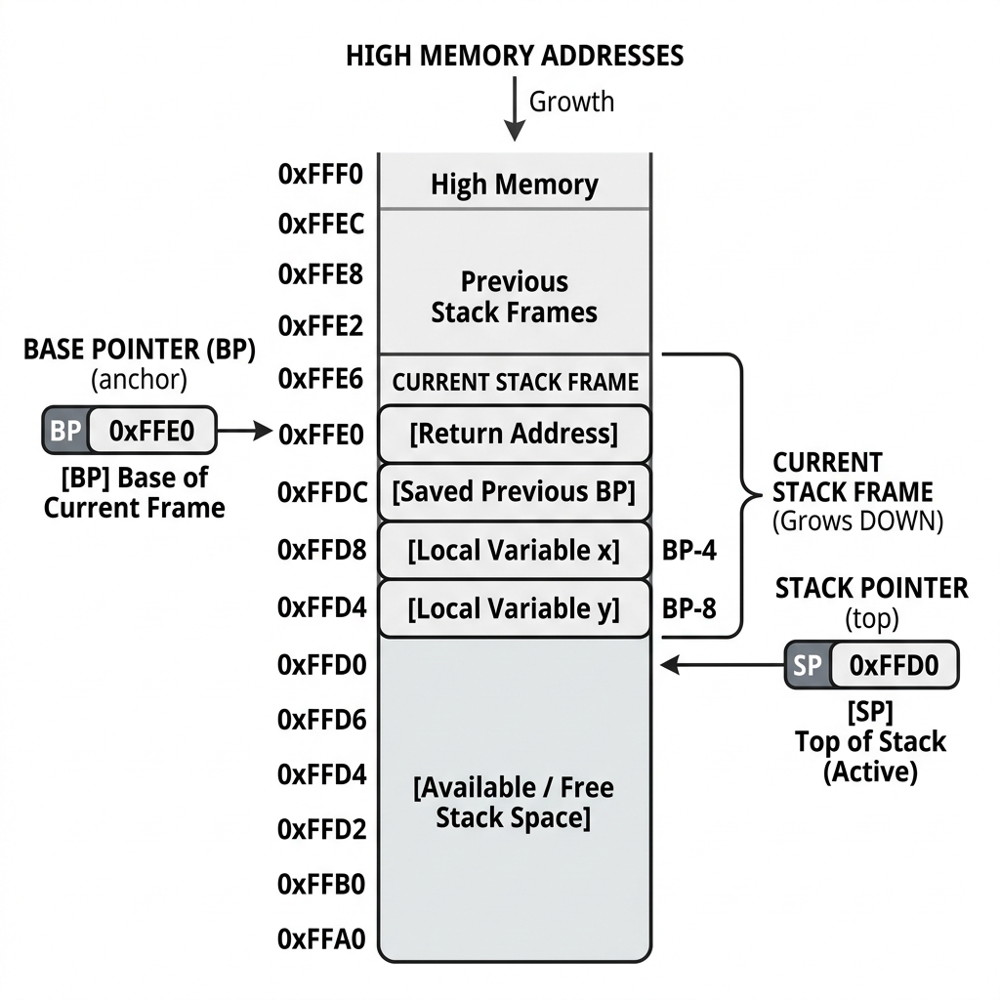

# Section 03 — Stack Memory

**Course:** Fundamentals of Operating Systems · Hussein Nasser

---

## 1. Intuition

Whenever a program executes, functions call other functions, creating a nested hierarchy. Every active function needs private memory space to store its arguments and local variables. Critically, this memory must be created instantly when the function begins and cleaned up automatically the moment the function exits. 

The **Stack** is a region of RAM designed precisely to solve this problem. It is structured like a stack of plates in a cafeteria:
* You can only add a new plate to the top (**Push**).
* You can only remove the plate from the top (**Pop**).

When a function is called, the CPU pushes a block of memory called a **Stack Frame** (or Activation Record) onto the top of the stack. When the function returns, its stack frame is lifted off. The memory space is not physically zeroed out or erased (which would be slow); instead, the CPU simply moves a register pointer, marking the space as "free" for the next function call to overwrite.

---

## 2. Why This Exists

If compilers did not use a stack to manage function memory, programs would face severe limitations:
* **No Recursion**: If functions used static, fixed memory locations for their local variables, calling a function recursively (a function calling itself) would overwrite the variables of the previous call, corrupting the execution state.
* **Manual Deallocation Overhead**: Without a stack, compilers would have to allocate local variables on the heap. This would require dynamic allocation algorithms and manual deallocation calls (like `free()`), leading to memory fragmentation, garbage collection overhead, and a high frequency of memory leaks.

The stack handles function execution nesting perfectly. Because function calls are strictly ordered—meaning the most recently called function is always the first to exit (Last-In, First-Out)—a simple hardware pointer increment/decrement is all that is needed to manage memory lifecycle with zero algorithmic overhead.

---

## 3. Core Concept

Here are the formal definitions of stack memory terminology:

| Term | Formal Definition | Hardware Representation |
|:---|:---|:---|
| **Stack Frame** | A contiguous block of memory allocated on the stack containing all data relevant to a single function call. | Mapped address range between the Frame Pointer and Stack Pointer. |
| **Stack Pointer (SP)** | A hardware CPU register that stores the memory address of the current boundary of the stack (the top of the stack). | Register `SP` (ARM) or `RSP` (x86-64). |
| **Frame Pointer (FP) / Base Pointer (BP)** | A hardware CPU register holding a fixed address reference within the current stack frame, anchoring access to local variables and parameters. | Register `FP`/`R11` (ARM) or `RBP` (x86-64). |
| **Stack Overflow** | A runtime error occurring when a program attempts to write more data to the stack than it has space allocated for, often due to infinite recursion. | Triggers a hardware page fault when executing past stack guard pages. |
| **Function Prologue** | A sequence of instructions at the very beginning of a function that sets up its stack frame. | Compiler-generated assembly instructions. |
| **Function Epilogue** | A sequence of instructions at the very end of a function that tears down its stack frame and restores the caller's state. | Compiler-generated assembly instructions. |

> [!important] Stack Growth Direction
> While we visually think of stacks as growing upward, in almost all modern computer architectures (including x86 and ARM), the stack grows **downward** in physical memory, moving from **high memory addresses to low memory addresses**. 
> * **Allocation** subtracts from the Stack Pointer (`SP = SP - Frame_Size`).
> * **Deallocation** adds to the Stack Pointer (`SP = SP + Frame_Size`).

---

## 4. Internal Working

Let's look at the mechanics of stack frames, pointers, and memory layout.

### SP vs. BP: The Shifting Top and the Static Anchor

To manage variables inside a function, the CPU utilizes two registers: the **Stack Pointer (SP)** and the **Base Pointer (BP)**. 

> **📷 SP and BP Register Anchors**
>
> 
>
> *Figure 1: Stack memory layout showing the Base Pointer (BP) anchoring the frame base and the Stack Pointer (SP) at the active top.*

* **The Stack Pointer (SP) is dynamic**: As the function pushes temporary values or calls nested functions, the SP slides down and up. Because its value is constantly changing, referencing local variables relative to SP is difficult for the compiler to track.
* **The Base Pointer (BP) is static**: During the function prologue, the BP is set to a fixed address inside the new frame and remains unchanged throughout the function's execution. Local variables can be referenced using stable offsets relative to BP (e.g., the first variable is at `BP - 4`, the second is at `BP - 8`).

### The Function Prologue (Allocating a Frame)

When `caller()` invokes `callee()`, the compiler executes the **Function Prologue** to construct the stack frame:
1. **Push Caller's BP**: The current value of the BP register (which points to `caller`'s frame) is pushed onto the stack. This preserves `caller`'s anchor.
2. **Set New BP**: The current SP value is copied into the BP register (`BP = SP`). This anchors the new frame for `callee()`.
3. **Allocate Space**: The SP is decremented by the total size of `callee`'s local variables (e.g., `sub sp, sp, #16`).

### The Function Epilogue (Tearing Down a Frame)

When `callee()` finishes, the **Function Epilogue** executes to restore the caller's execution context:
1. **Collapse Frame**: The SP register is moved back to point to the BP address (`SP = BP`), freeing the local variable space.
2. **Restore Caller's BP**: The old BP value saved on the stack is popped back into the BP register, restoring `caller`'s frame anchor.
3. **Return**: The return address is popped into the Program Counter (PC), resuming execution in `caller()`.

---

## 5. Step-by-Step Execution

Let's analyze a C program with nested function calls and trace the stack memory modification line-by-line.

### The C Code
```c
int multiply(int a, int b) {
    int result = a * b;
    return result;
}

int main() {
    int x = 4;
    int y = 5;
    int z = multiply(x, y);
    return 0;
}
```

### Execution Trace & Memory Transitions

Assume our initial stack starts at memory address `1000`.

```md
> **📷 Image Placeholder: Stack Frame Step-by-Step Transition**
>
> <!-- IMAGE: stack-frame-trace.png -->
>
> This diagram should display the stack memory layout vertically at each step of the trace, showing the values of SP and BP and labeling local variables (x, y, z, result), the saved BP, and the return address.
```

#### Step 1: `main` starts up
The OS loader jumps to `main()`. The prologue for `main` executes:
* `main` saves the caller's BP (address `1200` from the loader) on the stack.
* `main` sets `BP = 996`.
* `main` allocates 12 bytes for variables `x`, `y`, and `z` by decrementing SP: `SP = 996 - 12 = 984`.

```
Address   Value            Label / Purpose
996       1200             Saved Loader BP (Anchored by main's BP = 996)
992       4                Variable x (BP - 4)
988       5                Variable y (BP - 8)
984       0                Variable z (BP - 12) (Anchored by SP = 984)
```

#### Step 2: Preparing to call `multiply(x, y)`
The values of `x` (4) and `y` (5) are loaded into CPU parameter registers (or pushed to the stack depending on the calling convention; here we use registers `r0` and `r1`). The program pushes the **Return Address** (the address of the instruction in `main` that assigns `z`) onto the stack.
* **Return Address** is pushed to address `980`.
* `SP = 980`.

#### Step 3: Entering `multiply`
The hardware jumps to `multiply()`. The prologue for `multiply` runs:
1. Push `main`'s BP (`996`) onto the stack at address `976`.
2. Set the new Frame Pointer to the current SP: `BP = 976`.
3. Allocate space for the local variable `result` (4 bytes): `SP = 976 - 4 = 972`.

```
Address   Value            Label / Purpose
996       1200             Saved Loader BP (main's BP)
992       4                main: x
988       5                main: y
984       0                main: z
980       0x0040052C       Return Address (instruction in main)
976       996              Saved main BP (Anchored by multiply's BP = 976)
972       20               multiply: result (BP - 4) (Anchored by SP = 972)
```

#### Step 4: Returning from `multiply`
The multiplication is complete, and the result (`20`) is placed in the return register `r0`. The epilogue of `multiply` runs:
1. Collapse the local variables: `SP = BP = 976`.
2. Pop the saved BP (`996`) back into the BP register. `BP` is now restored to `996`. `SP` moves to `980`.
3. Pop the return address (`0x0040052C`) from address `980` into the Program Counter. `SP` moves to `984`.
4. Execution resumes in `main`.

#### Step 5: Assigning `z` and terminating
The compiler writes the return register `r0` (20) into `main`'s stack address for `z` (`BP - 12 = 984`). When `main` finishes, its own epilogue runs, restoring the loader's BP and returning control to the OS.

---

## 6. Real Implementation Notes

### Default Stack Sizes
Operating systems allocate a fixed maximum stack size per thread at startup:
* **Linux**: Typically **8 MB** (configurable via `ulimit -s`).
* **Windows**: Typically **1 MB** (configurable via PE header settings or thread creation parameters).

### Guard Pages and Stack Overflow Protection
To prevent stack overflows from corrupting adjacent heap or data memory, the OS maps a write-protected page called a **Guard Page** at the very bottom limit of the stack's address range. 
If the stack pointer grows too far and writes to this page, the MMU triggers a hardware page fault, which the kernel catches and translates into a `SIGSEGV` (Segmentation Fault) on Linux, terminating the process immediately.

### Windows `__chkstk` Probes
On Windows, if a function allocates more than 4 KB (one page) of local stack variables, the compiler inserts a call to a helper function called `__chkstk`. This function "probes" each memory page sequentially down to the allocation size. This ensures the guard pages are touched in sequence, allowing the OS to dynamically expand the stack space page-by-page. Skipping this check could bypass the guard page entirely, corrupting adjacent process memory.

---

## 7. Comparison Tables

### Stack vs. Heap Allocation Comparison

| Feature | Stack Memory | Heap Memory |
|:---|:---|:---|
| **Allocation Mechanism** | Simple pointer subtraction (`SP = SP - size`) | Complex search algorithms, header creation |
| **Allocation Cost** | ~0.5 ns (1 CPU cycle) | Up to ~100 ns (involves system calls) |
| **Lifetime** | Strictly tied to function call scope | Controlled explicitly by programmer (`free`) |
| **Growth Direction** | Downward (High to Low address) | Upward (Low to High address) |
| **Adjacency & Cache** | Highly contiguous (excellent L1 cache usage) | Scattered (poor L1 cache cache line utilization) |
| **Bugs Encountered** | Stack overflow, dangling pointers to stack | Memory leaks, double free, heap corruption |

---

## 8. Interview Questions

### Beginner
* **Q: Explain the difference between the Stack Pointer (SP) and the Base/Frame Pointer (BP/FP).**
  * **A:** The SP tracks the active top boundary of the stack and changes continuously as variables are pushed or functions are called. The BP is set once during the function prologue to point to a fixed anchor address in the stack frame, allowing the compiler to generate stable, constant offsets to access local variables.

### Intermediate
* **Q: Why is returning a pointer to a local variable from a function considered a dangerous bug?**
  * **A:** Local variables live in the function's stack frame. When the function returns, its frame is deallocated (the SP pointer moves past it). The physical bytes remain in RAM as "garbage" until overwritten by the next function call. A pointer to this local variable becomes a **dangling pointer**; accessing it will read garbage data or write to a new stack frame, corrupting execution state.

### Advanced
* **Q: What is a Stack Buffer Overflow, and how do compilers protect against it?**
  * **A:** A stack buffer overflow occurs when a program writes more data to a stack-allocated array than it was declared to hold, spilling over and overwriting adjacent frame metadata—specifically the **saved return address**. An attacker can exploit this to redirect the return address to malicious shellcode. Compilers defend against this by inserting **Stack Canaries** (random guard values placed before the return address). Before returning, the function verifies the canary is unchanged; if it is modified, the program terminates immediately.

---

## 9. Common Mistakes

* **Mistake:** Assuming that stack frames are wiped clean or filled with zeros when a function returns.
  * **Why it's wrong:** For performance, the CPU only moves the SP register. The data remains in RAM as "garbage." This can be read by subsequent function calls if they read uninitialized variables.
* **Mistake:** Attempting to allocate massive arrays (e.g., `int arr[1000000]`) directly on the stack.
  * **Why it's wrong:** 1 million integers take 4 MB of space. On Windows, where the default stack size limit is 1 MB, this causes an immediate Stack Overflow crash. Large or dynamically sized allocations should always be allocated on the heap.

---

## 10. Revision Notes

### Key Points
* The stack operates on a **Last-In, First-Out (LIFO)** basis, matching function call lifecycles.
* Stack frames contain: local variables, saved base pointers, and return addresses.
* In physical RAM, the stack grows **downward** toward lower memory addresses.
* Stack operations are exceptionally fast because allocation is merely a register subtraction.
* Cache friendliness is high because variables inside a frame sit adjacent in the same 64-byte L1 cache line.

### Important Definitions
* **Function Prologue**: Setup assembly instructions (push old BP, set new BP, adjust SP).
* **Function Epilogue**: Tear-down instructions (collapse frame, restore old BP, return to caller).
* **Dangling Pointer**: A pointer reference pointing to an address that has already been deallocated.

### Memory Tricks
* **"SP slides, BP abides"**: The Stack Pointer moves constantly with execution; the Base Pointer remains fixed as the frame's anchor.
* **"Return is a jump to the stack's bookmark"**: The `ret` instruction is simply popping the stack's saved return address into the Program Counter.

---

## 11. Image Suggestions

* Function call stack diagram (multiple nested frames)
* Stack frame layout (locals, saved BP, return address)
* SP/BP register movement across a call and return
* Stack growth direction (high → low addresses)
