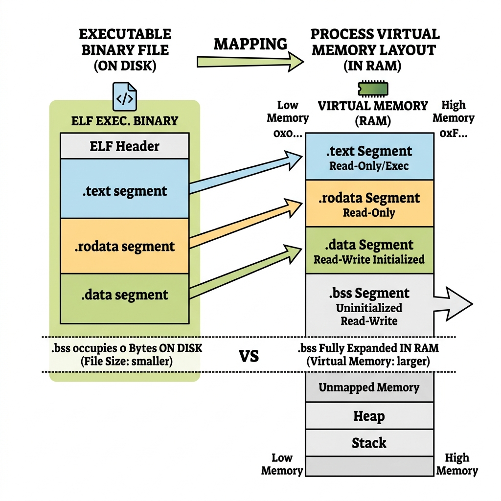

# Section 04 — The Data Section

**Course:** Fundamentals of Operating Systems · Hussein Nasser

---

## 1. Intuition

While the stack handles local variables that exist temporarily during a function call, a program often requires long-lived, shared data. You might need global variables (e.g., application configurations, program state flags) or constants (e.g., mathematical values like $\pi$, string labels) that remain accessible by any function at any point in time. 

The **Data Section** is a fixed, dedicated region of a process's memory layout allocated at program start and persisted until execution ends. 

Unlike the stack (which expands and shrinks dynamically) or the heap (which requires runtime management), the size of the data section is **entirely predetermined at compile time**. The compiler scans the source code, counts all global and static declarations, allocates a specific offset for each, and packs this template directly into the compiled executable binary.

---

## 2. Why This Exists

Without a dedicated data section:
* **Impractical Parameter Threading**: Sharing a configuration setting or a counter across 20 nested functions would require passing the value as an argument through every intermediate function call. This is tedious, error-prone, and adds constant stack push/pop overhead.
* **No Persistent Local State**: Functions would have no way to implement static local counters. For instance, if a function needs to keep track of how many times it has been called, it could not do so using stack variables, as they are destroyed on return.

The data section solves this by providing a single, globally addressable, permanent memory location for static and global variables. Because its layout is fixed before execution begins, the CPU can access these variables using direct, constant memory addresses rather than calculating relative stack frame offsets.

---

## 3. Core Concept

Here are the formal definitions of data section terminology:

| Term | Formal Definition | Hardware / Binary representation |
|:---|:---|:---|
| **Global Variable** | A variable declared outside of any block or function scope, possessing program-wide lifetime and visibility. | Located in the `.data` or `.bss` memory segment. |
| **Static Variable** | A variable whose scope is restricted (either to a function or a single file) but whose lifetime spans the entire program duration. | Located in the `.data` or `.bss` memory segment. |
| **Initialized Data (`.data`)** | The sub-segment of the data section containing global and static variables that have an explicit initial value declared in the source code. | Stored directly in the executable file on disk. |
| **Uninitialized Data (`.bss`)** | The sub-segment containing global and static variables that are declared but not initialized to a specific value in the code. | Consumes zero space in the on-disk file; initialized to zero by the OS loader. |
| **Read-Only Data (`.rodata` / `.rdata`)** | The segment containing constant variables, strings, and read-only static state that the program can read but never mutate. | Placed in write-protected virtual memory pages by the OS. |

> [!important] Scope vs. Storage Duration
> A common point of confusion is the `static` keyword. 
> * **Scope** determines *where* you can access a variable by name in your code (e.g., inside `main()`).
> * **Storage Duration** determines *how long* that variable remains allocated in RAM.
> A static local variable inside a function is only visible inside that function (local scope), but it lives in the data section for the entire duration of the program (static storage duration).

---

## 4. Internal Working

Let's look at the mapping, addressing, and cache mechanics of the data section.

### Fixed Offsets and Virtual Memory Page Protections

The compiler generates static offsets relative to the start of the data segment. For example, if the data segment starts at address `0x00500000`:
* Variable `A` is mapped to offset `0` (`0x00500000`).
* Variable `B` is mapped to offset `4` (`0x00500004`).

When the OS loader launches the process:
1. It maps the virtual memory addresses for the text, data, and stack segments.
2. It sets the **Virtual Memory Page Protections** via the CPU's Memory Management Unit (MMU):
   * `.text` (code) pages are set to **Read-Only + Executable** (`r-x`).
   * `.rodata` (constants) pages are set to **Read-Only** (`r--`).
   * `.data` and `.bss` pages are set to **Read-Write** (`rw-`).
3. If code attempts to write to a constant mapped in `.rodata`, the CPU catches the hardware write protection fault and terminates the program with a Segmentation Fault (`SIGSEGV`).

### Caching and the Cost of Mutability under Concurrency

Reading initialized global variables is fast because they are mapped to fixed locations. The first read pulls a 64-byte cache line into the L1 cache. Due to spatial locality, adjacent variables are pulled in as well, resulting in fast subsequent reads (~1 ns).

However, writing to mutable global variables in a multi-threaded system introduces a significant performance cost:

```
                  [ Core 1 (Thread A) ]            [ Core 2 (Thread B) ]
                            │                                │
                            ▼                                ▼
                     L1 Cache: Hold                  L1 Cache: Hold
                     Global Var (X)                  Global Var (X)
                            │                                │
                            ▼ (Thread A writes to X)         │
                  [ Core 1 Modifies Line ]                   │
                            │                                │
                            └───────( Invalidates )─────────▶│ (Core 2 L1 Cache marked STALE)
                                                             │
                                                             ▼ (Thread B reads X)
                                                      [ L1 Cache MISS ]
                                                             │
                                                             ▼
                                                      [ Re-fetch from RAM (~100ns) ]
```

#### Cache Coherency (MESI Protocol)
Modern multi-core CPUs use cache coherency protocols (like MESI) to ensure all cores agree on memory states. If Thread A on Core 1 writes to a global variable `X`, Core 1 must send an invalidation signal to Core 2. Core 2's L1 cache line containing `X` is marked as **Invalid**. 
The next time Thread B on Core 2 reads `X`, it suffers an L1 Cache Miss and must block execution while `X` is re-fetched from RAM or L3 cache. This is known as **cache bouncing** and creates a performance bottleneck under high write concurrency.

### The BSS optimization: Block Started by Symbol

> **📷 Binary Size vs Memory Layout**
>
> 
>
> *Figure 1: The BSS Optimization — uninitialized variables do not consume disk space in the executable file, but are expanded to zero-filled RAM pages at startup.*

If you declare an array `int arr[1000000] = {0};` (initialized), the compiler must save 4 MB of zeros directly inside the compiled binary file on disk. 
If you declare `int arr[1000000];` (uninitialized), it maps to the **BSS segment**. The compiler simply writes a metadata flag in the ELF header: *"allocate 4 MB of space for BSS at startup."* The binary file on disk remains small, and the OS loader zero-fills the allocated RAM pages when launching the process.

---

## 5. Step-by-Step Execution

Let's examine a C program with a global variable, static variable, and a constant, and trace their allocation locations and execution steps.

### The C Code
```c
int global_count = 100;
static int local_step = 2;
const int limit = 1000;

int increment() {
    global_count = global_count + local_step;
    return global_count;
}
```

### Compile-Time Memory Mapping

The compiler maps the variables to static segments:
* `global_count` (initialized global) $\rightarrow$ mapped to `.data` at offset `0x00`.
* `local_step` (initialized static) $\rightarrow$ mapped to `.data` at offset `0x04`.
* `limit` (constant) $\rightarrow$ mapped to `.rodata` at offset `0x00`.

### Execution Trace

Let's trace a call to `increment()`.

#### Step 1: Loading `global_count`
The CPU executes the instruction to load `global_count` into register `r0`:
`ldr r0, [data_base + 0x00]`
* **Memory Access**: This is the first read, resulting in a L1 cache miss. The memory controller fetches a 64-byte block from RAM starting at `data_base` and places it in the L1 Data Cache. 
* This block contains both `global_count` (offset `0x00`) and `local_step` (offset `0x04`).
* Register `r0` is written with `100`.

#### Step 2: Loading `local_step`
The CPU executes:
`ldr r1, [data_base + 0x04]`
* **Memory Access**: Because `local_step` sits adjacent to `global_count`, it resides in the same 64-byte cache line pulled in Step 1. This is a **L1 cache hit** (~1 ns, no RAM access).
* Register `r1` is written with `2`.

#### Step 3: Addition
The ALU executes:
`add r0, r0, r1`
* Register `r0` now holds `102`.

#### Step 4: Storing the modified value
The CPU writes the result back to `global_count`:
`str r0, [data_base + 0x00]`
* **Memory Access**: The value `102` is written to the L1 cache. 
* **Concurrency Penalty**: If another CPU core had this cache line loaded, a cache invalidation signal is sent across the system bus, invalidating the cache lines of all other cores.

---

## 6. Real Implementation Notes

### ELF Segment Names (Linux/Unix)
In an ELF executable, the data segment is split into distinct sections:
* `.data`: Initialized global/static variables.
* `.bss`: Uninitialized global/static variables.
* `.rodata`: Read-only constants and string literals.

### PE Segment Names (Windows)
In a Portable Executable (PE) binary, the segment names differ slightly:
* `.data`: Initialized data.
* `.rdata`: Read-only data (constants).
* `CRT` (C Runtime) allocations initialize global objects before `main()` executes.

### Hot Code Swapping Limitations
Because global variable offsets are baked directly into compiled machine code instructions as constant address offsets, the size of the data section is strictly non-resizable during execution. Languages that support hot-swapping code at runtime (like Erlang or Lisp) avoid using direct data-section addressing. Instead, they access state through dynamic lookup tables, allowing updated modules to be loaded into new memory addresses without breaking existing compiled reference pointers.

---

## 7. Comparison Tables

### Stack vs. Data Section Variables

| Feature | Stack Local Variable | Data Section Variable (Global/Static) |
|:---|:---|:---|
| **Addressing Method** | Base Pointer relative (e.g., `BP - 4`) | Absolute/Fixed offset (e.g., `data_base + 8`) |
| **Lifetime** | Temporary (tied to function stack frame) | Persistent (spans program execution) |
| **Thread Safety** | Safe (each thread has an isolated stack) | Unsafe (shared memory; requires synchronization) |
| **Disk Space Cost** | Consumes 0 bytes in executable binary | Initialized globals consume direct bytes in binary |
| **Memory Reclamation**| Automatic via stack pointer adjustments | Never reclaimed; stays allocated until exit |

---

## 8. Interview Questions

### Beginner
* **Q: What is the BSS section, and what is its primary optimization benefit?**
  * **A:** The `.bss` (Block Started by Symbol) section contains uninitialized global and static variables. The primary optimization is binary size reduction. Since the initial values are uninitialized (default to zero), the compiler does not store zero bytes in the physical executable file on disk. Instead, the OS loader allocates and zero-fills the required RAM pages at process startup.

### Intermediate
* **Q: What is the difference between a global variable and a static local variable?**
  * **A:** Both variables share the same lifetime (allocated in the data section at program start and persisted until exit). The difference is **scope/visibility**. A global variable is visible to all functions in the program. A static local variable is only accessible by name inside the function where it is declared.

### Advanced
* **Q: In a multi-core processor, why does writing to a global variable frequently introduce latency for other threads, even if they only read that variable?**
  * **A:** This is due to cache invalidation. Multi-core processors maintain cache coherency. When one core writes to a shared variable, it invalidates the corresponding cache lines on all other cores. When other cores subsequently read the variable, they suffer cache misses and must fetch the updated value from RAM or L3 cache (~100 ns latency), generating bus traffic and pipeline stalls.

---

## 9. Common Mistakes

* **Mistake:** Assuming `const` variables are stored in the stack.
  * **Why it's wrong:** While some compiler optimizations place simple integer constants directly inside the assembly instructions as immediate values, global and static `const` variables are placed in the `.rodata` (read-only data) section. This section resides in write-protected pages managed by the MMU.
* **Mistake:** Declaring massive arrays as global initialized variables, like `int data[1000000] = {1};`.
  * **Why it's wrong:** Initializing even one element prevents this variable from being placed in the BSS section. The compiler must allocate 4 MB of space inside the binary on disk, increasing the executable size significantly. If the elements start out empty, declare them uninitialized to utilize BSS.

---

## 10. Revision Notes

### Key Points
* The data section contains variables whose lifetimes span the entire program execution.
* `.data` holds initialized variables; `.bss` holds uninitialized variables; `.rodata` holds constants.
* The BSS segment optimizes binary file size by avoiding storing zero bytes on disk.
* Global addressing utilizes static offsets computed at compile time, eliminating base-pointer recalculations.
* Cross-core cache invalidation makes concurrent writing to global variables expensive.

### Important Definitions
* **MESI Protocol**: A cache coherency protocol tracking cache lines as Modified, Exclusive, Shared, or Invalid.
* **Segmentation Fault**: A hardware-enforced CPU trap triggered when a process attempts to access or write to protected virtual memory pages.

### Memory Tricks
* **"BSS = Blocks Saved on Disk"**: Uninitialized global variables cost zero disk bytes.
* **"Stack is scoped, Data is permanent"**: Stack variables are destroyed on function exit; data section variables survive until process termination.

---

## 11. Image Suggestions

* **Executable vs. Process Memory Layout**: Mapping ELF `.text`, `.data`, `.bss`, and `.rodata` segments from disk to virtual RAM pages.
* **Cache Invalidation Flowchart**: Showing Core 1 invalidating Core 2's L1 cache line on a global write.
* **Scope vs. Lifetime Matrix**: Visualizing variables by where they are accessible vs. where they are stored in memory.
