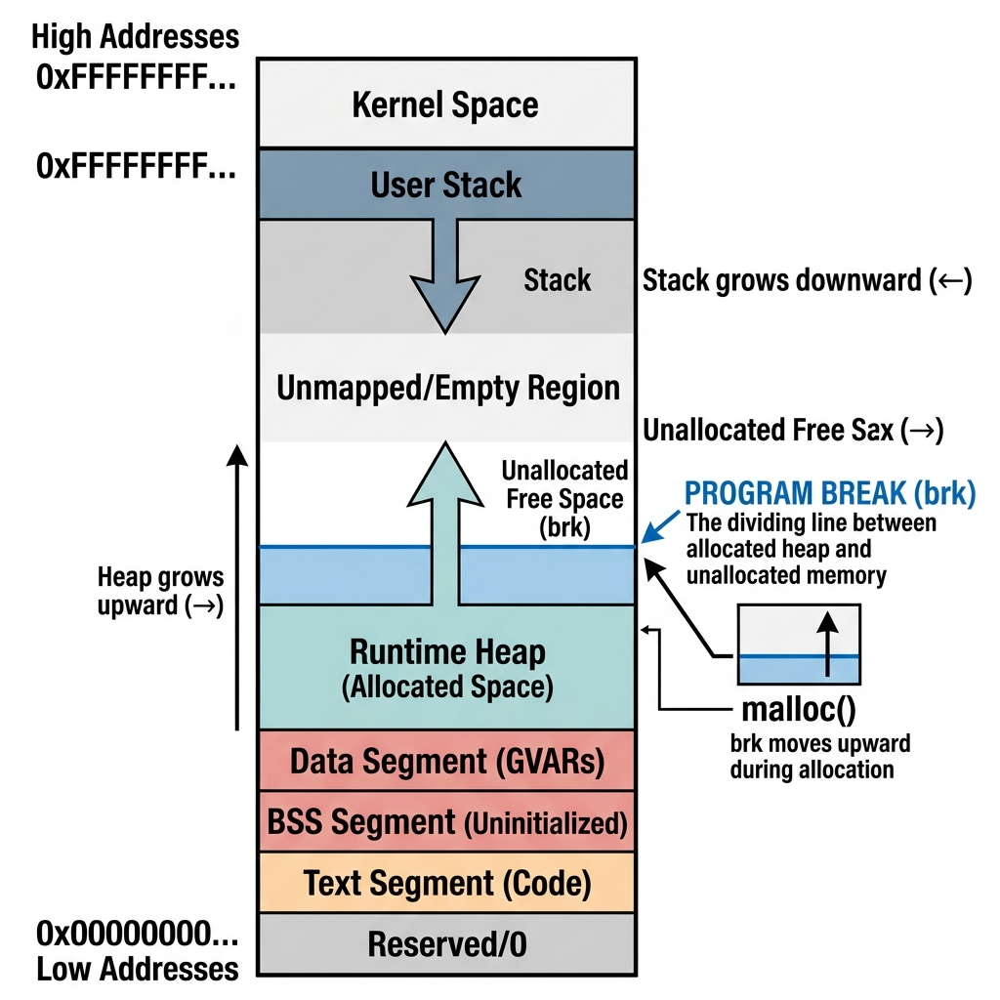

# Section 05 — Heap Memory

**Course:** Fundamentals of Operating Systems · Hussein Nasser

---

## 1. Intuition

While the stack handles local variables that automatically clean up when functions return, it has strict limitations:
* **Function Scope Lock**: Stack variables are destroyed when their parent function exits. You cannot return or pass references to stack variables safely once the stack frame collapses.
* **Size Limit**: Stack sizes are small and fixed (typically 1–8 MB). Allocating large objects triggers immediate stack overflow crashes.
* **Static Sizing**: Stack allocations must have their sizes determined at compile time or at function startup. You cannot easily adjust stack allocations dynamically at runtime based on user input.

The **Heap** is designed to solve these limitations. It is a large, flexible memory pool within a process's virtual address space. 

Unlike the stack, the heap does not follow a strict Last-In, First-Out (LIFO) model. It is a "dynamic dumping ground" where the programmer explicitly requests chunks of memory at runtime, maintains access to them for as long as needed across any function, and explicitly releases them when they are no longer required.

---

## 2. Why This Exists

The heap was introduced to manage dynamic data lifecycles:
* **Dynamic Lifespans**: To store data structures (like linked lists, trees, or graphs) that are created in one function and must persist long after that function has returned.
* **Large Allocations**: To allocate massive memory buffers (e.g., loading a 50 MB image or buffer) that would instantly exhaust the stack.
* **Runtime Sizing**: To allocate memory for structures whose sizes are only discovered during execution (e.g., allocating an array matching the exact number of rows returned by a SQL query at runtime).

The trade-off for this flexibility is **manual memory management**. Because the OS cannot predict when your code is done with heap memory, the programmer must track allocations. Forgetting to free memory leads to leaks, while freeing too early leads to dangling pointers and crashes.

> [!note] Garbage collectors are heap managers in disguise
> Languages like Java, Go, and Python don't eliminate heap allocation — they just hide it. The GC (Garbage Collector) is an automatic system running in the background that tracks all live references and calls the equivalent of `free()` on blocks that are no longer reachable. The tradeoff is GC pause latency and overhead vs. manual management bugs.

---

## 3. Core Concept

Here are the formal definitions of heap memory terminology:

| Term | Formal Definition | Description |
|:---|:---|:---|
| **Heap** | A region of a process's virtual memory address space reserved for dynamic allocation, growing from low to high memory addresses. | Managed by runtime libraries (`malloc`, `free`) and system calls (`brk`, `sbrk`, `mmap`). |
| **Program Break** | The boundary address marking the current upper limit of the process's heap. | Memory addresses below the break are mapped; those above are unmapped. |
| **`malloc()`** | A standard library function used to request a contiguous block of heap memory of a specified byte size. | Returns a generic pointer (`void*`) to the start of the allocated block. |
| **`free()`** | A standard library function used to release a previously allocated block of heap memory back to the system. | Marks the memory blocks as reusable, adjusting internal allocator structures. |
| **Pointer Dereferencing** | The action of reading or writing to the memory address stored inside a pointer variable. | The pointer's type tells the CPU how many bytes to read/write. |
| **Memory Leak** | A condition where a program allocates heap memory, loses all pointers referencing it, and fails to free it. | Wastes system RAM until the process terminates. |
| **Dangling Pointer** | A pointer that still stores the memory address of a block of heap memory that has already been deallocated. | Dereferencing it causes undefined behavior, garbage reads, or crashes. |
| **Double Free** | An error occurring when a program attempts to call `free()` twice on the same pointer without an intervening allocation. | Corrupts allocator metadata headers, leading to potential security exploits. |

---

## 4. Internal Working

Let's explore the mechanics of pointers, allocation headers, and dynamic system calls.

### Pointer Anatomy: Addressing and Typing

A pointer variable is simply a variable that holds a memory address. In compiled code:
* The value of the pointer is a number (e.g., `1024`).
* The **type** of the pointer (e.g., `int*` or `char*`) is metadata used by the compiler to generate instructions.

```
Address: 1024  ──▶ [ 0x00 ] [ 0x00 ] [ 0x00 ] [ 0x0A ] (Holds 10 as an int - 4 bytes)
Address: 2048  ──▶ [ 0x41 ]                             (Holds 'A' as a char - 1 byte)
```

If the CPU dereferences an `int*` pointer, it knows to read 4 bytes starting at the target address. If it dereferences a `char*` pointer, it reads only 1 byte. 

### Allocating Memory: What `malloc` Does Internally

When you call `malloc(8)` to allocate 8 bytes on the heap, the following steps occur under the hood:

```
[ User code: malloc(8) ]
         │
         ▼
[ glibc ptmalloc: check fastbin/smallbin for a free 8-byte chunk ]
         │
    Found? ┴───── YES ──────▶ [ Return cached chunk immediately, ~50 ns ]
         │
         NO
         │
         ▼
[ System call: brk() or mmap() to request more pages from kernel ]
         │
         ▼
[ Write 8/16-byte metadata header (size, flags) before the block ]
         │
         ▼
[ Return pointer to usable block (header_addr + header_size) ]
```

1. **Allocator Lookup**: `malloc` is managed by a user-space memory allocator (like Glibc's `ptmalloc`). The allocator first searches its internal structures (**arenas** and **bins**) to see if it has a previously freed 8-byte chunk available in user-space.
2. **System Call**: If no free chunk is available, the allocator requests memory from the OS kernel using a system call:
   * For small allocations, it calls `brk` or `sbrk` to move the **Program Break** upward.
   * For large allocations (typically > 128 KB), it uses `mmap` to map a new, independent anonymous memory page from the virtual memory subsystem.
3. **Kernel Mode Switch**: Making a system call triggers a CPU mode switch into kernel space. The CPU saves user registers, translates the virtual page tables, marks pages as writable, and switches back to user mode.
4. **Metadata Header Prefixing**: The allocator writes a small **Header** (usually 8 or 16 bytes) at the beginning of the allocated block. This header contains metadata, primarily the **size of the allocation**.
5. **Return Pointer**: `malloc` returns a pointer to the address *immediately following* the metadata header.

> [!tip] Watch malloc make system calls live
> ```sh
> strace -e trace=brk,mmap ./your_program 2>&1 | head -20
> ```
> You will see `brk()` calls enlarging the heap address boundary as your program requests more dynamic memory.

```
┌─────────────────────────┬───────────────────────────────────┐
│  Metadata Header        │  Usable Allocation Space          │
│  - Size: 8 bytes        │  - 8 bytes of raw memory          │
└─────────────────────────┴───────────────────────────────────┘
▲                         ▲
│                         └─ Pointer returned to programmer (ptr)
└─ Actual start of block
```

### Deallocating Memory: What `free` Does Internally

When you call `free(ptr)`:
1. The allocator subtracts the header size from the pointer (`header_address = ptr - header_size`).
2. It reads the size field from the metadata header to discover exactly how many bytes to free.
3. The allocator marks this block as "free" in its internal bins so it can be reused by future `malloc` calls, avoiding constant system calls.
4. **Coalescing**: If the adjacent memory blocks are also free, the allocator merges them into a single, larger free block to prevent heap fragmentation.

> [!caution] Double free is a security vulnerability, not just a crash
> Calling `free(ptr)` twice corrupts the allocator's internal bin linked lists. Because those linked lists live in memory, an attacker can craft a "double free" exploit to overwrite arbitrary memory locations — including function pointers and return addresses — leading to code execution. Always set `ptr = NULL` after every `free()`.

> [!tip] Detect leaks and corruptions with Valgrind
> ```sh
> valgrind --leak-check=full --show-leak-kinds=all ./your_program
> # ==12345== LEAK SUMMARY:
> # ==12345==    definitely lost: 8 bytes in 1 blocks
> # ==12345==  Invalid write of size 4 (heap buffer overflow)
> ```
> Valgrind intercepts every `malloc`/`free` call at runtime and reports exact leak sizes, double frees, and out-of-bounds heap writes with line numbers.

---

## 5. Step-by-Step Execution

Let's trace a C program line-by-line and observe how stack frames, heap blocks, and pointers modify memory.

### The C Code
```c
#include <stdlib.h>

int main() {
    int *data = (int *) malloc(2 * sizeof(int)); // Allocate 8 bytes
    data[0] = 50;
    data[1] = 60;
    free(data);
    return 0;
}
```

### Trace and Memory Layout

Assume our stack starts at `996` and our heap starts at address `5000`.

> **📷 Heap Allocation and the Program Break**
>
> 
>
> *Figure 1: Virtual memory map showing the downward stack growth and upward heap growth toward the Program Break limit.*

#### Step 1: `main` frame setup
The program starts. `main`'s prologue runs, allocating space on the stack for the local pointer variable `data` (4 bytes on 32-bit systems, 8 bytes on 64-bit systems).
* `data` resides on the stack at address `988`.

#### Step 2: Executing `malloc`
`malloc(8)` is called. The allocator reserves 8 bytes on the heap.
* A metadata header is written at address `5000` (storing size: `8`).
* The allocator returns a pointer to the usable memory block at address `5008`.
* The address `5008` is written to the stack variable `data` (at address `988`).

```
Stack Memory (High Address Range)
Address   Value            Purpose
996       1200             Saved Loader BP
988       5008             Local Variable 'data' (points to heap)

Heap Memory (Low Address Range)
Address   Value            Purpose
5000      8 (Metadata)     Allocation Size Header
5008      0                data[0]
5012      0                data[1]
```

#### Step 3: Writing values to the Heap
The program executes `data[0] = 50` and `data[1] = 60`.
* The CPU reads the address (`5008`) from `data` on the stack.
* It calculates the offset for `data[0]` (`5008 + 0 * 4 = 5008`) and writes `50`.
* It calculates the offset for `data[1]` (`5008 + 1 * 4 = 5012`) and writes `60`.

```
Heap Memory
Address   Value            Purpose
5000      8 (Metadata)     Allocation Size Header
5008      50               data[0]
5012      60               data[1]
```

#### Step 4: Calling `free(data)`
`free` is called with pointer `data` (`5008`).
* The allocator accesses the header at address `5000` (`5008 - 8`).
* It reads the size (`8`) and returns the 8-byte block starting at `5008` to the free pool.
* **Note**: The stack variable `data` still holds the value `5008` (it is now a **dangling pointer**).

---

## 6. Real Implementation Notes

### Glibc `ptmalloc` (Linux)
The default allocator in Linux is `ptmalloc` (based on `dlmalloc`). To handle multi-threaded programs efficiently without lock contention, it uses **Arenas**:
* **Main Arena**: Shared by default.
* **Thread Arenas**: Mutex-locked pools created dynamically per thread to allocate memory concurrently.
* **Bins**: Free blocks are categorized into bins based on size:
  * *Fastbins*: Singly-linked lists for fast single-threaded allocation of small blocks (< 80 bytes).
  * *Unsorted Bins*: Temporary holding locations for recently freed chunks before they are sorted.
  * *Smallbins* and *Largebins*: Sorted lists for general allocation requests.

```
Glibc Bin Structure:
  Fastbins    [16B] [24B] [32B] ... [80B]   ◄─ no coalescing, ultra-fast
  Smallbins   [16B] [24B] ... [512B]         ◄─ doubly-linked, coalesced
  Largebins   [512B+] sorted by size         ◄─ best-fit search
  Unsorted    [newly freed chunks]           ◄─ fast path before sorting
```

> [!tip] Inspect live heap usage on Linux
> ```sh
> # See virtual memory map of a running process (PID 1234)
> cat /proc/1234/maps | grep heap
> # 5630e000-5631f000 rw-p 00000000 00:00 0  [heap]
> #                              ^ rw = read/write, no execute
> ```

### Windows Heap Manager
Windows utilizes `HeapAlloc` and `HeapFree` which communicate with the kernel's virtual memory manager. It uses a **Low Fragment Heap (LFH)** strategy to reduce fragmentation by dividing allocations into predefined slot sizes.

### Alternative Allocators
For high-performance applications, developers often swap out default allocators:
* **jemalloc**: Focuses on avoiding fragmentation and enhancing multi-threaded concurrency (default in Rust).
* **tcmalloc**: Developed by Google, uses thread-local caches to perform allocations without lock overhead.

> [!note] Why Rust doesn't need a GC but is still memory-safe
> Rust uses its **Borrow Checker** to statically verify at compile time that all heap allocations have exactly one owner. When that owner goes out of scope, the compiler automatically inserts a `free()` call (called `Drop`). No runtime GC is needed because the compiler enforces ownership rules, making dangling pointers and double frees compile-time errors.

---

## 7. Comparison Tables

### Stack vs. Heap Execution Characteristics

| Aspect | Stack Memory | Heap Memory |
|:---|:---|:---|
| **Allocation Latency** | Near-zero (~1 CPU cycle) | High (~100–300 cycles) |
| **System Calls Involved**| No | Yes (`brk`, `sbrk`, `mmap`) |
| **Deallocation Cost** | Instantly collapses on return | Expensive (bookkeeping, coalescing) |
| **Cache Locality** | Excellent (spatial & temporal) | Poor (random address generation) |
| **Size Constraint** | Small, fixed limits | Large (limited by physical RAM/Swap) |
| **Metadata Overhead** | None | 8-16 bytes per allocation (header) |

---

## 8. Interview Questions

### Beginner
* **Q: Explain what a memory leak is and how it impacts system performance.**
  * **A:** A memory leak occurs when a program allocates memory on the heap but loses all reference pointers to it without calling `free()`. The OS cannot reclaim this memory because it is marked as active. Over time, leaks accumulate, reducing available RAM, causing swap-to-disk slowdowns, and eventually triggering Out-Of-Memory (OOM) process crashes.

### Intermediate
* **Q: What is a dangling pointer, and why is it dangerous?**
  * **A:** A dangling pointer is a pointer that holds the memory address of an object that has already been deallocated using `free()`. If the program dereferences a dangling pointer, it may read corrupted data (if the allocator has reused that address for another object) or cause a Segmentation Fault (if the page was unmapped), presenting severe bugs and security risks.

### Advanced
* **Q: How does `free(ptr)` know the size of the memory block to deallocate, even though no size argument is passed to it?**
  * **A:** Memory allocators prepend a small metadata header (usually 8 or 16 bytes) immediately before the address returned by `malloc()`. This header stores the size of the allocated chunk. When `free(ptr)` is called, the allocator offsets the pointer backwards, reads the header, identifies the size, and updates its free block bins accordingly.

* **Q: What is Escape Analysis in modern compilers, and how does it optimize heap allocations?**
  * **A:** Escape Analysis is a static compiler optimization phase. The compiler analyzes the scope of a dynamically allocated object to see if its reference pointer "escapes" the boundary of the function that created it (e.g. is returned or stored globally). If it does not escape, the compiler optimizes the program by allocating the object directly on the **stack** instead of the heap, saving runtime kernel mode switches, header allocation, and garbage collection sweeps.

---

## 9. Common Mistakes

* **Mindless Allocation Loops**:
  ```c
  // Bad practice
  for (int i = 0; i < 10000; i++) {
      int *p = malloc(sizeof(int));
      // ...
      free(p);
  }
  ```
  * **Why it's wrong**: This executes 10,000 separate kernel mode switches and allocates 10,000 separate headers. It is vastly more efficient to batch-allocate the memory at once:
  ```c
  int *p = malloc(10000 * sizeof(int));
  // ...
  free(p);
  ```
* **Forgetting to Nullify Dangling Pointers**:
  * **Why it's wrong**: Calling `free(ptr)` frees the heap memory, but the pointer variable `ptr` on the stack still stores the address. Always set `ptr = NULL` after freeing it so that subsequent accidental accesses fail cleanly rather than reading corrupt heap space.

---

## 10. Revision Notes

### Key Points
* The heap allows dynamic, runtime-sized, and long-lived memory allocations.
* `malloc` allocations prefix a hidden metadata header storing block sizes.
* System calls (`brk`/`sbrk`/`mmap`) expand the process heap by moving the **Program Break**.
* Cache locality is lower on the heap compared to the stack due to non-contiguous page assignments.
* Memory leaks degrade performance; dangling pointers and double frees corrupt memory and create security risks.

### Important Definitions
* **Program Break**: The virtual address boundary separating mapped heap space from unmapped virtual space.
* **Arena**: Isolated heap memory pool used by threads to allocate memory without lock contention.
* **Escape Analysis**: Compiler optimization that allocates non-escaping objects on the stack.

### Memory Tricks
* **"Heap is a library card, Stack is a notebook"**: On the stack, notes disappear when the class (function) ends. On the heap, you borrow memory (malloc) and must return it (free) manually.
* **"Free needs a header"**: `free(ptr)` reads the size prefix sitting right before `ptr` in RAM.

---

## 11. Image Suggestions

* **Low Fragment Heap Bucket Layout**: Showing how allocations are mapped to sized bins.
* **Metadata Header Prefix Structure**: Detailed map of the bytes preceding a malloc pointer.
* **Escape Analysis Decision Tree**: Visualizing compilation check routes for stack vs heap allocation.
* **Heap vs Stack Growth Collision**: Showing stack growing down and heap growing up in virtual memory.
