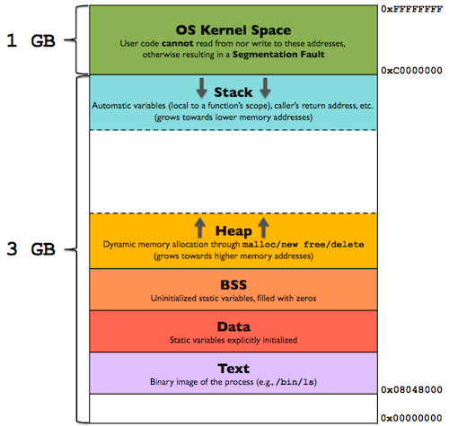
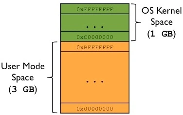

# Section 01 — Program vs Process

**Course:** Fundamentals of Operating Systems · Hussein Nasser

---

## 1. The Core Distinction

> [!info] The Core Question
> Why do we need an operating system (OS)? In truth, you don't *absolutely* need one. You can write an application that talks directly to hardware. However, doing so is extremely difficult. The OS exists for **convenience** — it handles the complex orchestration of hardware, allowing developers to focus on application logic.

People often use the terms "program" and "process" interchangeably, but they represent completely different states of execution:

- A **program** is a passive entity. It is a compiled, linked executable file sitting on persistent disk storage (e.g., an ELF binary on Linux or a `.exe` on Windows). It consumes only disk space, persists until deleted, and is static.
- A **process** is an active entity. It is a **program in motion** — an active instance of a program loaded into RAM, executing instructions, and consuming CPU cycles, memory, and kernel resources.

### Side-by-Side Comparison

| Feature | Program | Process |
|---------|---------|---------|
| **State** | Passive — stored on disk | Active — running in RAM |
| **Lifetime** | Persistent until explicitly deleted | Temporary — starts, runs, and terminates |
| **Resources** | Consumes disk space only | Consumes RAM, CPU cycles, file descriptors, network ports |
| **Uniqueness** | One physical file on disk | Many active instances can run simultaneously |
| **Identity** | File path / file name | Process ID (PID) assigned by the kernel |

> [!tip] Quick Check: Duplicate Processes
> **Q:** If you run `node app.js` twice in two separate terminals, are they the same process?
> **A:** **No.** They represent the same *program* (the `node` binary on disk), but they are two separate *processes*. Each gets its own unique PID, its own isolated memory layout (stack, heap, data), and its own Program Counter. Mutating state or variables in one process has absolutely zero impact on the other.

---

## 2. How a Program Becomes a Process

To transform source code on disk into an active process in memory, it must go through compilation, linking, and OS loading:

```
Source (.c) ──▶ Compiler ──▶ Object File (.o) ──▶ Linker ──▶ Executable (ELF/EXE) ──▶ OS Loader ──▶ Process in RAM
```

```
📄 Screenshot this: program_in_memory2.webp
Figure 1 — Program in Memory Layout
Shows: OS loading process from disk to RAM, mapping code and data sections.
```

> 
> *Figure 1: OS loading process — copying the static executable program from disk and mapping it as an active process in memory.*

1. **Compilation**: The compiler translates high-level code (e.g., C, Rust) into object files containing CPU-specific assembly instructions.
2. **Linking**: The linker combines individual object files and external libraries into a single executable file format (like ELF on Linux or PE on Windows).
3. **OS Loading**: When execution is triggered, the OS loader reads the executable off disk, maps its sections into virtual memory, sets up the execution stack and heap, and hands control to the entry point. The CPU then begins executing instructions.

### Static vs. Dynamic Linking

The linker uses one of two dependency resolution strategies:

- **Static Linking**: Copies the machine code of all dependency libraries **directly into** the final binary.
  - *Pros*: Self-contained, highly portable; runs anywhere without external dependencies.
  - *Cons*: Massive binary sizes.
- **Dynamic Linking**: Embeds **pointers and version constraints** in the executable to locate libraries at runtime (`.so` on Linux, `.dll` on Windows).
  - *Pros*: Lightweight executable files.
  - *Cons*: Low portability; requires those libraries to exist on the target machine.

```
📄 Screenshot this: dynamic-linking-failure.jpg
Figure 2 — Floppy Disk DLL Error
Shows: Windows pop-up dialog: "The code execution cannot proceed because MSVCR100.dll was not found."
```

> 
> *Figure 2: Late 90s Floppy Disk Trap — copying only the `.exe` file without its required `.dll` files resulted in dynamic linking failures on target systems.*

### Linking Comparison

| Feature | Static Linking | Dynamic Linking |
|---------|----------------|-----------------|
| **File Size** | Large | Small |
| **Portability** | High | Low (depends on host libraries) |
| **Linux Format** | `.a` (Archive) | `.so` (Shared Object) |
| **Windows Format**| `.lib` (Static Library) | `.dll` (Dynamic Link Library) |

---

## 3. What Every Process Gets from the OS

When the kernel initializes a process, it provisions an identity and an execution state:

### A. Identity
- **Process ID (PID)**: A unique integer assigned monotonically by the kernel.
  > [!warning] Monotonic Assignment & PID Reuse
  > Dead PIDs are not immediately recycled by the kernel. If a process dies, its PID remains idle for a duration to prevent race conditions and security bugs — such as a new process being assigned the same PID and accidentally gaining access to lingering socket descriptors or file descriptors belonging to the dead process.
- **Namespaces**: Key to containerization tools like Docker. Namespaces virtualize OS resources so that a process inside a container jail sees its own sandboxed PIDs, network interfaces, mounts, and file descriptors — completely isolated from the host system and other containers.
- **Process Control Block (PCB)**: An in-memory data structure managed by the kernel that stores all metadata about a process.
  ```
  ┌────────────────────────────────────────────────────────┐
  │              Process Control Block (PCB)               │
  ├────────────────────────────────────────────────────────┤
  │  - Process ID (PID)                                    │
  │  - Program Counter (PC) / Instruction Pointer          │
  │  - Saved CPU Registers (R0, R1, SP, etc.)              │
  │  - Page Table Pointer (Virtual Memory Map)             │
  │  - File Descriptor Table (open files, sockets)         │
  │  - CPU Scheduling & Usage Statistics                   │
  └────────────────────────────────────────────────────────┘
  ```

### B. Execution State
- **Program Counter (PC) / Instruction Pointer (IP)**: A dedicated CPU register holding the memory address of the next instruction to execute.
- **Registers**: The CPU's ultra-fast local scratchpad. Accessing registers takes fraction of a nanosecond, compared to ~100 ns for system RAM.
- **Virtual Memory Map**: The process's isolated address space. By default, processes cannot access each other's memory, though they can explicitly request shared memory segments (e.g., via `mmap` or `shmget`).

---

## 4. Memory Layout of a Process

The OS allocates a virtual address space bounded by a minimum address and a maximum address, split into four primary regions:

```
High Memory Addresses (e.g., 0xFFFFFFFF)
┌────────────────────────────────────────────────────────┐
│  Stack (grows downward ↓)                              │
│  - Local variables, function parameters, return        │
│    addresses for active functions                      │
├────────────────────────────────────────────────────────┤
│                                                        │
│                     Free Space                         │
│                                                        │
├────────────────────────────────────────────────────────┤
│  Heap (grows upward ↑)                                 │
│  - Dynamically allocated memory (malloc/new)           │
├────────────────────────────────────────────────────────┤
│  Data Section                                          │
│  - Global variables, static variables                  │
├────────────────────────────────────────────────────────┤
│  Text Section (Code)                                   │
│  - Read-only machine code instructions loaded from disk│
└────────────────────────────────────────────────────────┘
Low Memory Addresses (e.g., 0x00000000)
```

```
📄 Screenshot this: memory_layout.webp
Figure 3 — Process Memory Layout
Shows: Stack growing down, Heap growing up, Data section, Text section (Machine Code).
```

> 
> *Figure 3: Process Memory Layout — high memory addresses host stack frames, while low addresses contain static variables and machine instructions.*

- **Stack**: Grows downward (high to low addresses). Stores local variables, return addresses, and function execution frames.
- **Heap**: Grows upward (low to high addresses). Managed manually by the programmer (via `malloc` in C or `new` in C++).
- **Data Section**: Stores global and static variables initialized before runtime.
- **Text Section**: Stores the compiled, read-only CPU instructions.

---

## 5. Context Switch Cost

When the OS preempts a running process to allocate CPU time to another process, it triggers a **Context Switch**:

```
[ Process A Running ] 
       │
       ▼ (Timer Interrupt / Preemption)
1. Pause Process A
2. Save CPU Registers & PC to Process A's PCB (RAM)  ──▶ (~100 ns overhead)
3. Load Process B's Registers & PC from PCB (RAM)    ──▶ (~100 ns overhead)
4. Update CPU Program Counter
       │
       ▼
[ Process B Running ]
```

> [!important] The Multitasking Tax
> Context switching is the hidden cost of concurrent operating systems. Because writing and reading to RAM takes roughly **100 ns** per operation, saving dozens of CPU registers to a PCB in RAM during a context switch introduces noticeable latency. High context-switch rates degrade CPU efficiency, spending clock cycles on overhead rather than executing application code.

---

## 6. Language Runtimes — Where Does Your Code Run?

Not all programming languages map execution to processes in the same way.

- **Compiled Languages (C, Rust, Go)**: Compile directly to native CPU machine code. The CPU runs their instructions directly. Your code *is* the process.
- **Interpreted / VM Languages (JavaScript, Python, Java)**: Compile to bytecode or run through an interpreter. The CPU executes the *runtime interpreter binary* (e.g., `node`, `python`, `java`), which spins up its own stack and heap. Your code runs as a guest *inside* that binary.

```
sh$ node server.js
└── Active OS Process: the `node` binary (native machine code)
    └── Your server.js runs inside Node's virtual heap/stack
```

> [!note] Node.js Process Check
> In Node.js, calling `process.pid` returns the PID of the underlying `node` binary execution engine. The JavaScript file itself is not the OS process; it is executing inside the memory structures of the runner binary.

### Why This Matters — The LinkerD Story

The developers of **LinkerD** (a high-performance service mesh proxy) originally wrote the proxy in Java. However, Java's Virtual Machine (JVM) runtime and Garbage Collection (GC) pauses introduced latency spikes that violated microsecond-level proxy requirements. 

To solve this, they rewrote the proxy in **Rust**. Because Rust compiles directly to native machine code with no runtime or garbage collector, it eliminated the GC pauses, bringing predictable, ultra-low latencies.

### Language Execution Comparison

| Metric | Compiled (C / Rust / Go) | Interpreted / VM (JS / Python / Java) |
|--------|--------------------------|---------------------------------------|
| **CPU Execution** | Runs your code directly | Runs the runtime binary |
| **Memory Stack** | Uses your process's OS stack | Managed inside the runtime's memory |
| **Latency Profile**| Deterministic | Subject to Garbage Collection pauses |

---

## 7. Practical Demo: Assembly, GDB, and Process Inspection

Let's trace a simple program to see how variables, CPU registers, and the Program Counter interact.

### Step 1: Writing the Code (`test.c`)
```c
#include <stdio.h>

int main() {
    int a = 1;
    int b = 2;
    int c = a + b;
    c = c + 1;
    printf("a + b = %d\n", c);
    return 0;
}
```

### Step 2: Compiling to Assembly
To output the assembly code generated by the compiler, use the `-S` flag:
```sh
gcc -S -o test.s test.c
```

Open `test.s` to see how the C variables map to registers:
```assembly
# Partial ARM Assembly Output
push    {fp, lr}
add     fp, sp, #4
sub     sp, sp, #12
mov     r3, #1          @ Move value 1 into register r3 (a = 1)
str     r3, [fp, #-8]   @ Store r3 on the stack
mov     r3, #2          @ Move value 2 into register r3 (b = 2)
str     r3, [fp, #-12]  @ Store r3 on the stack
ldr     r2, [fp, #-8]   @ Load stack value (1) into r2
ldr     r3, [fp, #-12]  @ Load stack value (2) into r3
add     r3, r2, r3      @ Add r2 and r3, store in r3 (c = a + b)
str     r3, [fp, #-16]  @ Store result (c) on stack
```

> [!tip] Compiler Optimizations
> Compilers are highly intelligent. If you compile code with optimizations turned on (e.g. using `gcc -O3`), the compiler may realize that `a` and `b` are never used individually. It will completely skip allocating memory on the stack for them, executing the addition directly in the registers or pre-calculating the final value (`3`) at compile time.

### Step 3: Compiling for Debugging
Compile the code with debug symbols (`-g`). Debug symbols preserve the mapping between compiled instruction addresses and high-level C source code lines:
```sh
gcc -g -o test test.c
```

### Step 4: Debugging with GDB
Open the binary inside the GNU Debugger:
```sh
gdb ./test
```

Inside the debugger console:
```gdb
(gdb) start
# Starts process execution and pauses at the entry breakpoint in main()

(gdb) info registers
# Or 'i r'. Displays current register states, including the Program Counter (pc)
```

```
📄 Screenshot this: gdb-registers-output.jpg
Figure 4 — GDB info registers command
Shows: r0 (value 1), pc (0x10414), sp registers.
Key: The Program Counter (pc) holds the active instruction address in memory.
```

> 
> *Figure 4: GDB Output — showing general registers and the PC.*

Step to the next execution line:
```gdb
(gdb) next
# Executes the current line of code

(gdb) info registers
# Observe the Program Counter (pc) has increased to point to the next instruction address.
```

---

## 8. Diagnostic Tools — Your Best Friends

To inspect active processes and debug executables, use standard Linux utilities:

### A. Process Viewers
- `top`: Command-line system monitor displaying CPU usage, memory, and PIDs. It reads data directly from the kernel-exposed `/proc` filesystem.
- `htop`: Interactive, color-coded, user-friendly system monitor. Displays core threads and allows real-time filtering, sorting, and sending signals (like SIGKILL).

### B. Debuggers
- `gdb`: The GNU Debugger. Attaches to processes, sets execution breakpoints, steps line-by-line, and directly monitors CPU register changes. Requires compiling with `-g` to map instruction addresses back to source code.

---

## 9. Key Takeaways

- **Program vs. Process**: A program is static code on disk; a process is active instructions executing in RAM.
- **Isolated Memory**: Every process gets its own virtual memory layout consisting of Stack (local variables, downward-growing), Heap (dynamic allocations, upward-growing), Data (global variables), and Text (read-only code).
- **Process ID (PID)**: Unique identifier assigned monotonically. Dead PIDs are cached before reuse to prevent resource assignment bugs.
- **Process Control Block (PCB)**: Kernel memory block storing a process's metadata, open file descriptors, and register state.
- **Context Switch Tax**: Preempting a process requires saving registers to RAM (~100 ns per write), introducing scheduling overhead.
- **Linking Strategies**: Static linking embeds dependencies producing large, portable files. Dynamic linking maps references at runtime, creating lightweight binaries with host dependencies.
- **Runtime Jails (Containers)**: Namespaces isolate PIDs, networks, and file paths to create sandbox process instances.

---

*Next: Section 02 — How a Process Executes (fetch-decode-execute cycle, Program Counter, Text section)*
