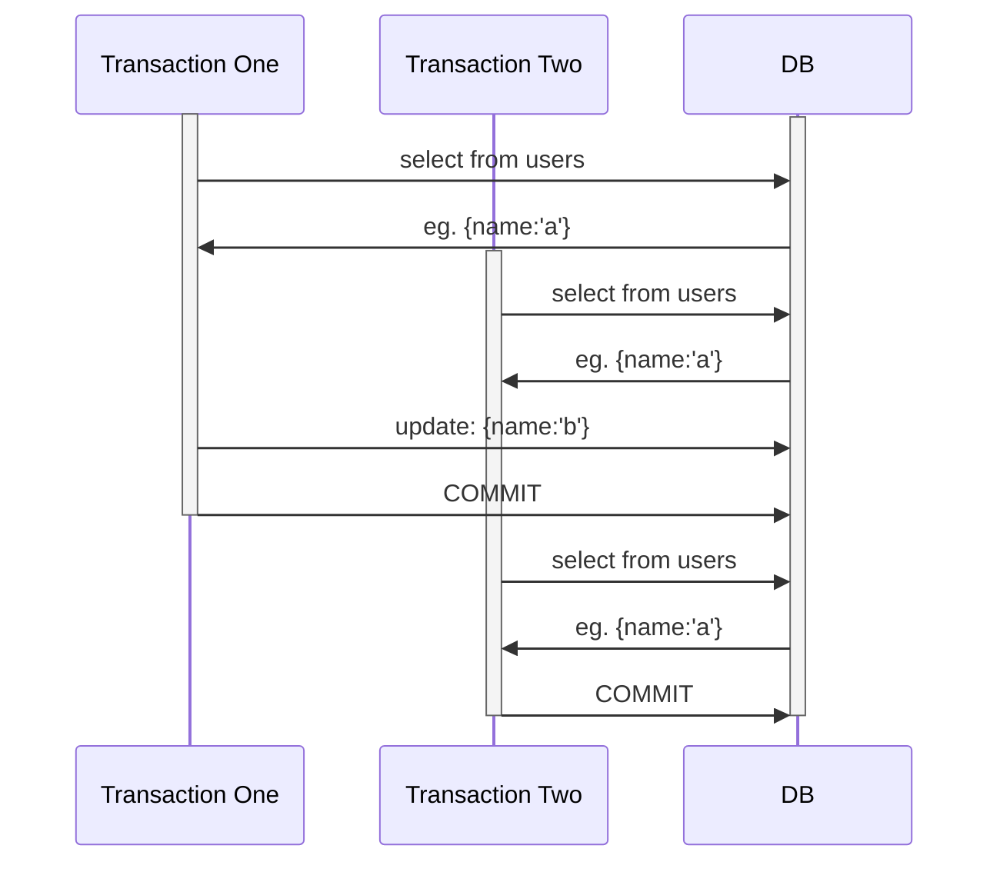
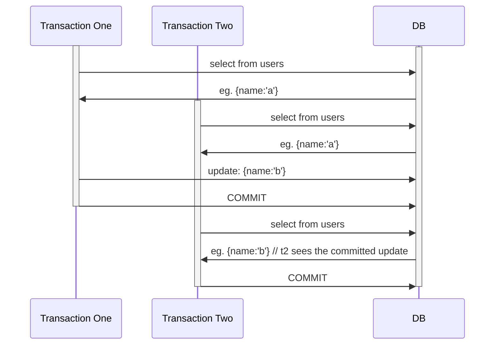
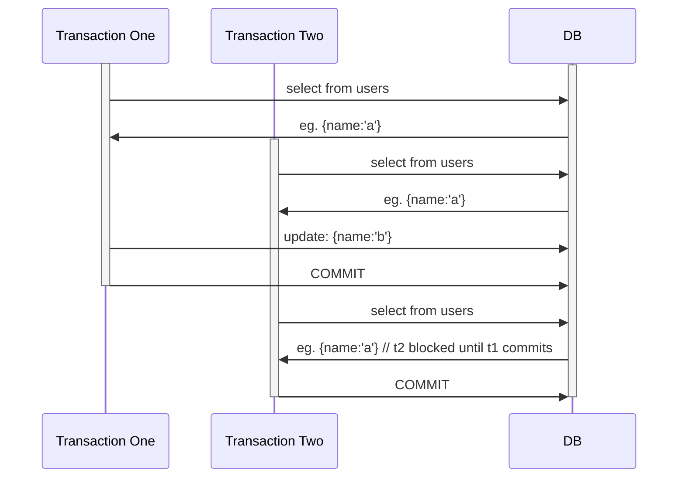

### ACID properites 
#### Atomicity
All the events within a transaction takes effect or none of them.
No matter how many statements I ran in my transaction either all of them would be executed or none of them are going to execute.
#### Consistency
Data will never go in inconsistent state
- Contraints
- Triggers
- Cascades
#### Durability
Even if system crashes the data should be durable as long as the disk is in good shape
#### Isolation
How much details of one transaction is available to the other transaction
- Repeatable Reads
- Read Committed
- Read Uncommitted
###### Repetable Reads
We will get the same result for a read once we read it in the transaction whether it letter get's modified by the other transaction.

###### Read committed
You will always get the updated value in the transaction. Whether it is been modifed by a transaction or a update statement(does implicit transaction internally)

###### Read Uncommitted
This is also  said as 'Dirty Read Problem' it is going to read the value whether a transaction is committed or not.
**It gives a little higher throughput**
###### Serializable
Only one trnsaction runs at a time. And that's why it is very slow
**in some databases the select statement will stuck until the other transactions are committed(mysql)**

### Scaling
##### Verticle Scaling
Cloud providers like aws and azure gives one click solution to upgrade database. Though db will require to restart.
And we cannot scale it infinitely there will be a limit due to computer architecture(_cache lines, bus ratios_). We cannot put 1TB 
sd card in a mobile which only supports 128gb storage.
There's a circuit  level limitation which means we cannot go beyond a certain level.
##### Horizontal scaling
**Master Slave Model** when we are receiving traffic in `90:10` db ratio or something like that then it is easy to do horizontal scalling.
So suppose we are receiving 90% read queries in the db and 10% right queries then we will separate them into two dtabases.
One is going to be master which will handle the write and another is going to be slave(**Read Replica**) which will handle the read queries.
**The logic written in the business logic itself when to make request to the type of database based upon query** _according to the video_.
##### Replication
We know that master and replica are connected via replication.
###### Synchronous Replication
api server will make write queries to the master db and then master db will replicate them in the slave db or api server can make write query
to both the database.  But the main point is that it is not going to send the response back to the user until the query takes effect in both the db.
- strong consistency
- zero  replication log
- slower writes
###### Asynchronous Replication
This is what we use in day to day world. The api server will only make request to the master db and then send the response back to the user.
Read replica or slave is going to pulls periodically for new data and if he gets then he will start applying all those **queries** so that he can synchronise with master db.
But there will be a time when write is happened in master but it is not happen in the slave and in that case we are going to get the inconsistent data and this problem is called **replica lag**
- eventual consistency
- some replication lag
- faster writes

Ok so we scaled the master db vertically and we have read replicas which we scalled horizontally and we have many of them but if we started getting too many write request and our master db is not able to handle them. So here Sharding comes into play
