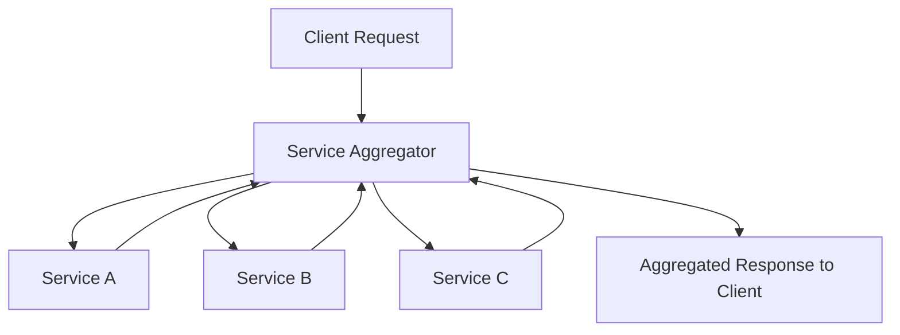

### Gateways
#### Gateway Aggregation Pattern
-  API Gateway service that provide to aggregate multiple individual requests towards to internal microservices with exposing a single request to the client.
- Use if client application have to invoke several different backend microservices to perform its logic.
- Client applications need to make multiple calls to different backend microservices, this leads to chattiness communications and impact the performance.
- If new service added into use cases, then client need to send additional request that increase the network calls and latency.
- To abstract complex internal backend service communication from the client applications.
- Dispatches requests to the several backend services, then aggregates the results and sends them back to the requesting client.
#### Gateway  Offloading pattern
- Gateway Offloading Pattern offers to combine commonly used shared functionalities into a gateway proxy services.
- Shared functionalities can application development by moving shared service functionality into centralized places. Authentication, Authorization, Rate Limiting, SSL certifications, Logging, Monitoring, Load Balancing.
- Implementing cross-cutting concerns for every microservice is not a good solution.
- Gateway Offloading Pattern offers to manage all those Cross-cutting Concerns into API Gateways.
-  Simplify the development of microservices by removing the cross-cutting concerns on services to maintain supporting resources, allow to focus on the application functionality.
#### API Gateway 
#### BFF 
- Backends for Frontends pattern basically separate API Gateways as per the specific frontend applications.
- Single API Gateway makes a single-point-of failure. ■ BFF offers to create several API Gateways and grouping the client applications according to their boundaries.
- A single and complex API Gateway can be risky and becoming a bottleneck into your architecture.
- Larger systems often expose multiple API Gateways by grouping client type like mobile, web and desktop functionality.
- Create several API Gateways as per user interfaces to provide to best match the needs of the frontend environment. • BFF Pattern is to provide client applications has a focused interfaces that connects with the internal microservices.
#### Service Aggregator Pattern
- Service Aggregator Pattern is receives a request from the client or API Gateway.
- Dispatches requests of multiple internal backend microservices.
- Combines the results and responds back to the initiating request in 1 response structure.
- Reduces chattiness and communication overhead between the client and microservices
- AddItem aggregates request data from to several back-end microservices: Product - SC and Pricing.

#### Service Discovery  and Service Registry
