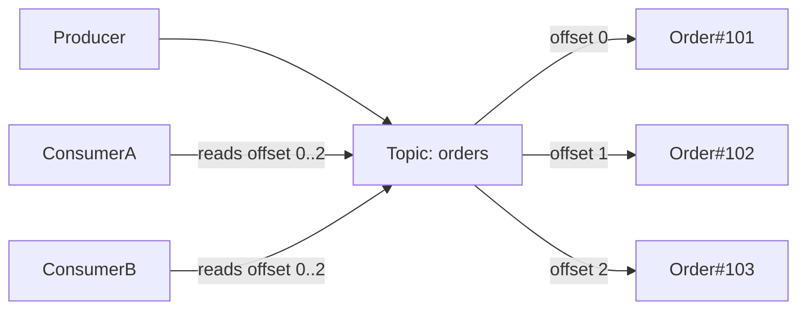

Now imagine three services.
---
# Message Streaming & Kafka Essentials

This note contrasts message queues (RabbitMQ) with event streams (Kafka) and explains core Kafka concepts: topics, partitions, offsets, and consumer behavior.

## Motivation (example)
In a food-delivery app, placing an order triggers many downstream tasks: payment, restaurant notification, delivery assignment, email, analytics, loyalty updates. Calling every service synchronously couples and slows the Order Service. A broker decouples producers and consumers.

## Queue vs Stream (concept)
- Queue: messages are consumed and removed; typically a single consumer processes a message (work queues).
- Stream: events are appended to a log and retained for a period; multiple consumers can independently read the same events using offsets.

```mermaid
flowchart LR
    Producer --> Queue[(RabbitMQ Queue)]
    Queue --> WorkerA[Worker A]
    Queue --> WorkerB[Worker B]

    Producer --> Topic[(Kafka Topic (log))]
    Topic --> ConsumerA[Consumer A]
    Topic --> ConsumerB[Consumer B]
```

## Kafka basics
- Topic: logical category (e.g., `orders`, `payments`).
- Partition: ordered, immutable sequence of messages within a topic.
- Offset: sequential id of a message within a partition; consumers track offsets to resume processing.
- Consumer group: a set of consumers that coordinate to consume partitions in parallel (each partition consumed by one group member).



## Key differences (high level)

| Feature | RabbitMQ | Kafka |
|---|---:|---:|
| Model | Message queue (work queues) | Event streaming (log) |
| Retention | Usually removed after ack | Retained for configured time/size |
| Multiple consumers | One consumer typically processes a message | Multiple consumers can read same data independently |
| Replay | Harder | Easy (seek by offset) |
| Throughput | High | Extremely high |
| State tracking | Broker tracks acks | Consumers track offsets |

## When to use
- RabbitMQ: background jobs, email sending, image processing, task scheduling, reliable work queues.
- Kafka: activity logs, clickstreams, IoT telemetry, event sourcing, real-time analytics, service integration where many consumers need the same events.

## Learning roadmap for Kafka
1. Why streaming (limitations of point-to-point queues)
2. Producers, topics, partitions, brokers
3. Consumer groups and offsets
4. Partitioning & ordering guarantees
5. Replication and fault tolerance
6. Delivery semantics (at-most-once, at-least-once, exactly-once)
7. Retention and replay
8. Build a simple producer/consumer
9. Advanced: Kafka Streams, Connect, Schema Registry, event sourcing

---
Notes: diagrams added to illustrate queue vs stream and topic/offset behavior.